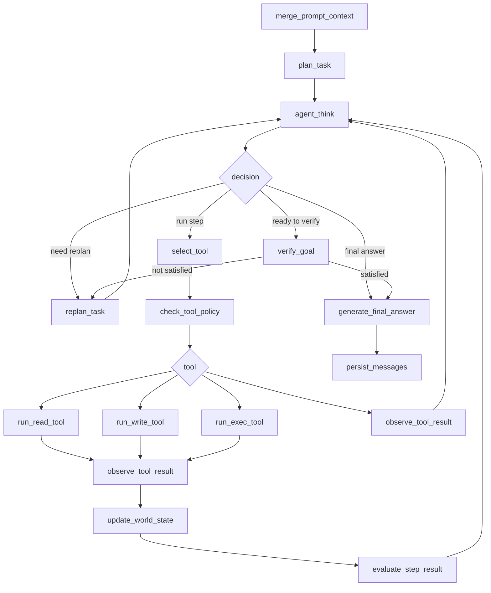

# Claude-Code Agent 设计借鉴与 AiMemo 升级方案

本文档记录从 `submodules/Claude-Code` 源码中提炼出的 agent 设计经验，并把这些经验映射到 AiMemo 当前 `Memory Chat Graph` 的下一阶段升级。

目标不是照搬 Claude-Code，而是吸收它在工具调用、消息轨迹、任务管理、结果验收和防幻觉方面的工程思路，避免继续用零散规则修补 agent loop。

## 背景

AiMemo 当前已经完成了从“隐藏 Local Operator 上下文”到“主对话工具循环”的第一阶段升级：

```text
merge_prompt_context
  -> plan_task
  -> agent_think
  -> select_tool
  -> check_tool_policy
  -> run_read_tool / run_write_tool / run_exec_tool
  -> observe_tool_result
  -> agent_think
  -> generate_answer
```

这个结构解决了工具结果无法回到 agent 的问题，但仍然暴露出几个核心缺陷：

- `agent_think` 仍然偏“下一步动作选择器”，不是完整的目标执行 agent。
- `exec_command exit_code=0` 容易被误判为用户目标完成。
- 工具 observation 虽然进入了 state，但还不是模型对话轨迹中的一等事实。
- 最终回答缺少强验收约束，可能引用没有被工具结果支持的内容。
- 短确认、跨轮 continuation、新任务边界仍容易混淆。

最近的问题非常典型：

```text
用户目标：
在 E:\demo 创建一个 rust 程序，生成 8 个随机数，写好后将运行结果给我

实际工具结果：
cargo run 输出 Hello, updated world!

错误行为：
系统认为 exec 成功，所以目标满足；
最终回答编造了一组随机数。
```

这说明问题不只是模型质量，而是 runtime 给了模型错误的结束信号。

## Claude-Code 的关键设计

### 1. 工具调用是 transcript 的一部分

Claude-Code 的主循环不是外部状态机单独决定“下一步工具”，而是让模型输出 `tool_use`，工具执行后把 `tool_result` 作为新的 user message 追加回上下文，然后继续下一轮模型调用。

核心形态：

```text
assistant: text/thinking + tool_use(...)
user: tool_result(...)
assistant: 基于 tool_result 继续调用工具或最终回答
```

关键源码：

- `submodules/Claude-Code/src/query.ts`
  - `while (true)` 主循环。
  - 检测 assistant message 中的 `tool_use`。
  - 只有没有 tool use 时才允许进入结束流程。
- `submodules/Claude-Code/src/services/tools/toolExecution.ts`
  - 执行单个工具并生成 `tool_result` 消息。
- `submodules/Claude-Code/src/services/tools/toolOrchestration.ts`
  - 批量执行工具，并维护执行顺序与上下文更新。

对 AiMemo 的启发：

- 工具结果不应只是 `world_state` 中的调试字段，还应作为 agent 下一轮推理的强事实输入。
- 最终回答必须基于本轮 task 的真实 tool observation，不能凭 task 计划或模型意图声称完成。

### 2. Tool 是协议对象，不是简单函数

Claude-Code 的 `Tool` 定义很厚。一个工具不仅有 `call()`，还包括：

```text
inputSchema
outputSchema
validateInput
checkPermissions
isReadOnly
isConcurrencySafe
isDestructive
interruptBehavior
mapToolResultToToolResultBlockParam
renderToolUseMessage
renderToolResultMessage
```

关键源码：

- `submodules/Claude-Code/src/Tool.ts`

对 AiMemo 的启发：

- `read_file`、`write_file`、`exec_command` 应该升级成统一 Tool Protocol。
- 每个工具都应该明确：
  - 参数 schema。
  - 输出 schema。
  - 是否只读。
  - 是否可并发。
  - 是否危险。
  - 失败是否可恢复。
  - observation 如何注入 agent 上下文。

### 3. Read-only 工具可并发，写/执行工具要串行

Claude-Code 会把工具调用按并发安全性分批：

- read/search/list 类工具可以并发。
- write/edit/bash 类工具通常串行。
- 即使并发执行，也必须保持 `tool_use_id -> tool_result` 的归属关系。

关键源码：

- `submodules/Claude-Code/src/services/tools/toolOrchestration.ts`
- `submodules/Claude-Code/src/services/tools/StreamingToolExecutor.ts`

对 AiMemo 的启发：

- 后续优化性能时，可以并发执行多个 read/search/info step。
- 但 write/exec 必须有严格顺序和上下文边界。
- 并发优化不能打乱 step dependency、tool result 归属和 checkpoint 状态。

### 4. Write 有硬契约：read-before-write

Claude-Code 的 `FileWriteTool` 对已有文件有明确保护：

- 已存在文件必须先 Read。
- 如果读取后文件被外部修改，Write 会拒绝。
- Write 成功后更新 read file cache，避免后续状态错乱。

关键源码：

- `submodules/Claude-Code/src/tools/FileWriteTool/FileWriteTool.ts`
- `submodules/Claude-Code/src/utils/queryHelpers.ts` 中 `extractReadFilesFromMessages`

对 AiMemo 的启发：

- read-before-write 应该是工具层契约，而不是只写在 planner prompt 中。
- planner 不遵守时，工具应返回明确错误；agent 看到错误后重新规划。
- 但恢复逻辑不应该写成“修改 JSON 字段”这类请求特化，而应该基于工具契约通用恢复。

### 5. Todo/Task 是目标约束，不只是 UI

Claude-Code 的 Todo/Task 工具会提醒模型持续维护任务列表，并要求：

- 复杂任务要拆分。
- 同一时间只有一个 in_progress。
- 只有真正完成后才能标记 completed。
- 遇到 blocker 时不要标记完成。

关键源码：

- `submodules/Claude-Code/src/tools/TodoWriteTool/TodoWriteTool.ts`
- `submodules/Claude-Code/src/tools/TodoWriteTool/prompt.ts`
- `submodules/Claude-Code/src/tools/TaskCreateTool/TaskCreateTool.ts`
- `submodules/Claude-Code/src/tools/TaskUpdateTool/TaskUpdateTool.ts`

对 AiMemo 的启发：

- AiMemo 的 `Task` 不应该只是后端状态字段，它应该成为 agent 看到并遵守的目标约束。
- `completed_steps` 不等于 `goal_satisfied`。
- 一个 step 成功，只能说明该 step 的工具调用成功，不能说明用户最终目标完成。

## AiMemo 当前缺失

### 1. 缺少验收层

当前 `WorldStatus` 已经有 `goal_satisfied`，但判断还太粗：

```text
目标要求运行结果 + 任意 exec_command 成功
  -> 认为满足
```

正确逻辑应该是：

```text
目标要求运行结果
  -> 必须存在成功 exec observation
  -> stdout/stderr 必须和目标语义相关
  -> 若不确定，进入 verifier 或 replan
```

例如：

```text
目标：生成 8 个随机数
stdout: Hello, updated world!
```

这不是成功结果，而是目标未满足。

### 2. 工具 observation 还没有变成强证据

当前 observation 已写入：

```text
tool_observations
world_state.observations
task.execution_history
```

但最终回答仍可能脱离这些事实。

应该建立规则：

- 回答运行结果，只能引用 `exec_command` observation 中的 stdout/stderr。
- 回答“已写入文件”，必须有成功 `write_file` observation。
- 回答“文件内容是什么”，必须有成功 `read_file` observation。
- 没有证据时只能说“我还没有实际执行/读取到”，不能补全。

### 3. `agent_think` 仍然单步化

当前虽然有 `plan_task`，但仍保留单 action fallback。这个兼容层对简单任务有用，但对工具组合任务危险。

风险：

- 模型每次只规划一步。
- 看到一步成功就想 final answer。
- replan 时容易忘记全局目标。
- 后续短确认可能被误判为新闲聊。

长期应该让 `agent_think` 只做两件事：

```text
1. 基于 Task/WorldState/WorldStatus 选择当前 ready step。
2. 如果当前 step 不可执行或失败，触发 replan。
```

而不是重新做自然语言工具规划。

### 4. 缺少接受标准

Task 现在有 `goal`，但缺少可检查的 `acceptance_criteria`。

例如用户说：

```text
创建 rust 程序，生成 8 个随机数，写好后将运行结果给我
```

应该派生出验收条件：

```json
{
  "acceptance_criteria": [
    "目标目录中存在 Rust 项目或可运行 Rust 源码",
    "源码逻辑会生成 8 个随机数",
    "已经执行程序",
    "最终回答包含真实执行输出"
  ]
}
```

没有 acceptance criteria，runtime 就只能用粗粒度规则判断，很容易把工具成功误判为任务成功。

## 建议的新 Agent Loop

### 总体结构



### 节点职责

#### `plan_task`

职责：

- 判断当前用户输入是新任务、旧任务 continuation，还是普通对话。
- 为本轮本地操作任务生成 `Task`。
- 生成 `acceptance_criteria`。
- 生成初始 `pending_steps`。

输入字段：

```text
history_context
current_user_message
prompt_context
last_task_summary
tool_observation_summary
```

输出字段：

```python
Task {
    id: str
    goal: str
    source_user_message: str
    status: str
    acceptance_criteria: list[AcceptanceCriterion]
    pending_steps: list[Step]
    completed_steps: list[Step]
    failed_steps: list[Step]
    world_state: WorldState
    execution_history: list[ExecutionEvent]
}
```

#### `agent_think`

职责：

- 不重新理解用户意图。
- 不凭空决定任务完成。
- 只基于 `Task + WorldState + WorldStatus` 选择下一步。

输出：

```python
AgentDecision {
    type: "run_step" | "replan" | "verify" | "final_answer"
    step_id: str | None
    reason: str
}
```

约束：

- 如果 `pending_steps` 非空，优先执行 ready step。
- 如果存在 active failure，必须 replan 或请求用户输入，不能 final answer。
- 如果 pending 为空，也不能直接 final answer，必须先 `verify_goal`。

#### `observe_tool_result`

职责：

- 把工具结果写入 `tool_observations`。
- 更新 `WorldState`。
- 更新当前 step 状态。
- 把工具输出变成可供模型阅读的 observation context。

重要原则：

- observation 是事实日志。
- observation 不直接决定任务结束。
- observation 不应被 answer generator 改写成“看起来成功”的摘要。

#### `verify_goal`

职责：

- 根据 `acceptance_criteria` 判断目标是否真的完成。
- 必须引用真实 observation。
- 不满足时返回缺失项，交给 replanner。

输出：

```python
GoalVerification {
    satisfied: bool
    evidence: list[EvidenceRef]
    missing_criteria: list[str]
    contradictions: list[str]
    reason: str
}
```

示例：

```json
{
  "satisfied": false,
  "missing_criteria": ["程序输出不是 8 个随机数"],
  "contradictions": [
    "用户目标要求随机数，但 exec stdout 为 Hello, updated world!"
  ],
  "evidence": [
    {"tool": "exec_command", "field": "stdout", "value": "Hello, updated world!"}
  ]
}
```

#### `generate_final_answer`

职责：

- 只负责表达，不负责判断是否完成。
- 只能基于 `GoalVerification.evidence` 和 `WorldState` 回答。

硬约束：

- 如果 `verify_goal.satisfied=false`，不能生成成功式最终回答。
- 如果用户要运行结果，必须从 `exec_command.stdout/stderr` 引用真实结果。
- 如果结果为空，要说结果为空，而不是补一段合理输出。

## 数据结构设计

### Task

```python
Task {
    id: str
    goal: str
    source_user_message: str
    status: Literal[
        "PLANNING",
        "READY",
        "RUNNING",
        "VERIFYING",
        "REPLANNING",
        "WAITING_USER_INPUT",
        "WAITING_APPROVAL",
        "COMPLETED",
        "FAILED",
        "CANCELLED",
        "SUPERSEDED",
    ]
    plan_version: int
    current_step_id: str | None
    acceptance_criteria: list[AcceptanceCriterion]
    pending_steps: list[Step]
    completed_steps: list[Step]
    failed_steps: list[Step]
    world_state: WorldState
    world_status: WorldStatus
    execution_history: list[ExecutionEvent]
    replan_count: int
    created_at: str
    updated_at: str
}
```

字段说明：

- `id`：任务 ID，同一用户目标内保持稳定。
- `goal`：用户目标的自然语言归纳。
- `source_user_message`：触发任务的原始用户输入。
- `status`：任务生命周期状态。
- `plan_version`：每次 replan 后递增。
- `current_step_id`：当前正在执行或刚刚执行的 step。
- `acceptance_criteria`：目标验收条件。
- `pending_steps`：待执行步骤队列。
- `completed_steps`：已成功执行步骤。
- `failed_steps`：失败步骤历史。
- `world_state`：事实状态。
- `world_status`：对事实状态的判断。
- `execution_history`：完整执行事件日志。
- `replan_count`：重规划次数。

### Step

```python
Step {
    id: str
    kind: Literal["tool", "reasoning", "decision", "verify", "final"]
    description: str
    tool_name: str | None
    arguments: dict
    dependencies: list[str]
    status: Literal["PENDING", "READY", "EXECUTING", "COMPLETED", "FAILED", "SKIPPED"]
    retry_count: int
    attempt_count: int
    output_ref: str | None
    last_error: dict | None
}
```

字段说明：

- `id`：步骤 ID，用于依赖和 observation 归属。
- `kind`：步骤类型。
- `description`：给模型和用户看的步骤说明。
- `tool_name`：工具步骤对应工具名。
- `arguments`：工具或 reasoning 参数。
- `dependencies`：依赖哪些 step 完成后才能执行。
- `status`：步骤状态。
- `retry_count`：planner 期望的重试次数。
- `attempt_count`：runtime 实际尝试次数。
- `output_ref`：reasoning step 生成内容的引用名。
- `last_error`：最近一次失败详情。

### AcceptanceCriterion

```python
AcceptanceCriterion {
    id: str
    description: str
    evidence_type: Literal["file_exists", "file_content", "command_output", "tool_success", "user_confirmation"]
    required: bool
    status: Literal["UNKNOWN", "SATISFIED", "MISSING", "CONTRADICTED"]
    evidence_refs: list[EvidenceRef]
}
```

字段说明：

- `id`：验收项 ID。
- `description`：验收条件说明。
- `evidence_type`：需要哪类证据。
- `required`：是否必须满足。
- `status`：当前验收状态。
- `evidence_refs`：支持或反驳该条件的证据。

### EvidenceRef

```python
EvidenceRef {
    source: Literal["tool_observation", "world_state", "user_message", "assistant_message"]
    tool_call_id: str | None
    step_id: str | None
    tool_name: str | None
    field: str
    value_excerpt: str
}
```

字段说明：

- `source`：证据来源。
- `tool_call_id`：关联的工具调用 ID。
- `step_id`：关联 step。
- `tool_name`：关联工具。
- `field`：证据字段，例如 `stdout`、`path`、`content`。
- `value_excerpt`：证据摘录，避免把大输出完整塞进状态。

### WorldState

```python
WorldState {
    cwd: str | None
    known_files: dict[str, dict]
    read_files: dict[str, dict]
    written_files: dict[str, dict]
    commands: list[dict]
    generated_outputs: dict[str, dict]
    observations: list[dict]
    failures: list[dict]
    approvals: list[dict]
    replan_debug: list[dict]
}
```

字段说明：

- `cwd`：当前任务默认工作目录。
- `known_files`：通过 list/info/search/read 已知的文件。
- `read_files`：已读取文件及内容摘要/mtime。
- `written_files`：已写入文件及内容摘要。
- `commands`：执行过的命令。
- `generated_outputs`：reasoning step 产物。
- `observations`：所有工具 observation。
- `failures`：失败 observation 的归档。
- `approvals`：用户授权记录。
- `replan_debug`：重规划调试信息。

### WorldStatus

```python
WorldStatus {
    goal_satisfied: bool
    requires_replan: bool
    replan_reason: str
    missing_requirements: list[str]
    contradictions: list[str]
    active_failure: dict | None
    next_step_id: str | None
    acceptance_summary: list[dict]
}
```

字段说明：

- `goal_satisfied`：目标是否通过验收。
- `requires_replan`：是否需要重规划。
- `replan_reason`：重规划原因。
- `missing_requirements`：缺失的验收条件。
- `contradictions`：工具事实与目标矛盾之处。
- `active_failure`：尚未解决的失败。
- `next_step_id`：下一个可执行 step。
- `acceptance_summary`：验收项概览。

## 防幻觉规则

### 运行结果回答规则

如果用户要求“运行结果/执行结果/跑一下/测试结果”，最终回答必须满足：

```text
存在成功 exec_command observation
并且回答中的运行输出来自 observation.data.stdout 或 observation.data.stderr
```

禁止：

```text
根据代码推测输出
根据目标补全输出
根据模型常识编造输出
```

### 文件写入回答规则

如果回答“已经写入/保存/覆盖文件”，必须满足：

```text
存在成功 write_file observation
并且 path 与用户目标或 Task step 匹配
```

### 文件读取回答规则

如果回答“文件内容是……”，必须满足：

```text
存在成功 read_file observation
并且内容来自 read_file result
```

### 不确定时的回答规则

如果任务尚未通过验收：

```text
不要包装成成功。
应该说明还缺什么，并继续 replan 或请求用户输入。
```

## 分阶段落地计划

### 第一阶段：文档与状态结构对齐

目标：

- 保留现有 graph 拓扑。
- 扩展 Task/WorldStatus 字段。
- 明确 `acceptance_criteria` 和 evidence 模型。

改动范围：

- `backend/app/agent/graphs/memory_chat/state.py`
- `backend/app/agent/graphs/memory_chat/nodes.py`
- 测试补充状态结构断言。

### 第二阶段：加入 `verify_goal`

目标：

- `pending_steps` 为空后不能直接 final answer。
- 先执行 `verify_goal`。
- `verify_goal` 不通过时生成 missing requirements，并触发 replan。

改动范围：

- `memory_chat/graph.py` 增加节点和路由。
- `nodes.py` 增加 verifier。
- 测试覆盖：
  - exec 成功但 stdout 与目标不符。
  - write 成功但未运行。
  - read 成功但未回答真实内容。

### 第三阶段：强化最终回答约束

目标：

- `generate_answer` 只使用 verification evidence 和 observation。
- 防止没有工具结果时声称工具已执行。
- 防止编造运行结果。

改动范围：

- `build_generate_answer_node`
- answer prompt
- bubble answer prompt

### 第四阶段：Tool Protocol 化

目标：

- 将 read/write/exec 统一封装成内部 ToolSpec。
- 每个工具声明 schema、risk、read_only、concurrency_safe、destructive。
- 工具层统一输出结构化 observation。

改动范围：

- `backend/app/local_operator/tools.py`
- `backend/app/local_operator/schemas.py`
- `backend/app/agent/graphs/memory_chat/nodes.py`

### 第五阶段：并发与流式优化

目标：

- read/search/list/info step 可以并发。
- write/exec 串行。
- 前端 graph 能看到并发工具节点和 verifier 状态。

前置条件：

- 工具结果归属稳定。
- checkpoint state 可完整展示。
- verifier 已阻止错误终止。

## 当前不做

暂时不做以下事情：

- 不引入 Rust、Python、JSON 等任务特化流程。
- 不为“修改某字段”写专门分支。
- 不把所有判断塞进规则快路径。
- 不取消现有金字塔上下文。
- 不一次性重写成原生 LangChain ToolNode，先保持当前可控结构。

## 结论

AiMemo 接下来应该从“工具能调用”升级到“工具事实能约束 agent”。核心变化是：

```text
工具成功 != 任务成功
step 完成 != goal 完成
模型想回答 != 可以回答
```

真正可靠的 agent loop 应该是：

```text
计划目标
执行步骤
记录事实
验收目标
未满足则重规划
满足后再回答
```

这条路线比继续补规则慢一点，但它能把 AiMemo 从“会调用工具的聊天机器人”推进到“能够稳定完成本地任务的 agent”。
