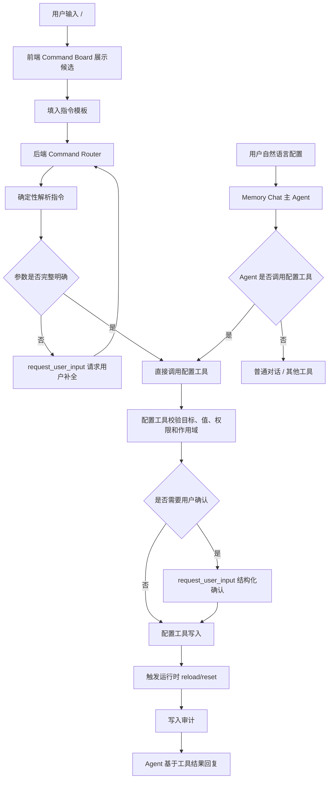

# Agent 指令配置设计

本文档定义 AiMemo 后续的“通过聊天指令配置 Agent”能力。目标是让用户用自然语言或斜杠指令调整聊天 Agent、精灵、模型、知识库和语音等运行时配置，而不是让用户手动编辑 `config.json5` / `.env`。

## 背景

当前 AiMemo 的配置主要分布在：

- `.env`：API Key、部分 provider 环境变量。
- `config.json5`：模型、精灵、Local Operator、语音等本地配置。
- 数据库：会话、知识空间挂载、声线、长期记忆、后台任务等运行时状态。

这种结构适合开发者，但对普通用户不友好。很多配置本质上是产品内的偏好或开关，例如“把聊天模型换成某个模型”“关闭精灵语音对话”“这轮对话挂载某个知识空间”“把精灵声音改成某个声线”。这些操作应该可以通过对话完成。

OpenClaw 一类 Agent 产品的可借鉴点是：配置不是孤立文件，而是 Agent 可理解、可解释、可确认的操作面。AiMemo 应吸收这个原则，但不照搬命令表；我们的指令系统要服务“本地记忆精灵 + 多 graph agent + 知识空间挂载”的产品形态。

## 目标

1. 用户可以通过聊天或精灵说话配置 Agent。
2. 常见配置支持自然语言，例如“把聊天模型切到 qwen3.5-plus”。
3. 高风险配置必须结构化确认，不能静默修改。
4. 配置修改应有审计记录、可回滚提示和明确错误。
5. `config.json5` 仍作为底层配置文件存在，但不要求用户直接编辑。
6. 指令配置结果必须能触发对应运行时 reload，例如模型 cache reset、语音状态刷新。

## 非目标

- 第一阶段不做完整脚本语言。
- 不允许用户通过指令写任意 JSON patch 到配置文件。
- 不把 API Key 明文回显给用户。
- 不把所有配置都迁入数据库；启动前必须存在的底层配置仍可保留在文件或环境变量中。

## 指令入口

AiMemo 应同时支持两类入口。

### `/` Command Board

用户在对话输入框输入 `/` 时，前端应像 OpenClaw 的 board 一样，在输入框上方弹出可选指令面板，而不是等消息发送到后端后再解释。

Command Board 的职责是前端交互，不是 Agent 推理：

- 输入 `/` 立即打开候选面板。
- 输入 `/config` 后候选项收敛到配置相关指令。
- 输入 `/mount` 后候选项收敛到知识空间挂载。
- 支持键盘上下选择、Enter 填入、Esc 关闭。
- 支持展示说明、作用域和风险标签，例如 `conversation`、`user`、`requires confirmation`。
- 选中候选项后只填充输入框模板，用户仍可编辑参数。
- 用户发送完整 `/` 指令后，后端 command router 应确定性解析并直接调用对应配置工具；不再交给 LLM 分析。
- `/` 指令参数缺失、参数歧义、多选或需要补充复杂配置时，后端 command router 必须通过 `request_user_input` 请求用户补全，不能把问题交给 Agent 继续判断。

示例候选：

```text
/config show
  查看当前模型、精灵、语音和知识空间配置。

/config elf.voice.mode <true|false>
  开启或关闭精灵语音对话。作用域：user。

/mount knowledge <space>
  将知识空间挂载到当前对话。作用域：conversation。

/agent status
  查看当前 Agent、模型和工具状态。
```

Command Board 需要从后端读取可用命令、知识空间、声线和模型候选，避免前端写死过多业务规则。

### 自然语言配置

用户直接说：

```text
把聊天模型改成 qwen3.5-plus。
精灵先别进入语音对话。
这个对话挂载“C++ 项目资料”知识库。
以后精灵说话用我刚刚做的星野声线。
```

Agent 识别到这是配置意图后，不应普通回答“好的”，而应进入配置工具调用流程。

重要：自然语言配置不应做成 Memory Chat Graph 的独立分支。不要在 `dispatch_context_workers` 之后新增一个 `detect_config_intent -> apply_config` 的岔路，因为这会给每轮普通对话增加额外判断和维护成本。

更合理的方式是把配置能力作为主 Agent 提示词和工具集合的一部分：

```text
当用户表达配置意图时，主 Agent 应调用配置工具；
当配置目标、作用域、风险或参数不明确时，主 Agent 应调用 request_user_input；
当配置成功后，主 Agent 基于工具结果给出简短确认。
```

也就是说，自然语言配置与读文件、挂载知识库、请求用户选择一样，都是 ReAct 工具循环中的一种可执行动作。

### 显式斜杠指令

面向高级用户和可复制文档，提供稳定指令：

```text
/config show
/config agent.chat.model qwen3.5-plus
/config elf.voice.mode false
/config elf.voice.default memo_elf_hoshino
/mount knowledge "C++ 项目资料"
/unmount knowledge "C++ 项目资料"
/agent status
```

斜杠指令不是唯一入口，但它和自然语言配置的执行路径不同：斜杠指令是确定性命令，应由后端 command router 解析为工具调用，Agent 不需要也不应该再分析用户意图。

## 指令分类

### 只读查询

不需要确认，可直接返回当前状态。

```text
/config show
/agent status
/agent models
/elf status
/knowledge mounts
```

典型输出：

```text
当前聊天模型：dashscope / qwen3.5-plus
当前 planner：dashscope / qwen-turbo
语音对话：disabled
当前对话挂载知识空间：C++ 项目资料、AiMemo 文档
```

### 会话级配置

只影响当前 conversation，风险较低，但仍应明确告知。

```text
/mount knowledge "AiMemo 文档"
/unmount knowledge "AiMemo 文档"
/config conversation.rag_mode strict
/config conversation.memory_recall balanced
```

这类配置应写入数据库，绑定 `conversation_id`。

### 用户级偏好

影响后续所有对话，需要确认。

```text
/config elf.voice.default "memo_elf_hoshino"
/config elf.voice.mode false
/config agent.answer_style concise
/config memory.auto_consolidate true
```

这类配置应写入用户运行时配置表或受控配置文件，并记录审计。

### 系统级配置

可能影响模型调用、费用、隐私或工具权限，必须确认。

```text
/config agent.chat.provider openai_compatible
/config agent.chat.model gpt-4.1
/config local_operator.enabled true
/config local_operator.workspace_roots "E:\\Projects"
```

必须通过 `request_user_input` 展示风险和选项，不允许一轮内静默修改。

### 密钥配置

API Key 可以通过指令引导，但不能明文存储在对话消息中作为长期上下文。

推荐方式：

```text
用户：配置阿里 API Key
Agent：弹出安全输入框 / 本地设置面板
后端：写入受控 secret store 或 .env 管理层
```

第一阶段可以只支持引导用户打开设置页，不直接在聊天中接收密钥。

## 交互流程

指令配置分两条入口：

- 显式 `/` 指令：前端 Command Board 提供输入辅助；发送后进入后端 command router，确定性解析并直接调用配置工具，不进入 LLM Agent 分析。
- 自然语言配置：不新增独立 graph 分支，由主 Agent 在同一条 Memory Chat 工具循环中判断并调用配置工具。



## 后端设计

### Agent 提示词约束

Memory Chat 主 Agent 的 system prompt 需要加入配置工具使用规则：

```text
当用户要求查看、修改、开启、关闭、切换、挂载、取消挂载、设置默认值、调整模型、调整精灵或语音能力时，
不要只用文字承诺已经修改；必须调用对应配置工具。

如果用户给出的配置目标不明确，调用 request_user_input 让用户选择。
如果配置会影响费用、隐私、工具权限、全局行为或所有会话，调用 request_user_input 确认。
如果配置工具返回失败，解释失败原因和下一步，而不是假装已生效。
```

这条约束应和现有 Local Operator / `request_user_input` 规则一样进入运行时 Agent rules，避免模型把配置请求当成普通聊天。

### 指令解析层

显式斜杠指令必须由轻量 parser / command router 确定性解析。parser 的职责是把 `/config elf.voice.mode false` 这类稳定格式直接转成配置工具调用参数，绕过 LLM 意图分析。

建议新增：

```text
backend/app/agent/commands/
  parser.py       解析斜杠指令
  registry.py     指令注册表
  schemas.py      CommandIntent / CommandResult
  policy.py       风险分级和确认策略
  router.py        将 CommandIntent 路由到受控配置工具
```

自然语言配置不走 parser 分支，由主 Agent 根据提示词和工具 schema 自行决定是否调用配置工具。第一阶段可以先在 chat API 层识别 `/` 前缀并交给 command router；自然语言路径则继续在 `memory_chat` graph 的工具层接入。

### Command Schema Registry

Command Board、command router、`request_user_input` 参数补全和配置工具校验必须共用同一份命令 schema。前端不应手写一套候选项，后端 parser 也不应维护另一套参数规则，否则后续会出现“面板能选但后端不能执行”或“后端支持但前端搜不到”的分叉。

建议把 `registry.py` 做成单一事实源，至少包含：

```json
{
  "id": "config.elf.voice_mode",
  "command": "/config elf.voice.mode",
  "title": "开启或关闭精灵语音对话",
  "description": "控制精灵是否进入持续语音对话模式，不代表 ASR/TTS 服务能力。",
  "aliases": ["/elf voice"],
  "category": "elf",
  "args": [
    {
      "name": "value",
      "type": "boolean",
      "required": true,
      "options": [
        {"label": "开启语音对话", "value": true},
        {"label": "关闭语音对话", "value": false}
      ]
    }
  ],
  "scope": "user",
  "risk": "low",
  "visibility": {
    "requires_feature": "elf",
    "developer_only": false
  },
  "executor": "set_elf_voice_mode",
  "reload": ["runtime_config", "elf_voice_state"],
  "result_view": "config_change"
}
```

这份 schema 同时驱动：

- Command Board 的候选、分类、说明、参数占位和风险标签。
- command router 的解析、参数类型校验、歧义判断和补全问题生成。
- `request_user_input` 的选项列表、单选/多选模式和默认推荐项。
- 配置工具调用前的权限、作用域、风险确认和 reload 策略。
- 指令帮助、审计日志和回滚提示。

命令 schema 不等于允许用户写任意配置路径。所有 `executor` 必须映射到受控工具，不能把用户输入直接转换成 JSON patch。

### `/` 参数补全规则

`/` 指令进入 command router 后，后续补全过程也必须保持确定性。无论缺少一个参数，还是需要填写一组复杂配置，都不允许让 Agent 介入分析。

必须调用 `request_user_input` 的情况：

- 必填参数缺失，例如 `/config elf.voice.mode` 没有给 `true|false`。
- 参数存在多个候选，例如 `/mount knowledge 项目` 命中多个知识空间。
- 参数需要多选，例如一次挂载多个知识空间。
- 参数需要用户补充自由文本，例如自定义 voice prompt、base URL、workspace root。
- 配置项后面可以接多组 key/value，例如批量设置模型 provider、model、base_url、tool_calling。
- 配置影响范围不明确，例如“当前对话”还是“全局默认”。
- 风险等级需要用户确认，例如 provider、API Key、Local Operator 权限。

补全问题应由 command router 根据命令 schema 生成：

```json
{
  "type": "request_user_input",
  "questions": [
    {
      "id": "elf_voice_mode",
      "question": "精灵语音对话要设置为哪个值？",
      "selection_mode": "single",
      "options": [
        {"id": "true", "label": "开启语音对话", "value": "true"},
        {"id": "false", "label": "关闭语音对话", "value": "false"}
      ]
    }
  ]
}
```

多选示例：

```json
{
  "type": "request_user_input",
  "questions": [
    {
      "id": "knowledge_spaces",
      "question": "要挂载哪些知识空间？",
      "selection_mode": "multiple",
      "options": [
        {"id": "space_1", "label": "AiMemo 文档", "value": "1"},
        {"id": "space_2", "label": "C++ 项目资料", "value": "2"}
      ]
    }
  ]
}
```

复杂配置示例：

```text
用户输入：
  /config agent.chat

router 行为：
  1. 读取 agent.chat 可配置 schema。
  2. 用 request_user_input 连续或批量询问 provider、model、base_url、tool_calling。
  3. 用户提交后直接调用 set_agent_model_config。
  4. 调用 reset_agent_runtime 热更新。
  5. 返回配置结果卡片。
```

禁止行为：

```text
router 发现参数缺失 -> 把原始消息交给 Agent 猜。
router 发现多个知识空间 -> 让 Agent 用文字问“你要哪个？”。
router 发现复杂配置 -> 让 Agent 自己编配置值。
```

如果 command router 无法识别 `/` 指令，也应返回确定性错误，而不是转给 Agent：

```text
未知指令：/configg
```

从 Step 2 的知识空间挂载实现得到的约束是：只有“参数缺失、参数歧义、需要多选或确认”才可以进入
`needs_input` 并渲染选项卡；一旦用户提供了完整但错误的指令，例如不存在的知识空间或错误的配置值，
就应直接 `failed`，只解释失败原因，不再给候选项。否则用户会误以为失败也是一个可继续选择的补全流程。

### Command Session Resume

`/` 指令补全、确认和多步配置可能跨越前端刷新、桌面精灵重载或用户暂时离开。command router 不能只把待补全状态放在前端内存里，而应保存一个短生命周期的 command session。

建议结构：

```json
{
  "session_id": "cmd_20260608_xxx",
  "command_id": "config.agent.chat",
  "raw_input": "/config agent.chat",
  "parsed_args": {
    "provider": "dashscope"
  },
  "missing_args": ["model", "tool_calling"],
  "status": "waiting_user_input",
  "conversation_id": "conv_xxx",
  "created_at": "2026-06-08T10:00:00+08:00",
  "expires_at": "2026-06-08T10:15:00+08:00"
}
```

恢复规则：

- 用户提交 `request_user_input` 后，后端按 `session_id` 恢复原始指令上下文，继续由 command router 执行。
- 前端刷新后，如果当前 conversation 存在 `waiting_user_input` 的 command session，应重新展示补全卡片。
- session 过期后返回明确提示，让用户重新输入指令。
- 同一 conversation 同一时间最多保留一个高风险待确认指令，避免用户误把确认提交到旧命令。
- 自然语言配置仍走 LangGraph checkpoint；显式 `/` 指令走 command session，两者都必须可恢复，但恢复机制不混用。

核心结构：

```python
class CommandIntent(BaseModel):
    command: str
    target: str
    action: str
    value: Any | None
    scope: Literal["turn", "conversation", "user", "system"]
    risk: Literal["low", "medium", "high"]
    reason: str
```

### 配置执行工具

Agent 不应直接写配置文件，应调用受控配置工具。配置工具需要像其他 ReAct 工具一样注册给主 Agent 使用：

```text
get_runtime_config
list_runtime_config_options
set_runtime_config
set_agent_model_config
list_agent_models
set_conversation_knowledge_mounts
set_default_voice_profile
set_elf_voice_mode
reset_agent_runtime
```

同一组配置工具应被两类入口复用：

- `/` 指令：command router 直接调用工具。
- 自然语言配置：主 Agent 通过 tool call 调用工具。

这样可以保证权限、确认、审计和热更新逻辑只有一套实现。

工具边界：

- `get_runtime_config`：读取当前配置，支持按作用域过滤。
- `list_runtime_config_options`：给 `/` board 和 Agent 提供可选模型、知识空间、声线、开关项。
- `set_runtime_config`：写入低风险通用配置，但不能写任意路径。
- `set_agent_model_config`：修改模型 slot，内部做 provider、tool calling、API Key 校验。
- `set_conversation_knowledge_mounts`：修改当前 conversation 挂载。
- `set_default_voice_profile` / `set_elf_voice_mode`：精灵语音专用配置。
- `reset_agent_runtime`：配置变更后热更新模型 cache、runtime config cache 或精灵状态。

所有工具必须返回结构化结果：

```json
{
  "ok": true,
  "changed": true,
  "scope": "user",
  "target": "elf.voice.mode",
  "old_value": false,
  "new_value": true,
  "reload_required": false,
  "message": "精灵语音对话已开启。"
}
```

### Command Result Message

斜杠指令的结果不应伪装成普通 assistant 推理回答。它应该作为结构化 command result 写入对话流，这样前端可以渲染成配置结果卡片，后端也能做审计和回滚。

建议结果消息包含：

```json
{
  "source": "command_router",
  "type": "command_result",
  "command": "/config elf.voice.mode true",
  "status": "success",
  "scope": "user",
  "changed": true,
  "target": "elf.voice.mode",
  "old_value": false,
  "new_value": true,
  "message": "精灵语音对话已开启。",
  "audit_id": "audit_xxx",
  "rollback_command": "/config elf.voice.mode false"
}
```

展示规则：

- 成功：显示配置变更卡片、作用域标签、是否已热更新、可选回滚指令。
- 无变化：显示“当前已经是该配置”，不写入重复审计。
- 失败：显示确定性错误、失败阶段和可执行恢复方式。
- 待确认：显示确认卡片，不提前写入配置。
- 精灵气泡只读 `message` 的短文本；详细结果仍在对话面板展示。

自然语言配置由 Agent 调用同一配置工具，最终可以由 Agent 简短总结；但底层工具结果仍应以结构化 observation / audit 保存，避免“文字说成功但实际没有生效”。

### 配置存储层

建议分三层：

```text
Layer 1: immutable bootstrap
  .env / config.json5 中启动前必须存在的值，例如后端端口、基础路径。

Layer 2: runtime config
  数据库或受控 JSON5 写入，用于用户偏好、模型 slot、精灵语音模式和默认声线。

Layer 3: conversation config
  conversation 级配置，例如知识空间挂载、当前对话 RAG 策略。
```

读取优先级：

```text
conversation override
  > user runtime config
  > config.json5
  > .env / default
```

## 与模型配置的关系

`docs/agent/model-provider-adapter.md` 已经定义模型 slot：

```text
agent_chat
planner
vision
embedding
tts
asr
```

指令配置不替代 slot 设计，而是给 slot 增加用户入口。

示例：

```text
用户：把主聊天模型切到 qwen3.5-plus
解析：
  target = models.agent_chat.model
  value = qwen3.5-plus
  scope = user
  risk = medium
执行：
  set_runtime_config("models.agent_chat.model", "qwen3.5-plus")
  reset_agent_models()
```

如果用户切换 provider：

```text
用户：把主模型切到 OpenAI
Agent 必须确认：
  1. 这会改变隐私和计费边界。
  2. 需要可用 API Key。
  3. 工具调用能力必须匹配当前 ReAct graph。
```

## 与精灵配置的关系

精灵是指令配置的主要入口之一。

需要支持：

```text
/config elf.voice.default <voice_id>
/config elf.voice.mode true|false
/config elf.bubble.max_height <number>
/elf status
```

其中精灵本体是否显示属于前端 / 桌面渲染行为，不作为 `/config` 的运行时“关闭精灵”语义。
当前优先配置的是语音对话模式、默认声线和气泡体验参数。

## 与知识库挂载的关系

知识库挂载是 conversation 级授权边界。指令可以简化操作，但不能绕过边界。

```text
用户：以后这轮对话检索 AiMemo 文档
执行：
  set_conversation_knowledge_mounts(conversation_id, ["AiMemo 文档"])
```

Agent 只能检索当前对话已挂载知识空间。即便用户说“查我的所有资料”，也不能自动扩大到未挂载空间，除非用户通过结构化确认挂载。

## 风险确认规则

必须确认：

- 修改 provider、API Key、base_url。
- 启用 Local Operator 写文件或执行命令能力。
- 扩大文件系统 workspace roots。
- 开启自动长期记忆写入或删除记忆。
- 改动会影响所有会话的用户级或系统级配置。

不需要确认：

- 查询当前配置。
- 当前 conversation 内挂载或取消挂载知识空间。
- 修改临时对话风格，例如“这轮回答短一点”。

## 审计与回滚

配置修改必须记录：

```text
actor: user / agent
conversation_id
message_id
target
old_value_hash 或 masked old value
new_value_hash 或 masked new value
scope
risk
created_at
```

对于可逆配置，结果中给出回滚指令：

```text
精灵语音对话已关闭。可用 /config elf.voice.mode true 重新开启。
```

## 前端设计要求

### Command Board

对话输入框需要支持 `/` command board：

- 面板从输入框上方弹出，不改变聊天列表布局。
- 候选项按分类展示：配置、Agent、精灵、知识空间、语音、调试。
- 每个候选展示名称、描述、作用域和风险。
- 支持 fuzzy search，例如输入 `/elf` 能搜到 `/config elf.voice.mode`。
- 支持参数占位，例如 `<space>`、`<voice_id>`，并可从后端候选中选择。
- 选中后填入输入框，不立即执行；用户发送后进入 command router。
- 如果用户发送的是完整斜杠指令，后端必须确定性解析为配置工具调用。
- 如果参数缺失、歧义、多选或需要复杂配置，command router 必须调用 `request_user_input` 补全；全程不让 Agent 介入。

### Command Visibility Policy

Command Board 的候选不应只按字符串匹配展示，还需要根据当前环境、会话和能力做可见性控制。否则用户会看到大量当前不可用的指令，执行时又频繁报错。

可见性策略由后端根据 command schema、运行时状态和权限生成，前端只负责展示：

- 当前没有知识空间时，`/mount knowledge` 可以禁用并提示“暂无可挂载知识空间”。
- 当前没有声线时，`/config elf.voice.default` 可以禁用并引导打开语音工坊。
- 没有对应 provider API Key 时，模型切换指令可以显示但标记“需要先配置密钥”。
- Local Operator、workspace roots、开发者调试指令默认隐藏，只有开发者模式或明确授权后展示。
- 语音服务能力不可用时，精灵语音相关动作指令应禁用或在执行时给出确定性失败。

候选项建议区分三种状态：

```text
visible + enabled: 当前可直接使用。
visible + disabled: 用户需要知道该能力，但当前缺少前置条件。
hidden: 当前用户或模式不应看到，避免误触高风险能力。
```

可见性只影响 UI 展示，不替代后端权限校验。即使命令被前端隐藏，后端 router 仍必须校验权限和风险。

指令结果不应只是一段文字。前端应支持：

- 配置变更结果卡片。
- 高风险确认卡片。
- 当前配置状态卡片。
- 密钥配置跳转设置页。
- 对话中展示“已应用到当前对话 / 已应用到全局”的作用域标签。

精灵气泡里只展示简短结果，详细配置结果应同步写入工坊 / 对话面板。

## 第一阶段实现建议

### Step 1：只读指令

- `/config show`
- `/agent status`
- `/elf status`
- `/knowledge mounts`
- 输入 `/` 时弹出 Command Board，并从后端 command schema registry 读取候选命令。
- 打通 command result message，以结果卡片展示只读状态。

只读实现能先打通 parser、tool、UI 卡片。

### Step 2：conversation 级指令

- `/mount knowledge`
- `/unmount knowledge`
- `/config conversation.rag_mode`

优先做低风险配置，验证对话级 override。

### Step 3：精灵配置指令

- `/config elf.voice.default`
- `/config elf.voice.mode`

需要联动 Runtime Config API、语音状态和配置文件持久化。

Step 3 的目标不是只在 command router 里硬编码三个 executor，而是把精灵相关配置收束到一套受控配置服务中，
让 `/` 指令、自然语言工具调用、设置页和桌面语音状态都读写同一份状态。

#### Step 3.1：统一配置边界

精灵配置分三类，不能混在同一个开关里：

```text
elf.voice.mode
  是否开启“持续语音对话模式”。不等于语音服务是否可用。
  作用域：user。风险：low。可回滚。

elf.voice.default
  默认精灵声线，即 voice_profiles 中 active 且 ready 的声线。
  作用域：user。风险：low。可回滚。
```

其中 `voice.enabled` / ASR / TTS provider 是“语音服务能力”，只读展示即可；`elf.voice.mode` 是用户是否让精灵进入语音对话模式。Step 1 里曾经把这两个概念展示混淆过，Step 3 必须保持命名和 UI 一致。

精灵本体是前端 / 桌面渲染组件。隐藏精灵不等于关闭精灵能力，因此不再把 `elf.enabled` 作为指令配置目标。

#### Step 3.2：存储策略

当前代码里有三个状态源：

- `elf_voice_mode_service`：`elf.voice.mode` 当前是进程内内存态，重启会丢。
- `voice_profiles`：默认声线通过 `VoiceProfile.is_active` 存储在数据库。

Step 3 建议新增一个小而明确的 runtime config service：

```text
backend/app/services/runtime_config_service.py
  get_runtime_config(path, default, scope="user")
  set_runtime_config(path, value, scope="user")
  get_effective_runtime_config(path, default)
```

读取优先级保持：

```text
database runtime config > config.json5 > settings/default
```

`elf.voice.mode` 应从内存态迁移到 runtime config / 受控配置文件，避免刷新或重启后状态丢失。默认声线也应写入受控配置，使下一次启动能恢复用户选择。

#### Step 3.3：命令行为

`/config elf.voice.mode <true|false>`

- 参数缺失：返回 `needs_input`，用单选卡展示“开启语音对话 / 关闭语音对话”。
- 参数非法：返回 `failed`，不展示候选项。
- 设置成功：写入 runtime config，返回 `success`。
- 语音服务能力不可用时：如果用户开启语音对话，返回 `failed`，说明当前 ASR/TTS 服务未启用或缺少配置；不要自动引导候选。
- 注意：这里显示的是“精灵语音对话”，不是“语音服务能力 enabled”。

`/config elf.voice.default <voice_id|name>`

- 参数缺失：返回 `needs_input`，只列出 `status=ready` 的声线，使用和 `request_user_input` 一致的单选卡。
- 名称完全匹配唯一声线：直接激活。
- 名称部分匹配多个声线：返回 `needs_input`，让用户选择具体声线。
- 声线不存在、不是 ready、或远端 voice id 不可用：返回 `failed`，只说明原因。
- 设置成功：调用现有 `activate_voice_profile`，返回 `success`，`rollback_command` 指向旧 active profile。

#### Step 3.4：Command Board 可见性

Command schema registry 需要给 Step 3 命令提供动态 options：

- `elf.voice.mode`：固定 true/false，但如果语音服务能力不可用，命令仍可见但标记 disabled 或在执行时失败。
- `elf.voice.default`：从 `voice_profiles` 读取 ready 声线；没有 ready 声线时 visible + disabled，并提示去语音工坊创建或修复声线。

前端只展示后端 schema，不手写声线列表或语音状态判断。后端 executor 仍必须重新校验，不能依赖前端隐藏。

#### Step 3.5：结果展示与经验约束

沿用 Step 2 得到的展示规则：

- `needs_input`：才展示可选项卡；单选/多选视觉复用 `request_user_input`。
- `failed`：只展示失败结果卡片，不展示候选按钮、不展示“可选空间/声线”列表。
- `noop`：展示当前已经是该值。
- `success`：展示旧值、新值、作用域、reload 状态和回滚指令。

这能避免“失败以后又弹一堆候选”的歧义，也能避免命令结果卡片和用户补全卡片长得像两个系统。

#### Step 3.6：实现顺序

推荐按以下顺序落地：

1. 增加 runtime config service 和受控配置写入，先支持 `elf.voice.mode` 和 `elf.voice.default_profile_id`。
2. 改 Runtime Config API，让前端和桌面都能读取语音模式 effective runtime config。
3. 在 command registry 新增 `config.elf.voice.mode` 和 `config.elf.voice.default`。
4. 在 command router 接入两个 executor，并复用通用布尔解析、声线解析和 `needs_input` 结果构造。
5. 前端 Command Board 和 Command Result Card 不新增特殊视觉，只消费 schema/options/result。
6. 补测试：成功、noop、缺参数 needs_input、非法参数 failed 无候选、声线未 ready failed、rollback command。

### Step 4：模型 slot 配置指令

- `/config agent.chat.model`
- `/config agent.chat.provider`
- `/config planner.model`

必须接入 `reset_agent_models()`，并做好 provider 能力校验。

### Step 5：设置页联动

把聊天指令和设置 UI 做成同一套后端 API。用户从 UI 修改和从 Agent 指令修改，最终都走同一条验证、审计、reload 流程。

### Step 6：会话恢复与可见性策略

- 为 `/` 补全和确认增加 command session resume。
- 前端刷新后恢复待补全指令卡片。
- Command Board 接入 visibility policy，区分 enabled、disabled 和 hidden。
- 对高风险待确认指令增加过期时间和单会话互斥保护。

## 设计原则

1. 指令配置是产品能力，不是隐藏开发者后门。
2. Agent 可以解释配置，但不能绕过确认和权限。
3. 自然语言配置不新增 graph 分支，应通过主 Agent 提示词和配置工具完成。
4. 高风险配置必须结构化确认。
5. 配置修改必须有明确作用域。
6. 运行时 reload 必须显式触发，不能依赖用户重启猜测。
7. API Key 等 secret 不进入普通聊天历史和长期记忆。
8. `/` Command Board 是输入辅助；完整 `/` 指令发送后走 command router，不走 LLM Agent 分析。
9. `/` 指令和自然语言配置必须复用同一组后端配置工具，避免两套权限和审计逻辑分叉。
10. `/` 指令的参数补全、歧义消解、多选和风险确认都由 command router 通过 `request_user_input` 完成，不能回退给 Agent。
11. Command schema registry 是指令面板、解析、补全、权限、审计和结果渲染的单一事实源。
12. 斜杠指令结果是结构化 command result，不是普通 assistant 自由文本。
13. 斜杠指令的补全和确认必须可恢复，刷新后不能丢失待处理状态。
14. Command Board 的可见性由后端策略控制，但后端权限校验永远不能依赖前端隐藏。
