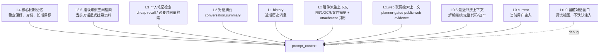
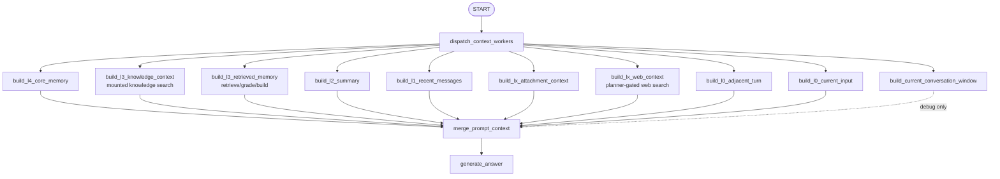

# Context Pyramid

本文档记录 Ai 记对话回答前的“金字塔上下文构建层”。

## 代码位置

```text
backend/app/agent/context/pyramid.py
  定义 ContextBudget、ContextLayer、PyramidPromptContext。
  负责把 L4/L3.5/L3/L2/L1 history/L0.5 adjacent/L0 current 组装成 prompt_context。

backend/app/agent/graphs/memory_chat/nodes.py
  dispatch_context_workers 使用 LangGraph Send 分发上下文 worker。
  merge_prompt_context 汇总 worker 结果。
  generate_answer 只消费 prompt_context，不再自行拼接上下文。
  build_lx_attachment_context 用于把图片等附件转换为可注入上下文的派生文本。

backend/app/agent/graphs/memory_chat/graph.py
  在 retrieve/grade 或 direct 分支之后加入上下文 worker 分发与汇总节点。

backend/tests/test_context_pyramid.py
  覆盖预算裁剪、摘要接入、weak/poor 检索策略。
```

## 分层结构



## 当前实现

```text
L4 核心长期记忆
  读取 longtermmemory 表中的 active level=4 记忆。

L3.5 挂载知识空间检索
  只读取当前 conversation 显式挂载的知识空间。
  未挂载时只输出 no-scope 说明，不做全局知识库检索。
  已挂载时默认先检索挂载资料；仅非常明确的闲聊或客观常识问题才跳过首轮检索。

L3 个人笔记检索
  在 L3 worker 内部每轮默认执行 cheap recall、检索门控、检索评分和 layer 构建。
  cheap recall 使用关键词/标题/标签/摘要匹配，不请求 embedding。
  只有明确个人记忆意图、个人画像问题，或可选 planner 明确要求时，才升级向量检索。
  planner 不再决定是否执行 cheap recall；它只作为可选 query rewrite 或显式升级向量检索的辅助。
  这样可以避免“看似普通常识题、实际关联用户笔记”的问题丢失个人语境。
  根据 retrieval_grade 决定是否进入 prompt。
  good: 纳入检索 chunk。
  weak: 只纳入少量候选，并提示只能谨慎参考。
  poor / none: 不纳入弱相关 chunk，避免诱导模型编造。

L2 对话摘要
  读取 conversation.summary。
  滚动摘要由 conversation_summary_graph 异步生成。

L1 近期对话窗口
  从最新消息向前装入，直到达到 recent_message_tokens。
  最终渲染时恢复为时间正序。该层作为 history 明确标注，不能和当前输入混为同一指令。

L0.5 最近邻接上下文
  从当前输入前最近 1-2 条 completed 消息中构建一个小窗口，并附加 user(current)。
  它专门用于解析“继续”“完整代码”“这个/上面/刚才那个”等省略指代。
  如果 L2 摘要或更早 L1 历史与 L0.5 冲突，回答必须优先绑定 L0.5。

L0 当前用户输入
  单独保存本轮必须回答的问题。agent_think 以它作为新任务边界。

Lx 附件派生上下文
  处理当前轮或被检索到的图片、文件等附件。
  原始附件作为证据保存到 attachment storage，prompt 中默认注入的是 metadata、
  未来的 OCR、caption、key facts、尺寸、来源路径等派生文本，而不是把历史图片重新塞进每一轮模型输入。
  派生文本必须保留 attachment_id / storage_path / source_hash，方便 agent 在派生信息
  不够时重新打开原图或重新解析。

Lx.web 联网搜索上下文
  可选的公网时效信息层。由 planner 基于当前用户输入和本地上下文判断是否需要联网，
  需要时生成最小化 query，再交给 web_search_service 执行搜索、缓存、限额、隐私确认和
  web_fetch 来源核验。该层不属于 L4 长期记忆、L3 个人笔记或 L3.5 挂载知识库；它只是本轮
  临时外部证据，必须保留 query、provider、来源 URL、fetch 状态和审计信息。
  当本地笔记/知识库足以回答时，planner 应跳过 Lx.web。

L1+L0 当前对话窗口
  把近期消息和当前用户输入合并为连续对话，当前输入使用 user(current) 标记。
  该层保留给调试/图状态查看，不再作为最终 prompt 和工具 planner 的默认输入。
  原因是连续窗口容易让 agent 把历史 assistant 草稿误当成本轮 current 指令。
```

## 预算

预算定义在 `ContextBudget`：

```text
core_memory_tokens = 1200
retrieved_memory_tokens = 6000
summary_tokens = 2000
conversation_window_tokens = 6000
recent_message_tokens = 4000
adjacent_message_tokens = 1200
weak_retrieval_max_chunks = 3
```

运行时会优先读取 `config.json5` 的 `context_pyramid` 配置，当前项目默认配置为：

```json5
"context_pyramid": {
  "core_memory_tokens": 2400,
  "retrieved_memory_tokens": 12000,
  "summary_tokens": 4000,
  "recent_message_tokens": 8000,
  "adjacent_message_tokens": 1200,
  "conversation_window_tokens": 10000,
  "weak_retrieval_max_chunks": 5,
}
```

`retrieved_memory_tokens` 会同时用于 L3 个人笔记检索和 L3.5 挂载知识空间检索；如果两者同轮出现，会分别占用这一预算。`adjacent_message_tokens` 必须保持较小，目标是“近而准”，不是替代 L1。L0 当前用户输入没有单独 token 上限，会原样保留。

历史上曾把 `summary_tokens`、`recent_message_tokens`、`conversation_window_tokens` 放到数万甚至十万级，这会让旧题目、旧代码和旧摘要在模型注意力里获得过高权重，出现“用户追问本轮题目，模型回答上一道题”的串题现象。默认预算现在收敛到 4k/8k/10k，并增加 L0.5 邻接层作为省略指代的硬锚点。

## Worker 模式

当前上下文构建已经使用 LangGraph `Send` worker：



上下文 worker 之间数据依赖很少，天然适合并行。每个 worker 写入独立 state 字段：

```text
context_l4_layer
context_l3_knowledge_layer
context_l3_layer
context_l2_layer
context_conversation_window_layer
context_l1_layer
context_lx_attachment_layer
context_lx_web_layer
context_l0_adjacent_layer
context_l0_layer
```

`merge_prompt_context` 按 L4 -> L3.5 mounted knowledge -> L3 personal notes -> L2 -> L1 history -> Lx attachments -> Lx.web -> L0.5 adjacent -> L0 current
顺序还原为 `PyramidPromptContext`，并渲染为最终 `prompt_context`。L1+L0 当前对话窗口只用于
调试和后续状态树，不再默认进入最终 prompt，避免跨任务 continuation 过触发。

## 防串题策略

当用户输入很短，且包含“继续”“完整代码”“改一下”“这个不对”等省略指代时，模型最容易从旧摘要或远期历史里捞错主题。当前策略分三层处理：

```text
1. L0 当前输入仍是必须回答的问题。
2. L0.5 最近邻接上下文提供最近一轮语义锚点，用于解析省略指代。
3. L2 滚动摘要只承接较早背景；若和 L0.5/L1 冲突，必须让位于最近上下文。
```

`conversation_summary_graph` 的摘要 prompt 同步收紧：旧任务不得被写成当前任务；如果新增消息切换主题，旧主题必须降级为历史背景或已解决事项；摘要正文控制在 1200 字以内，避免把大量原始历史重新塞回 L2。

L3 worker 是一个强制个人笔记 RAG worker：

```text
retrieve_notes
  -> grade_retrieval
  -> build_l3_context_layer
```

主图不再把检索规划放在所有上下文 worker 前面；生产默认路径也不再调用检索规划 LLM。L0/L1/L2/L4 可以和 L3 检索链路并行执行。

## 图片与附件上下文策略

附件处理不把“记录原图”和“提取文字”做成二选一：

```text
原始附件
  作为证据保存，包含 attachment_id、storage_path、mime_type、size、width、height、sha256。
  对用户可见，也可被 agent 在必要时重新解析。

派生文本
  作为上下文和检索入口，包含 OCR、caption、key facts、标签、坐标/尺寸 metadata。
  当前上传阶段先生成基础 metadata 派生文本；只要本轮用户消息挂载了图片，
  build_lx_attachment_context 会主动调用视觉模型生成 vision 派生文本并注入上下文。
  inspect_image_attachment 仍作为后续追问或重新解析工具保留。OCR、caption、key facts
  的更细粒度后台持久化派生仍可后续扩展。
  派生文本是可重算、可过期的，不等同于原图真相。

上下文注入
  默认注入派生文本和原图引用，不在每轮历史上下文中重复注入完整图片。
  当前轮新上传图片可以按模型能力直接作为 image block 进入回答模型。
```

`build_lx_attachment_context` 的目标职责：

```text
1. 读取当前 user message 关联的附件，以及 L1/L2/L3 中提到的 attachment 引用。
2. 对当前轮新图片自动生成或读取 vision 派生文本，优先产出足够回答本轮问题的图片内容。
3. 对历史图片默认只注入已保存派生文本和 attachment_id/storage_path。
4. 如果派生文本不足，prompt 中必须让 agent 能看到可回源的 attachment 引用，
   后续通过 inspect_image_attachment 重新读取原图，而不是基于不完整 caption 编造。
5. 把最终结果写入 context_lx_attachment_layer，交给 merge_prompt_context 合并。
```
