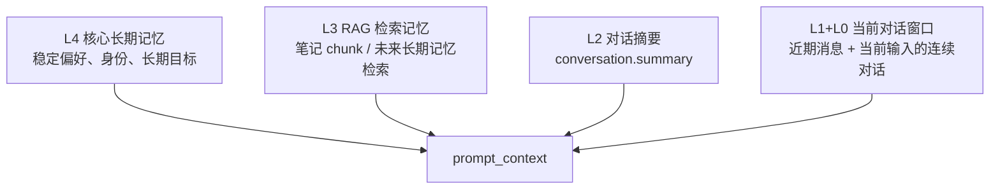
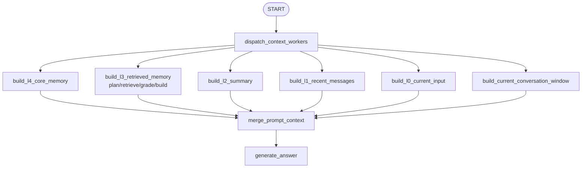

# Context Pyramid

本文档记录 Ai 记对话回答前的“金字塔上下文构建层”。

## 代码位置

```text
backend/app/agent/context/pyramid.py
  定义 ContextBudget、ContextLayer、PyramidPromptContext。
  负责把 L4/L3/L2 和 L1+L0 当前对话窗口组装成 prompt_context。

backend/app/agent/graphs/memory_chat/nodes.py
  dispatch_context_workers 使用 LangGraph Send 分发上下文 worker。
  merge_prompt_context 汇总 worker 结果。
  generate_answer 只消费 prompt_context，不再自行拼接上下文。

backend/app/agent/graphs/memory_chat/graph.py
  在 retrieve/grade 或 direct 分支之后加入上下文 worker 分发与汇总节点。

backend/tests/test_context_pyramid.py
  覆盖预算裁剪、摘要接入、weak/poor 检索策略。
```

## 分层结构



## 当前实现

```text
L4 核心长期记忆
  读取 longtermmemory 表中的 active level=4 记忆。

L3 RAG 检索记忆
  在 L3 worker 内部完成检索规划、向量检索、检索评分和 layer 构建。
  根据 retrieval_grade 决定是否进入 prompt。
  good: 纳入检索 chunk。
  weak: 只纳入少量候选，并提示只能谨慎参考。
  poor / none: 不纳入弱相关 chunk，避免诱导模型编造。

L2 对话摘要
  读取 conversation.summary。
  滚动摘要由 conversation_summary_graph 异步生成。

L1 近期对话窗口
  从最新消息向前装入，直到达到 recent_message_tokens。
  最终渲染时恢复为时间正序。该层主要用于调试和后续状态树。

L0 当前用户输入
  单独保存本轮必须回答的问题，主要用于调试和节点排查。

L1+L0 当前对话窗口
  把近期消息和当前用户输入合并为连续对话，当前输入使用 user(current) 标记。
  这是最终 prompt 的底层对话上下文，也是工具 planner 的优先输入。
```

## 预算

预算定义在 `ContextBudget`：

```text
core_memory_tokens = 300
retrieved_memory_tokens = 1200
summary_tokens = 500
conversation_window_tokens = 1200
recent_message_tokens = 1000
weak_retrieval_max_chunks = 3
```

当前预算是工程初值，不是最终参数。后续可以根据真实对话长度、模型上下文窗口和回答质量继续调。

## Worker 模式

当前上下文构建已经使用 LangGraph `Send` worker：



上下文 worker 之间数据依赖很少，天然适合并行。每个 worker 写入独立 state 字段：

```text
context_l4_layer
context_l3_layer
context_l2_layer
context_conversation_window_layer
context_l1_layer
context_l0_layer
```

`merge_prompt_context` 按 L4 -> L3 -> L2 -> 当前对话窗口顺序还原为
`PyramidPromptContext`，并渲染为最终 `prompt_context`。单独 L1/L0 不直接进入
最终 prompt，避免模型把近期消息和当前输入割裂开。

L3 worker 是一个局部 RAG worker：

```text
plan_l3_retrieval
  -> retrieve_notes
  -> grade_retrieval
  -> build_l3_context_layer
```

主图不再把检索规划放在所有上下文 worker 前面，因此 L0/L1/L2/L4 可以和 L3 检索链路并行执行。
