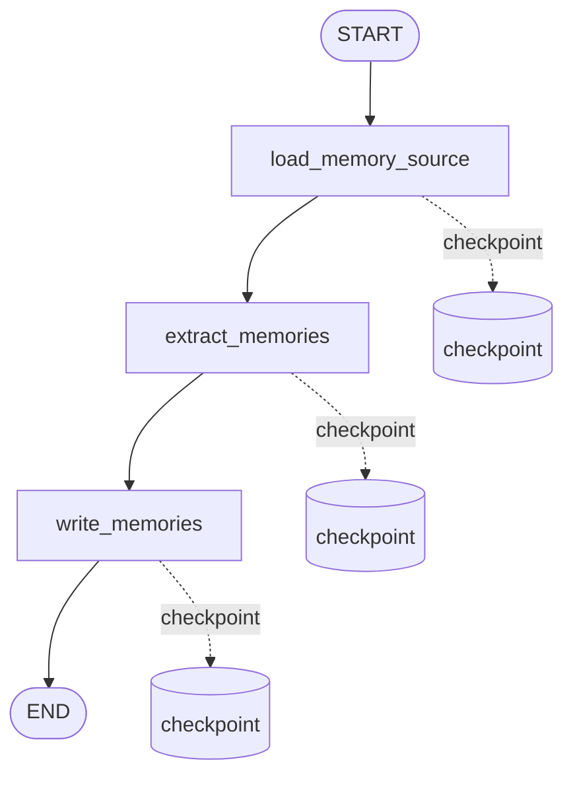

# Conversation Memory Graph

`conversation_memory_graph` 负责从一轮对话中抽取 L4 核心长期记忆。它通过 job 后台执行，不阻塞主聊天回答。

用户可通过 Memories API 管理这些长期记忆，详见：

```text
docs/backend/memories.md
docs/api/memories.md
```

## 流程



## 节点职责

```text
load_memory_source
  根据 payload 读取 user_message_id 和 assistant_message_id。
  第一版只处理一问一答，边界清晰，方便排查。

extract_memories
  调用 qwen3.5-plus 判断是否有值得长期记住的信息。
  调用时绑定 response_format={"type":"json_object"}，优先让模型进入 JSON mode。
  输出 extraction_result，并写入 LangGraph checkpoint。
  模型输出会先经过 parse_memory_extraction_response 归一化。
  如果模型偶发返回非严格 JSON，则降级为 {"memories": []}，不让后台 job 失败。

write_memories
  将高质量记忆写入 longtermmemory。
  写入前过滤 should_write=false、低 importance、低 confidence 的候选。
  使用 content_hash 去重，避免重复记忆。
```

## Job 约定

```text
type: conversation_memory
graph_name: conversation_memory_graph
payload:
  {
    "conversation_id": 1,
    "user_message_id": 10,
    "assistant_message_id": 11
  }
thread_id: job:{job_id}
dedupe_key: conversation_memory:assistant_message:{assistant_message_id}
```

## 写入规则

第一版采用保守阈值：

```text
should_write = true
importance >= 0.7
confidence >= 0.6
content 非空
content_hash 不重复
```

支持的 `category`：

```text
preference
identity
goal
instruction
event
fact
```

所有写入的记忆第一版都使用：

```text
level = 4
status = active
source_type = chat_message
source_id = assistant_message_id
```

## 恢复语义

```text
如果 graph 在 extract_memories 后中断：
  extraction_result 已进入 checkpoint。
  恢复时直接执行 write_memories。
  不重复调用 LLM。

如果 write_memories 被重复执行：
  content_hash 去重会跳过已存在记忆。
```

## JSON 解析容错

长期记忆抽取属于后台增强任务，不阻塞用户当前回答。这里的失败策略偏保守：

```text
模型返回合法 JSON
  -> 正常进入 write_memories。

模型支持 JSON mode
  -> extract_memories 通过 response_format={"type":"json_object"} 请求严格 JSON。

模型返回 markdown / 夹杂解释文本
  -> parse_json_object 会尝试截取 JSON object。

模型返回缺逗号、字段类型异常等非严格 JSON
  -> 记录 warning 日志。
  -> extraction_result 降级为 {"memories": []}。
  -> job 继续完成，不写入长期记忆。
```

这样做的取舍是：宁可少写一条长期记忆，也不要因为模型格式波动污染 job 队列。

## 当前限制

第一版暂不实现：

```text
长期记忆向量化
记忆冲突检测
用户确认机制
记忆编辑 UI
多 worker 分类抽取
```

后续可以把 `extract_memories` 拆成 preference / identity / goal / instruction 等多个 worker 并行抽取，再由 synthesizer 合并结果。
