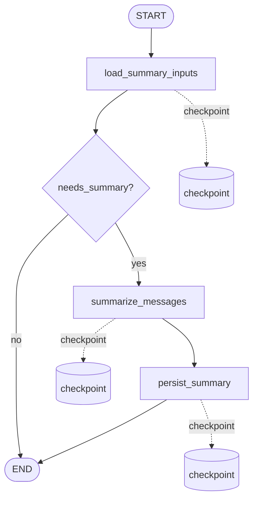

# Conversation Summary Graph

`conversation_summary_graph` 负责更新 L2 对话滚动摘要。它通过本地 job 后台执行，不阻塞用户聊天。

## 流程



## 节点职责

```text
load_summary_inputs
  读取 conversation.summary 和 summary_message_id。
  加载 summary_message_id 之后的 completed user/assistant 消息。
  计算未摘要 token 总量，判断是否超过阈值。

summarize_messages
  调用 qwen3.5-plus 生成新的滚动摘要。
  输出 generated_summary，并写入 LangGraph checkpoint。

persist_summary
  写回 conversation.summary。
  写回 conversation.summary_message_id = 本次处理到的最后一条消息 id。
  写入前再次检查 summary_message_id，避免重复推进。
```

## Job 约定

```text
type: conversation_summary
graph_name: conversation_summary_graph
payload: {"conversation_id": 1}
thread_id: job:{job_id}
dedupe_key: conversation_summary:conversation:{conversation_id}
```

## 触发规则

第一版使用固定阈值：

```text
未摘要消息 token 总量 > 1500
  -> 创建 conversation_summary job
```

聊天完成后会即时检查一次；`JobReconciler` 也会周期性扫描 active conversations，补建漏掉的摘要 job。

## 幂等与恢复

```text
如果 graph 在 summarize_messages 后中断：
  generated_summary 已在 checkpoint 中。
  恢复执行时从 persist_summary 继续。
  不重复调用 LLM。

如果 persist_summary 被重复执行：
  当 conversation.summary_message_id >= 本次 last_message_id 时直接跳过。
```

## 摘要边界

L2 摘要只服务当前 conversation 的上下文压缩。它可以保留：

```text
当前讨论主题
用户当前目标和计划
本会话内尚未解决的问题
重要事实和偏好线索
```

稳定身份、长期偏好、长期目标后续应由 L4 长期核心记忆 graph 处理，不放在本 graph 中完成。
