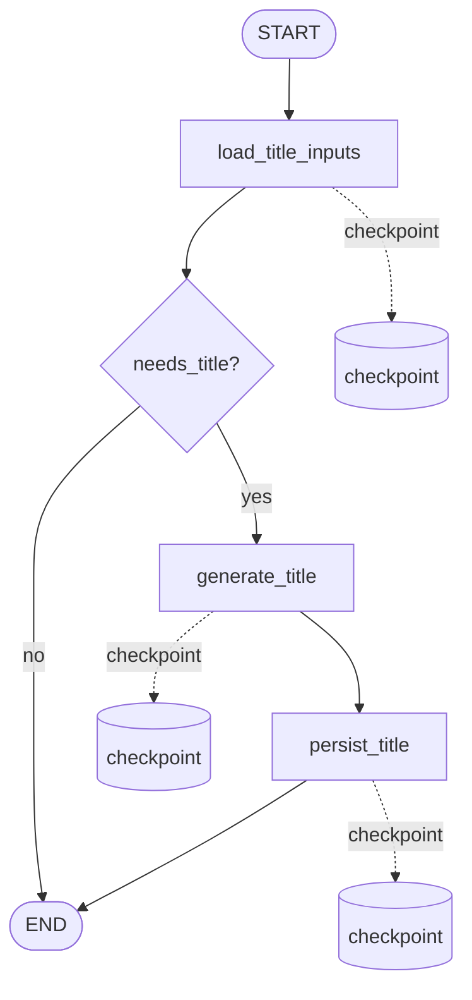

# Conversation Title Graph

`conversation_title_graph` 在用户发出第一条消息后，异步给会话生成一个简短的中文标题，
让侧栏的对话卡片从默认的「新对话」变成可识别的话题摘要。它通过本地 job 后台执行，
不阻塞用户聊天。

## 流程



## 节点职责

```text
load_title_inputs
  读取 conversation.title。
  若已被人工命名或被其他 job 写过（title != "新对话"），直接 needs_title=False。
  否则读取最早一条 completed 的 user 消息作为命名输入。

generate_title
  调用 qwen3.5-plus 生成 ≤ 16 字的中文短标题。
  LLM 异常时降级为前 12 字截断 + …，保证不会卡住。
  统一通过 _normalize_title 去引号、去「标题：」前缀、超长截断。

persist_title
  写回 conversation.title。
  写入前再次检查 title 是否仍为「新对话」，避免覆盖人工命名。
```

## Job 约定

```text
type: conversation_title
graph_name: conversation_title_graph
payload: {"conversation_id": 1}
thread_id: job:{job_id}
dedupe_key: conversation_title:conversation:{conversation_id}
```

## 触发规则

由 `enqueue_conversation_title_job_if_needed` 在 `chat_service` 的非流式 / 流式
回复完成后调用：

```text
conversation.title == "新对话" 且存在 ≥ 1 条 completed user 消息
  -> 创建 conversation_title job（按 dedupe_key 幂等）
```

worker 每 2 秒轮询一次 jobs 表，配合前端 1.5s / 4.5s 的两次列表刷新，
侧栏标题通常会在用户消息发完后 3–5 秒内更新。

## 幂等与恢复

```text
title != "新对话" 时 load_title_inputs 直接返回 needs_title=False，graph 即结束。
generate_title 后写入 checkpoint：恢复执行从 persist_title 继续，不重复调用 LLM。
persist_title 写库前再判一次 title，避免与人工命名冲突。
```

## 与其他 graph 的边界

- 该 graph 只关心「首次命名」，不会重写已有标题。
- 后续如果要支持 LLM 重命名或合并对话主题，可以新增 `conversation_rename_graph`，
  本 graph 不变。
- 删除会话时，`delete_conversation` 会按 `dedupe_key LIKE 'conversation_%:conversation:{id}'`
  一并清掉本会话排队中的 title job。
