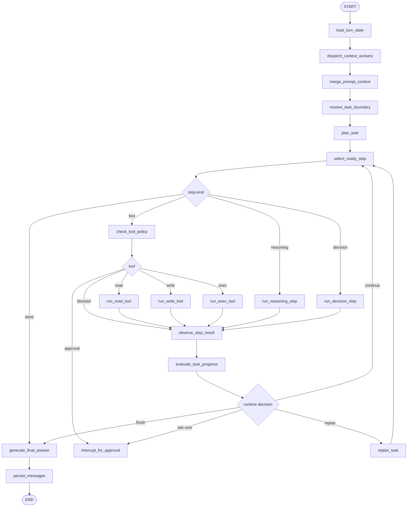
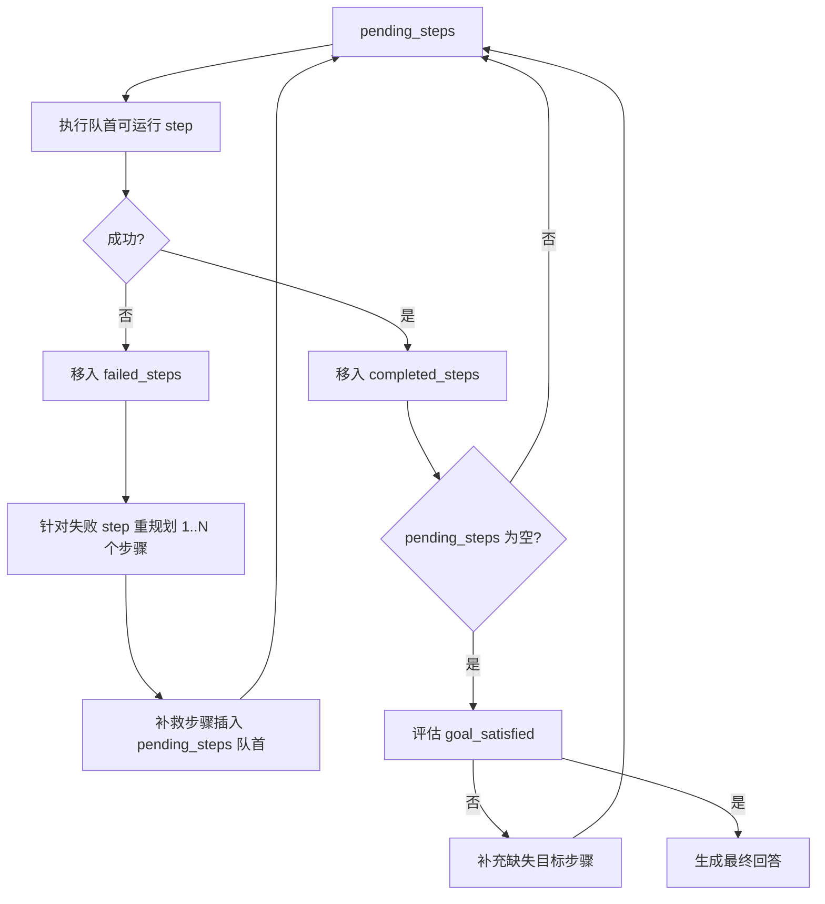
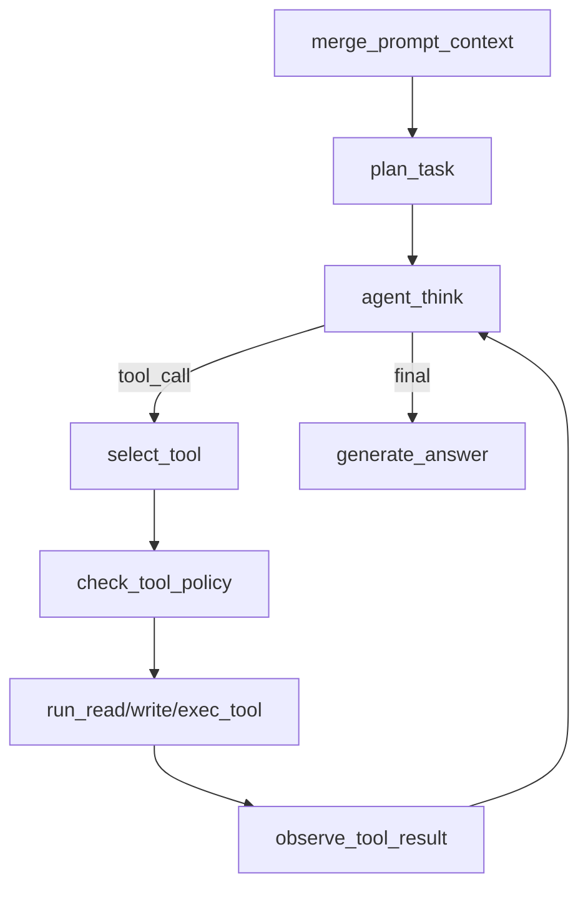

# Dynamic Execution Graph 设计

本文档定义 Memory Chat Agent 从“下一步工具选择器”升级为“动态任务执行器”的目标结构。

## 背景

当前主对话 graph 已经有工具循环：

```text
agent_think
  -> select_tool
  -> run_read_tool / run_write_tool / run_exec_tool
  -> observe_tool_result
  -> agent_think
```

这解决了“工具结果回不到 agent”这一层问题，但还没有解决任务层问题：

- 当前用户输入可能是一个新的任务，也可能是在确认上一轮任务。
- 一个任务通常不止一步，工具调用之间有依赖。
- 工具会失败，执行世界会变化，原计划可能失效。
- 后续工具能力会继续扩展，不能为每种用户请求写一条特化流程。

因此，后续不应继续把 `agent_think` 扩成大量规则分支，而应让 agent 先形成显式执行计划，
再基于计划、真实 observation 和 world state 动态执行与重规划。

## 核心结论

AiMemo 需要的是 Dynamic Execution Graph：

- LangGraph 外层拓扑稳定，负责 checkpoint、stream、interrupt、状态恢复。
- Task 内部计划动态，运行时可以插入、替换、取消或重试 Step。
- 每次工具执行后更新 WorldState，让 agent 基于事实继续行动。
- 执行失败或计划偏航时触发 Replan，而不是直接凭最终回答收尾。

它不是传统固定 FSM。固定的是 runtime 节点职责，不固定的是用户任务 DAG。

## 不做的事

本设计不把 agent 变成一堆请求特化：

```text
读取 JSON 并改字段 -> 单独规则
修改 Python import -> 单独规则
运行项目失败后换 wheel -> 单独规则
```

确定性工具策略仍然需要，例如敏感文件拦截、read-before-write、exec 审批。
但“用户目标应该分几步完成”由 Task Plan 表达，不由业务代码为每个自然语言句式写死。

## 总体结构



第一版可以把 `run_reasoning_step`、`run_decision_step` 合并成一个 reasoning runtime，
但 state schema 必须先允许这两类 Step。

## 核心对象

### Task

Task 表达“当前 agent 正在完成的用户目标”。

```python
Task {
    id: str
    goal: str
    source_user_message: str
    status: TaskStatus
    plan_version: int
    current_step_id: str | None
    pending_steps: list[Step]
    completed_steps: list[Step]
    failed_steps: list[Step]
    steps: list[Step]  # 兼容 UI/checkpoint 的镜像字段
    world_state: WorldState
    execution_history: list[ExecutionEvent]
    replan_count: int
    created_at: str
    updated_at: str
}
```

第一版执行模型采用“待完成队列 + 执行历史栈”：



这里使用队列语义而不是严格 LIFO 栈语义：失败 step 可以扩展为多个补救步骤，
但原先还未执行的后续 step 必须留在补救步骤之后等待，不能越过失败继续运行。

### TaskStatus

```text
PLANNING
READY
RUNNING
WAITING_APPROVAL
WAITING_USER_INPUT
REPLANNING
COMPLETED
FAILED
CANCELLED
SUPERSEDED
```

`SUPERSEDED` 表示“旧任务被当前用户的新任务取代”。
例如上一轮在写 Rust 文件，本轮用户明确要求读取并修改 `config.json`，
旧任务不能继续消费当前输入。

## 当前落地状态

当前 Memory Chat Graph 已经把全局规划从 `agent_think` 拆到独立 `plan_task` 节点：



职责边界：

- `plan_task` 只负责生成或保留全局 `Task`。
- `agent_think` 只负责基于 `Task + WorldState + WorldStatus` 执行下一步。
- `pending_steps` 是执行来源；成功 step 移入 `completed_steps`，失败 step 移入
  `failed_steps` 后由 replanner 生成新的队首补救步骤。
- `WorldState` 记录事实，`WorldStatus` 判断目标是否满足、缺少哪些要求、是否需要重规划。
- 工具 observation 不能单独终止任务；终止必须由 `WorldStatus` 和 task 状态共同决定。
- `failed_steps` 是执行历史，不代表永久阻塞；是否仍需重规划由尚未解决的 active failure
  与 `missing_requirements` 决定。
- 只要 task 存在，`agent_think` 必须通过 `pending_steps` 执行，不能回退到旧的单步工具
  planner。否则工具 observation 会脱离 Task 队列，导致 WorldState 与执行计划不一致。
- 如果当前用户输入是“可以/继续/直接覆盖/按你说的”这类短确认，且上一轮 assistant
  明确提出了覆盖、保存、运行、测试等本地操作建议，`plan_task` 必须把它视为
  continuation，并结合 history 规划真实工具步骤，不能直接进入普通回答。
- 如果 `pending_steps` 非空但没有 ready step，graph 会生成 `INVALID_PLAN_DEPENDENCY`
  或 `NO_READY_STEP`，把它作为 `WorldStatus.last_error` 交给 replanner。
- replan 合并策略分三类：
  - step failure：补救步骤 `prepend` 到 pending 队首，保留原 pending tail。
  - invalid plan：新步骤 `replace` 旧 pending，避免重复拼接非法计划。
  - missing goal：补充步骤 `append` 到 pending，用于缺少运行结果等目标缺口。
- replanner 也可以返回 `plan_patch.drop_failed_step`。它只在失败 step 不再被任何
  pending step 依赖时生效：失败记录保留在 `failed_steps`，task 解除 `REPLANNING`
  并继续执行原 pending 队列。如果 pending 仍依赖该失败 step，必须生成补救步骤。
- 同一个 `step.id` 在同一队列/历史中会被合并，不会无限重复堆积。重复尝试通过
  `attempt_count` 和 `last_error` 表达，便于前端展示和 replanner 判断。
- replanner 不能无变化地重复执行完全相同的失败工具调用；如果要重试同类工具，
  必须先改变前置条件，例如读取信息、修改文件、调整参数或生成新的中间产物。

第一版 `WorldStatus` 字段：

```python
WorldStatus {
    goal_satisfied: bool
    missing_requirements: list[str]
    requires_replan: bool
    replan_reason: str
    last_error: dict | None
    blocked_step_id: str | None
    recovery_hint: str
    recovery_path: str | None
    completed_steps: list[str]
    failed_steps: list[str]
    next_step_id: str | None
}
```

当前确定性恢复策略：

- `READ_BEFORE_WRITE_REQUIRED` -> `read_file(original_path)` -> `write_file(original_path, overwrite=true)`。
- 恢复过程必须使用原 `write_file.path`，不能切换到其他路径绕过保护。
- 如果目标要求运行结果，但只有写入 observation，没有成功 `exec_command` observation，
  `WorldStatus.requires_replan=true`，由 replan 补运行步骤或修复后续步骤。
- read-before-write 是机械恢复，不增加语义 `replan_count`；恢复完成后仍会回到
  `WorldStatus` 检查原始目标是否满足。
- 编译、运行、测试类失败不做语言特化规则。`WorldState` 保留 stdout/stderr 和已读写文件，
  通用 replanner 基于这些 observation 决定后续步骤。成功 exec 后，旧的 exec failure
  会被视为 resolved，避免继续重复恢复。
- 缺少运行结果时的机械 fallback 只在“还没尝试运行”或“失败后前置条件已变化”时补
  `exec_command`。如果同一 command/cwd 已失败，且失败后没有成功的 read/write/list/search
  等 observation 改变认知或文件状态，fallback 必须停止，避免在同一错误上循环。
- 工具失败不会只传 `error_code`：`WorldState.failures`、`WorldStatus.last_error`、
  step.`last_error` 和 replanner prompt 的 `recent_failures` 都应包含 command、cwd、
  exit_code、stdout_excerpt、stderr_excerpt 等摘要，确保 agent 能看到真实失败原因。
- 每次 LLM replanner 调用都会把压缩调试记录写入 `WorldState.replan_debug`，包括
  `world_status`、`recent_failures`、prompt 摘要、raw response、解析后的 payload、
  接受或拒绝原因。前端点击 `agent_think` 等节点查看 state 时，可通过
  `task.world_state.replan_debug` 判断问题出在模型规划、JSON 解析还是步骤合并。
- 回答层不能越过 observation 声称本地操作完成。如果本轮是本地操作 continuation，
  但没有任何 `write_file` / `exec_command` observation，`generate_answer` 必须直接
  阻断完成态回答；如果没有成功的 `exec_command` observation，也不能编造运行结果。

### Step

Step 是动态计划中的节点，不等同于工具调用。

```python
Step {
    id: str
    description: str
    kind: "tool" | "reasoning" | "decision" | "final"
    tool_name: str | None
    arguments: dict
    dependencies: list[str]
    status: StepStatus
    retry_count: int
    attempt_count: int
    output_ref: str | None
    last_error: dict | None
    error: dict | None
}
```

### StepStatus

```text
PENDING
READY
EXECUTING
COMPLETED
FAILED
BLOCKED
WAITING_APPROVAL
CANCELLED
SUPERSEDED
```

### WorldState

WorldState 是 agent 对“执行后世界已经变成什么样”的事实视图。

```python
WorldState {
    cwd: str | None
    known_files: dict
    read_files: dict
    written_files: dict
    generated_outputs: dict
    observations: list[ToolObservation]
    failures: list[Failure]
    approvals: list[ApprovalRecord]
}
```

第一版最重要的是：

- 读到的文件内容、路径、hash。
- 已写入的文件路径、hash。
- exec 的 stdout、stderr、exit_code、cwd。
- 已失败步骤与错误码。
- reasoning step 生成的可供后续 write 使用的文本内容。

如果没有 WorldState，agent 只能从聊天文本和 observation 摘要里猜，
很容易出现“上一轮做过什么”和“本轮世界事实”混淆。

### ExecutionEvent

ExecutionHistory 记录任务真实运行轨迹。

```python
ExecutionEvent {
    id: str
    type: "planned" | "step_started" | "step_completed" | "step_failed" | "replanned" | "superseded"
    step_id: str | None
    summary: str
    payload: dict
    created_at: str
}
```

它既用于调试面板，也用于 replanner 理解已经发生了什么。

## Planner 输出

Planner 首次看到任务时，应输出结构化 Task Plan，而不是只返回一个 tool action。

示例输入：

```text
读取 E:/test/config.json，
把 timeout 改成 30，
然后保存回去
```

示例输出：

```json
{
  "goal": "读取 E:/test/config.json，修改 timeout 后保存回原文件",
  "steps": [
    {
      "id": "read_config",
      "kind": "tool",
      "description": "读取目标配置文件",
      "tool_name": "read_file",
      "arguments": {"path": "E:/test/config.json"},
      "dependencies": []
    },
    {
      "id": "prepare_updated_content",
      "kind": "reasoning",
      "description": "基于真实文件内容生成修改后的完整文件内容",
      "arguments": {
        "instruction": "把 timeout 改成 30，保留其他内容"
      },
      "dependencies": ["read_config"]
    },
    {
      "id": "write_config",
      "kind": "tool",
      "description": "把更新后的内容覆盖写回目标文件",
      "tool_name": "write_file",
      "arguments": {
        "path": "E:/test/config.json",
        "content_ref": "prepare_updated_content",
        "overwrite": true
      },
      "dependencies": ["prepare_updated_content"]
    }
  ]
}
```

这里 planner 可以声明 `content_ref`，但不能凭空跳过 read step 直接覆盖旧文件。

## 执行原则

### Ready Step 选择

`select_ready_step` 只能选择：

- 依赖全部完成。
- 状态是 `PENDING` 或 `READY`。
- 不被旧 task supersede。

第一版先串行选择一个 Step。
后续当 Step 依赖互不相交时，可以让 runtime 并行 dispatch ready steps。

### Tool Step

Tool Step 走现有工具层：

```text
check_tool_policy
  -> read/write/exec tool
  -> audit
  -> observe_step_result
```

工具策略仍然独立于 planner：

- read 路径授权和敏感文件规则。
- write read-before-write、敏感文件拦截、占位内容拦截。
- exec cwd、超时、输出截断、高风险命令拦截。
- medium/high write/exec 后续接 LangGraph `interrupt()`。

### Reasoning Step

Reasoning Step 只生成中间产物，不直接声称工具已执行。

例如：

```text
读取到 config.json 内容
  -> reasoning 生成 updated_config_text
  -> world_state.generated_outputs[step_id]
  -> write_file 使用 content_ref
```

### Final Step

最终回答必须基于 Task 和 WorldState：

- 已完成哪些 Step。
- 哪些工具真实成功。
- 哪些失败仍未恢复。
- 哪些用户目标尚未完成。

不能只基于 planner 意图声称“已经写入”。

## Runtime Replan

重规划不是丢掉历史重新猜，而是把当前事实交给 replanner：

```text
原始 goal
当前 plan_version
已完成 steps
失败 step
world_state
未完成 steps
用户当前输入
```

replanner 可以：

- 保留后续 Step。
- 修改 Step 参数。
- 插入新的 Step。
- 取消失效 Step。
- retry 某 Step。
- 分支成新的后续路径。
- 判定需要用户确认。
- 判定任务失败。

### Replan 触发条件

第一版至少支持：

- Tool Step 返回失败或 blocked。
- Step 输出缺少后续依赖需要的数据。
- planner 生成的参数引用不存在。
- 用户发来明确的新任务，旧 Task 进入 `SUPERSEDED`。
- 工具预算或重试次数达到限制。

## 任务边界

History 和 Current 必须分开：

```text
L1 history
  历史消息，只能作为背景和 continuation 证据。

L0 current
  当前用户输入，是本轮任务边界的最高优先级信号。
```

只有当前输入明确表示继续上一任务时，旧 Task 才能继续，例如：

```text
按你刚才说的保存
继续
就写到那个文件里
```

如果当前输入包含新的目标、路径、命令或修改对象，应优先创建新 Task，
旧 Task 标记为 `SUPERSEDED` 或保留为已完成历史。

### Checkpoint 过期策略

LangGraph 的恢复语义是：如果同一个 `thread_id` 的 checkpoint 仍有 `next` 节点，
下一次调用会从旧节点继续；即使传入新的 input，新字段也会先合并进旧 state。
对聊天 agent 来说，这会导致上一轮的 `pending_tool_action` 或
`planned_tool_actions` 消费下一轮用户输入。

因此 Memory Chat Graph 的入口层做了一个保守边界判断：

- 如果本次请求的 `user_message_id` / `assistant_message_id` 与 checkpoint 中一致，
  认为这是同一轮恢复，允许 `graph_input=None` 继续旧节点。
- 如果 checkpoint 停在中间，但本次请求带来新的业务消息 ID 或新的用户输入，
  旧 checkpoint 会被标记为 `expired_stale_checkpoint`，工具队列和 pending action
  会被清空，旧 task 会作为 `expired_task` 标记为 `SUPERSEDED`，然后新输入从
  `START -> load_turn_state` 开启新一轮。

这不是完整的 TaskSession 持久化，只是 checkpoint 层的止血机制；后续如果引入
审批 `interrupt()`，需要为“继续同一轮审批”提供明确 resume API，不能复用普通
发送消息入口。

## Checkpoint、Job 与业务表

定位如下：

```text
Job
  应用级任务排队、恢复、重试和后台执行。

LangGraph Checkpoint
  保存一次 graph runtime 的节点状态、Task、Step、WorldState、interrupt 现场。

Task / Step
  agent 自己理解“当前目标是什么、计划怎么走、世界发生了什么”的执行对象。
```

第一版 Task/Step 可以先存在 Memory Chat Graph state 中，依赖 checkpoint 恢复。
当桌面 agent 开始执行更长、更复杂的本地任务后，再落业务表：

```text
agent_tasks
agent_task_steps
agent_task_events
```

## 第一版实现范围

### 本轮要做

- 保留现有 read/write/exec 工具和 policy。
- 让 planner 输出 Task Plan。
- 在 state 中引入 Task、Step、WorldState。
- 串行执行 ready Step。
- Tool Step 执行后更新 WorldState。
- 失败后进入 Replan。
- L1 history 与 L0 current 分开。
- 新任务覆盖旧 continuation，旧任务标记边界。

### 本轮不做

- 多 ready step 并行执行。
- 复杂回滚。
- 长任务后台 job 化。
- Task/Step 业务表持久化。
- 完整审批 UI。
- edit/patch 专用工具。

## 从当前代码迁移

当前代码中应保留：

- `check_tool_policy`
- `run_read_tool`
- `run_write_tool`
- `run_exec_tool`
- `observe_tool_result`
- Local Operator 工具层和审计层

当前代码中应逐步替换：

- `planned_tool_actions` 作为临时队列的中心地位。
- 只返回单个 tool action 的 planner。
- 对自然语言请求不断增加特化工具链规则。

最终 `planned_tool_actions` 应成为 Task Step runtime 的派生视图，
不是 agent 任务模型本身。
