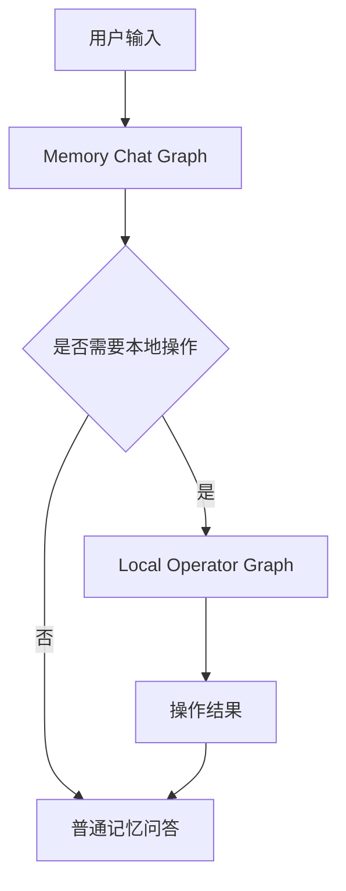
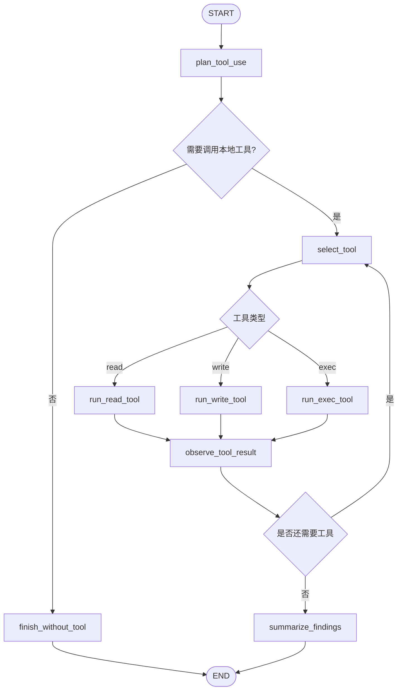

# Local Operator Agent 设计

本文档描述 Ai 记 / Memo Elf 的本地操作智能体设计。目标是让用户在和 AI 对话时，可以授权 AI 读取本地文件、写入文件、执行命令，并逐步从“记忆型个人知识库”升级为“本地个人智能体”。

## 当前实现状态

Local Operator 已经不再是单独挂在 Memory Chat Graph 旁边的 read-only 子图。当前实现采用主对话 ReAct 工具循环：

```text
agent
  -> tools
  -> ToolMessage observation
  -> agent
  -> final answer / request_user_input
```

当前可用工具：

| 工具 | 用途 | 约束 |
| --- | --- | --- |
| `list_dir` | 列目录 | 只读，路径必须在授权 roots 内 |
| `read_file` | 读取文本文件 | 支持行范围和最大字节数，返回 `full_view/truncated` |
| `search_files` | 按文件名搜索 | 只读 |
| `search_text` | 搜索文本内容 | 只读 |
| `get_file_info` | 查看文件 / 目录元信息 | 只读 |
| `write_file` | 创建或整文件覆盖文本文件 | 覆盖已有文件前要求完整 `read_file`，除非用户明确确认绕过 |
| `exec_command` | 前台执行短时非交互命令 | 返回 stdout/stderr/exit_code；非 0 退出码是工具失败，供 agent 重规划 |
| `exec_command_background` | 后台启动长跑服务 | 仅用于 flask/uvicorn/npm dev 等持续运行服务 |
| `read_background_output` | 读取后台任务输出 | 通过 task_id 轮询状态和日志 |
| `kill_background_task` | 停止后台任务 | 会终止进程树 |
| `list_background_tasks` | 列出当前会话后台任务 | 含历史 / orphaned |
| `request_user_input` | 结构化反问用户 | 触发 LangGraph interrupt，前端/桌面精灵渲染选项卡 |

旧文档中“第一阶段只实现 read”“建议作为独立子图”的描述属于设计演进记录；当前代码以本节为准。前后台命令边界见 [前后台任务边界](./background-vs-foreground.md)。

## 项目规则注入（AGENTS.md → planner system prompt）

`backend/app/agent/graphs/local_operator/nodes.py::_build_local_operator_planner_prompt`
在 prompt 尾部会拼接 `RUNTIME_AGENT_RULES`（定义在
`backend/app/agent/project_rules.py`），从而把仓库根 `AGENTS.md` 的核心条款带
进 planner 的每次推理。最关键的一条：用户要求创建项目 / 新建文件 / 写一组代码，
但**没有明确指定目标目录**时，planner 必须设置 `needs_tool=false`，让最终回答
节点先反问用户应该用哪个目录，而不是默认选择当前工作区。

修改条款时同时改 `AGENTS.md` 与 `project_rules.py` 保持一致，然后跑
`backend/tests/test_runtime_agent_rules.py` 验证注入仍然生效。

## 目标

Local Operator Agent 负责三类本地能力：

```text
read   读取文件、列目录、搜索文件和搜索内容
write  创建或修改文件，必须先生成 diff 并等待用户确认
exec   执行本地命令，必须经过风险评估和用户确认
```

早期第一阶段只实现 `read`。目前已经扩展到 `write`、`exec` 和后台服务任务，但仍保留读取优先、工具审计和风险分层的设计原则。

## 与 Memory Chat Graph 的关系

Memory Chat Graph 仍然是用户对话入口。Local Operator 不应该直接塞进普通回答节点，而应该作为一个独立子图或独立 graph 被调用。

建议结构：



原因：

- 本地操作有权限、安全和审计要求。
- `write` 和 `exec` 有副作用，必须和普通 RAG 回答隔离。
- 独立 graph 更容易用 checkpoint 恢复工具调用过程。
- 后续可以把操作进度推送给桌面精灵。

## LangChain 工具调用框架

工具定义应使用 LangChain 的 `@tool`，而不是自定义一套私有工具协议。

示意：

```python
from langchain_core.tools import tool


@tool
def read_file(path: str, start_line: int | None = None, end_line: int | None = None) -> str:
    """读取授权 workspace 内的文本文件，可指定行号范围。"""
    ...
```

这样做的好处：

- 工具参数 schema 可以被模型理解。
- 可以复用 LangChain / LangGraph 的 tool calling 生态。
- 工具调用记录更容易进入 graph state 和 checkpoint。
- 后续如果引入工具节点、并行工具调用或 ReAct 风格循环，迁移成本更低。

### `@tool` 定义规范

根据 LangChain 工具调用机制，第一阶段工具实现需要遵守下面几条规则：

- 每个工具必须有清晰的函数名。函数名会成为模型看到的工具名，例如 `read_file`、`search_text`。
- 每个工具必须有 docstring。docstring 是模型理解工具用途的重要描述，缺失时可能导致工具 schema 不完整或直接报错。
- 工具参数必须有类型标注。类型标注会进入工具 schema，帮助模型生成合法参数。
- 复杂参数使用 Pydantic `args_schema`，并为每个字段写 `Field(description=...)`。
- 工具返回值保持结构化 JSON 字符串，避免只返回一段散文，方便 graph 记录、前端展示和审计落库。

示意：

```python
from pydantic import BaseModel, Field
from langchain_core.tools import tool


class ReadFileInput(BaseModel):
    path: str = Field(description="要读取的文件路径，必须位于授权 workspace 内。")
    start_line: int | None = Field(default=None, description="起始行号，1-based。")
    end_line: int | None = Field(default=None, description="结束行号，包含该行。")


@tool(args_schema=ReadFileInput)
def read_file(path: str, start_line: int | None = None, end_line: int | None = None) -> str:
    """读取授权 workspace 内的文本文件，可指定行号范围。"""
    ...
```

这条规范很重要：工具描述越准确，模型越不容易误用工具；字段说明越明确，后续切到原生 `ToolNode` 时越平滑。

### ToolNode 与受控工具循环

LangGraph 提供了 `ToolNode` 和 `tools_condition`，它们适合构建典型 ReAct 工具循环：

```text
LLM 决定是否调用工具
  -> ToolNode 执行工具
  -> 工具结果作为 ToolMessage 回到消息列表
  -> LLM 再决定继续调用工具还是结束
```

这个模式很标准，也非常适合以后能力成熟后的 Local Operator。不过第一阶段 read-only 我建议采用“标准工具 + 受控循环”的混合方案：

```text
工具定义：使用 LangChain @tool
工具选择：由 Local Operator Graph 的 plan 节点输出结构化 action
工具执行：由 run_read_tool 节点按白名单调用 tool.invoke()
工具审计：run_read_tool 前后显式写 agent_operations
循环控制：由 graph state 里的 tool_budget / observations 控制
```

选择受控循环的原因：

- 本地文件读取涉及路径权限，第一版应该让工具执行路径完全可审计。
- 我们需要在工具调用前后写入 `agent_operations`，受控节点更容易保证记录完整。
- `write` / `exec` 后续需要人工确认，受控循环更容易插入审批、风险评估和恢复逻辑。
- 工具仍然是标准 `@tool`，以后可以平滑迁移到 `ToolNode` 或局部使用 `ToolNode`。

因此第一版不是绕开 LangChain 工具体系，而是把“工具协议”交给 LangChain，把“是否允许执行、如何审计、如何限制轮数”留在我们自己的 graph 节点里。

## 建议代码结构

第一阶段建议把本地操作能力放在独立目录，避免和现有 RAG、memory、chat service 混在一起。

```text
backend/app/local_operator/
  __init__.py
  schemas.py
  policy.py
  filesystem.py
  audit.py
  tools.py

backend/app/agent/graphs/local_operator/
  __init__.py
  graph.py
  nodes.py
  state.py
```

职责说明：

| 文件 | 职责 |
| --- | --- |
| `schemas.py` | 定义工具入参、工具返回、错误结构、审计记录输入等 Pydantic/SQLModel schema。 |
| `policy.py` | 路径授权、敏感文件判断、大小限制、ignore 规则、风险等级判断。 |
| `filesystem.py` | 真正执行 list/read/search/info 的文件系统服务，不直接暴露给模型。 |
| `audit.py` | 写入 `agent_operations` 审计表，封装 start/complete/fail/block 等状态更新。 |
| `tools.py` | 使用 LangChain `@tool` 包装 filesystem service，并在工具调用前后写审计。 |
| `state.py` | 定义 Local Operator Graph 的 state。 |
| `nodes.py` | 定义 plan、run tool、observe、summarize 等 graph 节点。 |
| `graph.py` | 编译 Local Operator Graph，暴露可复用入口。 |

设计约束：

- `tools.py` 不直接拼文件系统逻辑，只调用 `filesystem.py`。
- `filesystem.py` 不知道 LangChain，只返回结构化结果。
- `policy.py` 是所有 read/write/exec 的共同安全入口。
- `audit.py` 是所有工具调用的共同审计入口。
- graph 节点只负责编排，不直接绕过 tool 调用文件系统。

## 第一阶段：Read-only

第一阶段只允许读取本机只读范围内的内容。

当前默认只读范围参考 Claude Code 的 Read 工具心智模型：

- 模型层不要预先假设“我不能读 C 盘/系统目录/用户硬盘”。
- 如果用户给出明确路径，先规划 read-only 工具调用。
- 路径不存在、不可读、敏感、不是文本文件、设备路径或 UNC 网络路径，由工具返回真实错误。
- 代码层仍保留安全边界和审计，不把判断交给模型自由发挥。

默认 roots：

```text
Ai 记仓库根目录
当前用户 Home 目录
Windows 本机存在的固定盘符根目录，例如 C:/、D:/
LOCAL_OPERATOR_WORKSPACE_ROOTS 追加目录
```

这意味着读取 `C:\...` 这类绝对路径时，模型应该尝试工具，而不是直接让用户复制内容。
但工具仍会拦截 `.env`、密钥、数据库、设备路径、UNC 网络路径、非文本文件和超大文件。

建议工具：

```text
list_dir(path, max_entries?)
  列出目录内容。

read_file(path, start_line?, end_line?)
  读取文本文件。默认限制最大字节数和最大行数。

search_files(root, pattern, max_results?)
  按文件名搜索。

search_text(root, query, include_glob?, max_results?)
  搜索文件内容。

get_file_info(path)
  返回文件大小、修改时间、是否目录、是否文本等元信息。
```

### Read 工具 Schema

工具由 LangChain `@tool` 暴露给模型。实现时建议为每个工具定义明确的 Pydantic args schema，而不是直接接收松散 dict。

#### `list_dir`

用途：列出授权 workspace 内的目录内容。

参数：

| 字段 | 类型 | 必填 | 默认值 | 说明 |
| --- | --- | --- | --- | --- |
| `path` | string | 是 | 无 | 目录路径。可以是 workspace 相对路径，也可以是授权目录内绝对路径。 |
| `max_entries` | integer | 否 | 100 | 最大返回条目数。上限建议 500。 |
| `include_hidden` | boolean | 否 | false | 是否包含隐藏文件。默认不包含。 |

返回：

```json
{
  "path": "E:/Ai记/frontend/src",
  "entries": [
    {
      "name": "features",
      "relative_path": "frontend/src/features",
      "kind": "directory",
      "size": null,
      "modified_at": "2026-05-20T10:00:00"
    }
  ],
  "truncated": false
}
```

返回字段说明：

| 字段 | 说明 |
| --- | --- |
| `path` | 规范化后的绝对路径。 |
| `entries` | 目录条目列表。 |
| `relative_path` | 相对 workspace 的路径，优先给模型和前端展示这个字段。 |
| `kind` | `file` 或 `directory`。 |
| `size` | 文件字节数。目录为 `null`。 |
| `modified_at` | 修改时间。 |
| `truncated` | 是否因 `max_entries` 被截断。 |

#### `read_file`

用途：读取文本文件，可指定行号范围。

参数：

| 字段 | 类型 | 必填 | 默认值 | 说明 |
| --- | --- | --- | --- | --- |
| `path` | string | 是 | 无 | 文件路径。 |
| `start_line` | integer nullable | 否 | null | 起始行，1-based。为空表示从文件开头读取。 |
| `end_line` | integer nullable | 否 | null | 结束行，包含该行。为空表示读取到限制内的末尾。 |
| `max_bytes` | integer | 否 | 65536 | 最大返回字节数。不能超过系统上限。 |

返回：

```json
{
  "path": "E:/Ai记/backend/app/main.py",
  "relative_path": "backend/app/main.py",
  "line_start": 1,
  "line_end": 80,
  "total_lines": 214,
  "content": "...",
  "truncated": false
}
```

返回字段说明：

| 字段 | 说明 |
| --- | --- |
| `line_start` | 实际返回起始行。 |
| `line_end` | 实际返回结束行。 |
| `total_lines` | 文件总行数。 |
| `total_bytes` | 文件总字节数，用于判断是否读的是大文件。 |
| `read_bytes` | 本次读取过程涉及的文件字节数。第一版大文件统计为文件大小，后续可细化为真实 IO 字节数。 |
| `bytes_returned` | 返回给 graph/模型的 UTF-8 字节数。 |
| `modified_at` | 文件修改时间。 |
| `content` | 文件内容片段。 |
| `numbered_content` | 带行号的内容片段，Local Operator 汇总上下文优先使用这个字段。 |
| `truncated` | 是否因大小、行数或请求范围被截断。 |
| `truncated_by_bytes` | 是否因为 `max_bytes` 截断。 |

### 借鉴 Claude Code 的 Read 工具设计

本项目的 read 工具不是照搬 Claude Code，但会选择性吸收它在工程稳定性上的长处。当前已经吸收的点如下：

```text
路径进入系统前先规范化
  支持 ~ 展开。
  Windows 下支持 /c/Users/... 这类 POSIX 风格盘符路径。
  拒绝空字节路径。
  拒绝 /dev/zero、/dev/random、/proc/.../fd 这类危险设备路径。
  Windows 下暂不读取 UNC 网络路径，避免系统凭据泄露风险。

读取结果保留定位信息
  返回 line_start、line_end、total_lines。
  额外返回 numbered_content，方便 agent 引用具体行号。
  返回 total_bytes、bytes_returned、modified_at，方便调试和前端展示。

文本内容跨平台归一
  去掉 UTF-8 BOM。
  支持 UTF-16LE BOM。
  把 CRLF/CR 归一为 LF，避免不同系统换行导致模型上下文不一致。

大文件读取使用范围读取
  小文件可以一次性读入，提高实现简单度。
  大文件按行扫描，只保留请求范围内的内容。
  即使文件整体很大，只要用户指定的行号范围足够小，也允许读取。

错误更像工具而不是异常
  PATH_NOT_FOUND 会尝试给出同目录近似文件建议。
  安全策略拦截统一带 blocked=true，前端和 graph 可以区分“失败”和“被安全策略拦截”。
```

当前没有照搬的部分：

```text
read cache / file_unchanged
  暂不做。Ai 记现阶段更需要审计清楚，缓存可以等工具调用频率变高后再加。

token 级输出限制
  暂时用 max_bytes 控制。后续如果 read 结果直接进入大模型上下文，可以再叠加 token 预算。

完整权限弹窗系统
  read-only 阶段仍由 workspace roots + 敏感文件策略控制。write/exec 阶段再引入 interrupt 审批。
```

#### `search_files`

用途：按文件名搜索。

参数：

| 字段 | 类型 | 必填 | 默认值 | 说明 |
| --- | --- | --- | --- | --- |
| `root` | string | 否 | workspace root | 搜索根目录。必须在授权 workspace 内。 |
| `pattern` | string | 是 | 无 | 文件名关键词或 glob。 |
| `max_results` | integer | 否 | 50 | 最大结果数。 |
| `include_hidden` | boolean | 否 | false | 是否包含隐藏文件。 |

返回：

```json
{
  "root": "E:/Ai记",
  "pattern": "memory",
  "matches": [
    {
      "relative_path": "backend/app/services/memory_service.py",
      "kind": "file",
      "size": 12034
    }
  ],
  "truncated": false
}
```

#### `search_text`

用途：搜索文本内容。

参数：

| 字段 | 类型 | 必填 | 默认值 | 说明 |
| --- | --- | --- | --- | --- |
| `root` | string | 否 | workspace root | 搜索根目录。 |
| `query` | string | 是 | 无 | 搜索文本。第一版可先做普通字符串搜索，后续再支持正则。 |
| `include_glob` | string nullable | 否 | null | 限制文件 glob，例如 `*.py`、`*.tsx`。 |
| `max_results` | integer | 否 | 50 | 最大匹配条数。 |
| `context_lines` | integer | 否 | 2 | 每个命中返回的上下文行数。 |

返回：

```json
{
  "root": "E:/Ai记/backend/app",
  "query": "memory_key",
  "matches": [
    {
      "relative_path": "backend/app/models/long_term_memory.py",
      "line": 18,
      "text": "memory_key: str | None = Field(default=None, index=True)",
      "before": ["class LongTermMemory(SQLModel, table=True):"],
      "after": ["category: str = Field(index=True)"]
    }
  ],
  "truncated": false
}
```

#### `get_file_info`

用途：读取路径元信息，不返回正文。

参数：

| 字段 | 类型 | 必填 | 默认值 | 说明 |
| --- | --- | --- | --- | --- |
| `path` | string | 是 | 无 | 文件或目录路径。 |

返回：

```json
{
  "path": "E:/Ai记/frontend/package.json",
  "relative_path": "frontend/package.json",
  "exists": true,
  "kind": "file",
  "size": 921,
  "modified_at": "2026-05-20T10:00:00",
  "is_text": true,
  "is_sensitive": false
}
```

### 工具错误码

所有 read 工具失败时应返回结构化错误，而不是只抛出普通字符串。

| 错误码 | 含义 |
| --- | --- |
| `PATH_NOT_FOUND` | 路径不存在。 |
| `PATH_OUTSIDE_WORKSPACE` | 解析后的路径不在授权 workspace 内。 |
| `PATH_CONTAINS_NULL_BYTE` | 路径包含空字节，拒绝解析。 |
| `DEVICE_PATH_BLOCKED` | 路径指向危险设备或进程 fd，拒绝读取。 |
| `UNC_PATH_BLOCKED` | Windows UNC 网络路径暂不读取。 |
| `PATH_IS_DIRECTORY` | 调用 `read_file` 但目标是目录。 |
| `PATH_IS_FILE` | 调用 `list_dir` 但目标是文件。 |
| `BINARY_FILE_BLOCKED` | 检测为二进制文件，拒绝读取全文。 |
| `SENSITIVE_FILE_BLOCKED` | 命中敏感文件规则。 |
| `FILE_TOO_LARGE` | 文件超过读取上限，需要指定行号或更精确搜索。 |
| `TOO_MANY_RESULTS` | 搜索结果过多，已截断。 |
| `INVALID_ARGUMENT` | 参数非法，例如行号范围错误。 |
| `READ_FAILED` | 其他读取失败。 |

错误返回示例：

```json
{
  "ok": false,
  "error_code": "SENSITIVE_FILE_BLOCKED",
  "message": "该文件可能包含密钥或环境变量，默认不读取。",
  "path": "E:/Ai记/.env",
  "blocked": true
}
```

第一阶段不做：

```text
写入文件
删除文件
移动文件
执行命令
读取授权目录之外的文件
读取二进制文件全文
绕过 ignore / 隐私规则
```

## Workspace 权限边界

Local Operator read-only 不再只限制在项目目录。当前默认授权：

默认 workspace：

```text
项目根目录
当前用户 Home 目录
```

用户可以通过 `.env` 追加更多可读取目录：

```text
LOCAL_OPERATOR_WORKSPACE_ROOTS=E:\Ai记;D:\资料;~/Documents
```

路径规则：

- 所有输入路径先规范化为绝对路径。
- 解析后的路径必须位于授权 workspace roots 内。
- 禁止通过 `..`、符号链接或 Windows junction 逃逸 workspace roots。
- 默认跳过 `.git`、`.venv`、`node_modules`、`dist`、缓存目录和大型二进制文件。

### 默认路径选择规则

权限层和规划层要分开理解：

```text
权限层
  默认允许读取 Ai 记项目根目录和当前用户 Home。
  LOCAL_OPERATOR_WORKSPACE_ROOTS 可以追加更多目录。

规划层
  用户问“当前项目/当前仓库/当前工作区”时，默认 path/root = "."。
  用户问“当前电脑/本机/Home/用户目录里有没有某项目或文件”时，默认 root = "~"。
  如果 graph 测试或调用方没有授权真实 Home，则使用传入 roots 中的第二个 root。
```

因此，AI 不能说“我只能看到 Ai 记目录”。更准确的说法是：

```text
我可以读取已授权的本地目录。默认包括 Ai 记项目目录和用户 Home；
但如果你没有给具体路径，我会根据问题语义选择当前项目或 Home 作为搜索范围。
```

## Read 工具安全规则

### 文件大小限制

默认限制：

```text
单次 read_file 最大 64KB
单次 read_file 最大 800 行
search_text 每个结果最多返回 20 行上下文
search_text 最多返回 50 条结果
```

超过限制时，工具返回截断提示，并建议用户指定行号或更精确搜索。

### 文本检测

读取前先判断文件是否像文本文件。

允许：

```text
.py .ts .tsx .js .jsx .json .md .txt .yaml .yml .toml .css .html .rs .sh .ps1
```

谨慎处理：

```text
.env
*.key
*.pem
*.sqlite
*.db
```

第一版建议默认不读取 `.env`、密钥、数据库文件全文。用户明确要求时，也应只返回脱敏摘要或拒绝。

## Local Operator Graph

当前 Local Operator Graph 已支持 read 工具、第一版 `write_file` 工具和第一版
`exec_command` 工具。`write_file` 只做整文件写入，适合创建新文件或完整重写；
`exec_command` 只做短时、非交互终端命令，局部 diff/edit 和长任务后续单独接入。



节点职责：

```text
plan_tool_use
  判断用户问题是否需要本地文件工具，并给出读取目标、搜索关键词、写入目标和停止条件。
  当前采用“规则快路径 + LLM planner 兜底”：
  - 明确读取/列目录/搜索文件等请求直接选工具，不调用 LLM。
  - 明确创建/写入文件且给出路径和内容时，可以直接选 write_file。
  - 普通聊天快速跳过。
  - 模糊但像本地操作的问题调用 qwen-turbo planner，要求返回结构化 JSON。

select_tool
  根据 plan 和已有 observations 选择下一次工具调用。
  第一版采用白名单选择，只允许调用 list_dir/read_file/search_files/search_text/get_file_info/write_file/exec_command。

run_read_tool
  执行 read 类 LangChain @tool 工具。
  该节点负责工具调用、审计写入和错误归一化；权限检查在工具内部完成。

run_write_tool
  执行 write 类 LangChain @tool 工具。
  当前只有 write_file，工具内部会做 workspace 授权、敏感文件拦截和 read-before-write 保护。

run_exec_tool
  执行 exec 类 LangChain @tool 工具。
  当前只有 exec_command，工具内部会做 cwd 授权、危险命令拦截、超时、输出截断和审计。

observe_tool_result
  将工具结果写入 graph state，判断结果是否足够，并扣减 tool_budget。

summarize_findings
  基于工具结果生成面向上层 Memory Chat Graph 的本地工具上下文。
```

第一版可以限制最大工具轮数，例如最多 6 次，避免模型在目录里无限搜索。

### Planner 策略

`plan_tool_use` 不是完全靠关键词，也不是每轮都调用 LLM。当前策略：

```text
规则快路径
  用户明确说“读取文件”“列出目录”“搜索文件”“搜索内容”“查看文件信息”
  -> 直接生成 read-only 工具 action。

写入快路径
  用户明确说“创建文件”“写入文件”“保存到文件”，并且可以提取路径和内容
  -> 生成 write_file action。
  如果是覆盖已有文件，planner 会自动拆成：
     get_file_info -> write_file(overwrite=true)
  这样满足 read-before-write 保护，避免直接覆盖用户刚改的文件。

普通聊天
  例如闲聊、记忆问答、常识问题、数学题
  -> 快速返回 needs_tool = false，不调用 LLM。

模糊本地操作候选
  例如“帮我确认这个仓库还在工作区里吗”
  -> 调用 qwen-turbo planner。
  -> planner 只能返回 list_dir/read_file/search_files/search_text/get_file_info/write_file。
```

LLM planner 只负责“是否需要本地文件工具”和“用哪个工具”。它不是安全边界。
真正执行时仍然要经过：

```text
工具白名单
workspace 路径授权
敏感文件拦截
大小和结果数量限制
agent_operations 审计
```

### Write File 第一版

`write_file(path, content, overwrite)` 借鉴 Claude Code `Write` 工具的核心约束：

```text
整文件写入
  模型必须给出完整 content，不做隐式 patch。

创建父目录
  目标父目录不存在时自动创建。

覆盖保护
  已存在文件必须 overwrite=true。
  覆盖前本轮必须先 read_file 或 get_file_info 观察过同一路径。

敏感文件保护
  .env、*.key、*.pem、*.sqlite、*.db 等仍然拒绝写入。

审计
  agent_operations.operation_type = write
  risk_level = medium
  当前第一版 approval_required = false，后续接入 interrupt 人工确认后改为 true。
```

第一版暂不支持：

```text
局部替换
多文件批量写入
删除 / 移动 / 重命名
写前 diff 确认 UI
LangGraph interrupt 审批恢复
```

### Exec Command 第一版

`exec_command(command, cwd, timeout_ms, max_output_bytes)` 借鉴 Claude Code Bash/PowerShell
工具的设计边界，但第一版不做完整 shell AST 解析，采用“白名单意图 + 危险模式拦截”的保守策略。

```text
用途边界
  只用于终端级操作，例如查看版本、运行测试、git status、构建命令。
  不用于读文件、写文件、搜索文件；这些需求必须走专用工具。

cwd 授权
  cwd 必须位于 LocalOperatorPolicy.workspace_roots 内。
  相对 cwd 以第一个 workspace root 为基准解析。

危险命令拦截
  拦截后台任务、交互式命令、下载后执行、删除/格式化/关机/权限提升、git reset --hard、
  git clean -f、force push、shell 重定向写文件等模式。

执行限制
  默认 timeout_ms = 30000，上限 120000。
  默认 max_output_bytes = 65536，上限 262144。
  stdout/stderr 会被截断后返回给 graph，避免大输出撑爆 checkpoint 或 SSE。

审计
  agent_operations.operation_type = exec
  risk_level = low/medium/high，由命令策略判断。
  当前第一版 medium exec 仍会直接执行；high exec 直接 blocked。
  后续接 LangGraph interrupt 后，medium/high exec 应进入人工审批。
```

### 后台命令工具

`exec_command` 只适合短期阻塞型命令。对 dev server、`python app.py`、`npm run dev`
这种长跑型命令，使用专门的后台命令工具，进程独立于后端生命周期存活：

```text
run_command_background(command, cwd?)
  - 在 LocalOperatorPolicy.workspace_roots 内启动 detached 子进程
  - stdout / stderr 重定向到 data/background_logs/<task_id>.{stdout,stderr}.log
  - 同一会话最多 5 个并发后台任务
  - 返回 task_id；后端关闭时不会杀掉该进程

read_command_output(task_id, since_line?, max_lines?)
  - 增量读取日志（按全局行号），默认 50 行，上限 200 行

kill_background_command(task_id)
  - 触发跨平台进程树终止；DB 记录置为 killed

list_background_tasks(include_finished=true)
  - 列出当前会话的全部后台任务（含历史 / orphaned）
  - 用户问“现在跑着哪些服务”或要求停掉某个但没给 task_id 时，agent 必须先调它再决定
```

Memory Chat Graph 的系统提示词里包含一条硬性约束：

> 用户问"现在跑着哪些服务/后台任务"或者想停掉一个但没给 task_id 时，
> 先调用 `list_background_tasks` 看本会话的任务列表（含历史/orphaned），
> 再根据 task_id 操作；不要凭空猜 task_id，也不要直接 kill。

实现细节、状态机、平台差异（Windows 不能用 `DETACHED_PROCESS` 等踩坑）见
[Background Tasks 后端](../backend/background-tasks.md) 和
[Background Tasks API](../api/background-tasks.md)。

### 条件边设计

Local Operator Graph 的路由不靠字符串 if/else 散落在业务代码里，而是集中在 graph 条件边中：

```text
route_after_plan(state)
  needs_tool = false -> finish_without_tool
  needs_tool = true  -> select_tool

route_after_select_tool(state)
  read tool  -> run_read_tool
  write tool -> run_write_tool
  exec tool  -> run_exec_tool

route_after_observe(state)
  tool_budget <= 0        -> summarize_findings
  enough_evidence = true  -> summarize_findings
  last_tool_failed = true 且无法恢复 -> summarize_findings
  otherwise              -> select_tool
```

这样做的好处是：Mermaid 图能准确表达真实执行路径，checkpoint 也能清楚记录当前卡在哪个节点。

### Checkpoint 与恢复

read-only 阶段没有副作用，但仍然应该让 graph 具备恢复能力：

- `planned_actions` 写入 state 后，如果服务中断，恢复时不需要重新规划。
- 每次 `run_read_tool` 完成后，把 `tool_calls` 和 `observations` 写入 state。
- `agent_operations` 使用 `turn_id + tool_call_id` 保证同一次工具调用可追踪。
- 如果恢复时发现某个操作已经 `completed`，节点可以直接读取审计结果，避免重复读取大文件。

第一阶段即使不做复杂断点恢复，也要按这个结构写代码，避免后面接 write/exec 时返工。

## Graph State 草案

```python
class LocalOperatorState(TypedDict):
    conversation_id: int
    turn_id: int | None
    user_input: str
    workspace_roots: list[str]
    mode: Literal["read", "write"]
    needs_tool: bool
    tool_intent: str | None
    tool_budget: int
    planned_actions: list[dict]
    next_action: dict | None
    tool_calls: list[dict]
    observations: list[dict]
    enough_evidence: bool
    final_answer: str
    error: str | None
```

工具调用记录建议包含：

```text
tool_name
arguments
status
started_at
completed_at
result_summary
error
```

## 操作审计

即使第一阶段只有 read，也建议从一开始记录审计日志。未来 write/exec 会自然复用。

建议表：`agent_operations`

```text
agent_operations
  id
  conversation_id
  turn_id
  operation_type      read/write/exec
  status              planned/running/completed/failed/rejected
  tool_name
  input_json
  output_json
  risk_level          low/medium/high
  approval_required
  approved_at
  created_at
  updated_at
```

### 字段说明

| 字段 | 类型建议 | 必填 | 说明 |
| --- | --- | --- | --- |
| `id` | integer primary key | 是 | 操作记录 ID。用于前端查看详情、后续审批、重试或审计追踪。 |
| `conversation_id` | integer | 是 | 关联业务会话 `conversations.id`。说明这次本地操作发生在哪个对话中。 |
| `turn_id` | integer nullable | 否 | 关联 `chat_turns.id`。如果操作发生在某一轮 Memory Chat Graph 中，应写入该轮 ID。某些后台恢复任务可能没有 turn。 |
| `operation_type` | string enum | 是 | 操作类型。当前支持 `read`、`write`、`exec`。 |
| `status` | string enum | 是 | 操作状态。用于前端展示和恢复。详见“状态枚举”。 |
| `tool_name` | string | 是 | 实际调用的 LangChain tool 名称，例如 `read_file`、`list_dir`、`search_text`、`write_file`、`exec_command`。 |
| `input_json` | JSON/text | 是 | 工具调用入参快照。必须保存规范化后的路径和用户原始参数，方便审计。 |
| `output_json` | JSON/text nullable | 否 | 工具调用结果摘要。不要无脑保存完整大文件内容，避免数据库膨胀和隐私扩散。 |
| `risk_level` | string enum | 是 | 风险等级。第一阶段 read 默认为 `low`，敏感文件读取可标为 `medium` 或 `high`。 |
| `approval_required` | boolean | 是 | 是否需要用户确认。第一阶段普通 read 为 `false`；后续 write/exec 通常为 `true`。 |
| `approved_at` | datetime nullable | 否 | 用户批准时间。第一阶段通常为空；write/exec 被批准后写入。 |
| `created_at` | datetime | 是 | 记录创建时间。 |
| `updated_at` | datetime | 是 | 最后更新时间。 |

### 状态枚举

`status` 建议使用以下枚举：

| 状态 | 含义 | 第一阶段是否使用 |
| --- | --- | --- |
| `planned` | graph 已规划该操作，但尚未执行。 | 可选 |
| `pending_approval` | 等待用户确认。 | read 阶段不用，write/exec 使用 |
| `running` | 工具正在执行。 | 使用 |
| `completed` | 工具执行成功。 | 使用 |
| `failed` | 工具执行失败，例如路径不存在、权限不足、超时。 | 使用 |
| `rejected` | 用户拒绝执行。 | read 阶段不用，write/exec 使用 |
| `blocked` | 安全策略拦截，例如越界路径、敏感文件、危险命令。 | 使用 |
| `canceled` | 操作被取消。 | 后续使用 |

`operation_type` 枚举：

| 类型 | 含义 |
| --- | --- |
| `read` | 只读文件系统操作。 |
| `write` | 写入、修改、删除、移动文件。 |
| `exec` | 执行本地命令。 |

`risk_level` 枚举：

| 等级 | 含义 |
| --- | --- |
| `low` | 普通授权目录内只读操作。 |
| `medium` | 可能包含隐私或较大量数据的读取，或后续低风险写入。 |
| `high` | 敏感文件、破坏性写入、命令执行或系统级操作。 |

### `input_json` 结构

不同 tool 的 `input_json` 可以不同，但必须包含通用字段：

```json
{
  "tool_name": "read_file",
  "raw_args": {
    "path": "backend/app/main.py",
    "start_line": 1,
    "end_line": 120
  },
  "normalized_args": {
    "path": "E:/Ai记/backend/app/main.py",
    "workspace_root": "E:/Ai记",
    "start_line": 1,
    "end_line": 120
  },
  "policy": {
    "workspace_allowed": true,
    "sensitive_path": false,
    "max_bytes": 65536,
    "max_lines": 800
  }
}
```

字段说明：

| 字段 | 说明 |
| --- | --- |
| `tool_name` | 冗余保存工具名，方便单独查看 JSON 时理解内容。 |
| `raw_args` | 模型或 graph 原始传入参数。用于排查模型为什么这么调用。 |
| `normalized_args` | 后端规范化后的参数。路径必须是安全解析后的绝对路径。 |
| `policy` | 本次调用经过的权限和限制策略。 |

### `output_json` 结构

`output_json` 保存结果摘要，不建议保存完整大文件。

`read_file` 示例：

```json
{
  "ok": true,
  "kind": "file",
  "path": "E:/Ai记/backend/app/main.py",
  "line_start": 1,
  "line_end": 120,
  "total_lines": 214,
  "bytes_returned": 18342,
  "truncated": false,
  "content_preview": "from fastapi import FastAPI\\n..."
}
```

`search_text` 示例：

```json
{
  "ok": true,
  "query": "memory_key",
  "root": "E:/Ai记/backend/app",
  "match_count": 12,
  "truncated": false,
  "matches": [
    {
      "path": "backend/app/models/long_term_memory.py",
      "line": 18,
      "preview": "memory_key: str | None = Field(default=None, index=True)"
    }
  ]
}
```

失败示例：

```json
{
  "ok": false,
  "error_code": "PATH_OUTSIDE_WORKSPACE",
  "message": "路径不在授权 workspace 内",
  "blocked": true
}
```

### 建议索引

```text
idx_agent_operations_conversation_created
  conversation_id, created_at

idx_agent_operations_turn
  turn_id

idx_agent_operations_status
  status

idx_agent_operations_type_status
  operation_type, status
```

索引用途：

- 前端按会话查看本轮操作历史。
- graph 恢复时查找 running / pending_approval 操作。
- 后续 write/exec 审批页按状态筛选。

第一阶段：

```text
read 操作 risk_level 默认 low
approval_required 默认 false
但仍写入操作日志
```

### 第一阶段字段落地范围

read-only 第一阶段必须写入：

```text
conversation_id
turn_id
operation_type = read
status
tool_name
input_json
output_json
risk_level
approval_required = false
created_at
updated_at
```

可以暂时为空：

```text
approved_at
```

为后续 write/exec 预留但第一阶段不复杂化：

```text
pending_approval
rejected
canceled
```

## 前端展示

第一阶段 read-only 可以先不做复杂确认卡片，但要显示工具调用过程，方便用户理解 AI 为什么这么回答。

建议在对话中展示轻量状态：

```text
AI 正在读取：
  list_dir frontend/src/features
  read_file backend/app/main.py
  search_text memory_key backend/app
```

后续 write/exec 必须加入确认卡片：

```text
AI 想修改文件：
  path: ...
  diff: ...

[允许] [拒绝]
```

```text
AI 想执行命令：
  command: ...
  risk: high

[允许执行] [拒绝]
```

## 与精灵事件的关系

Local Operator 的工具调用过程可以发精灵事件：

```text
local_operator.reading
local_operator.searching
local_operator.finished
local_operator.failed
```

桌面精灵可以用这些事件显示：

```text
我在帮你找文件。
我找到了几个相关位置。
这个文件我不能读取，可能包含敏感信息。
```

## Write 和 Exec 的后续扩展

从 LangGraph 的人工介入能力看，`write` 和 `exec` 不应该只靠前端弹窗临时拦截，而应该在 graph 内部显式进入审批节点。后续建议使用 `interrupt()` 暂停 graph，把待审批的 diff 或 command 返回给前端；用户确认后再用 `Command(resume=...)` 恢复执行。

关键规则：

- `interrupt()` 不要被宽泛的 `try/except Exception` 吞掉。
- 进入 `interrupt()` 之前不要执行不可逆副作用。
- 如果审批前必须创建记录，只能创建幂等的 `agent_operations` 草稿。
- 用户拒绝后 graph 应该走向 `rejected` 分支，而不是抛异常结束。
- checkpoint 的 `thread_id` 仍然沿用会话/任务命名空间，避免和 metadata/embedding job 混淆。

### Write

必须遵守：

- 先生成 diff。
- 用户确认后才能写入。
- 写入前记录原文件 hash。
- 写入后记录新文件 hash。
- 支持失败回滚或至少保留操作审计。

推荐工具：

```text
propose_patch(path, diff)
apply_patch(operation_id)
create_file(path, content)
```

### Exec

必须遵守：

- 命令先经过风险分类。
- 默认需要用户确认。
- 设置超时。
- 限制 cwd 在授权 workspace 内。
- 记录 stdout、stderr、exit_code。
- 高风险命令拦截或二次确认。

高风险示例：

```text
rm -rf
del /s
format
shutdown
curl ... | sh
powershell Invoke-Expression
修改系统配置
读取密钥后上传网络
```

## 第一阶段验收标准

当前第一版已落地的范围：

```text
backend/app/models/agent_operation.py
  AgentOperation 审计表。

backend/app/local_operator/
  policy.py      workspace 权限和敏感文件策略。
  filesystem.py  read-only 文件系统服务。
  audit.py       agent_operations 写入封装。
  tools.py       LangChain @tool 工具包装。
  schemas.py     工具入参和返回结构。

backend/app/agent/graphs/local_operator/
  state.py       Local Operator Graph 状态。
  nodes.py       plan/select/run/observe/summarize 节点。
  graph.py       graph 构建和运行入口。

Memory Chat Graph
  新增 build_local_operator_context worker。
  本地读取结果会作为额外上下文并入最终 prompt_context。
```

```text
Local Operator 文档完成。
read-only 工具基于 LangChain @tool 定义。
所有 read 工具限制在授权 workspace 内。
read_file 支持行号范围和大小限制。
search_files / search_text 可用于项目内检索。
工具调用进入 graph state。
工具调用写入 agent_operations 审计表。
Memory Chat Graph 可以在需要时调用 Local Operator Graph。
前端能看到本轮使用过哪些 read 工具。
```

## 暂不实现

```text
write 文件
exec 命令
长期运行任务
远程服务器操作
未配置目录的全盘扫描
自动提交 git
自动安装依赖
```
