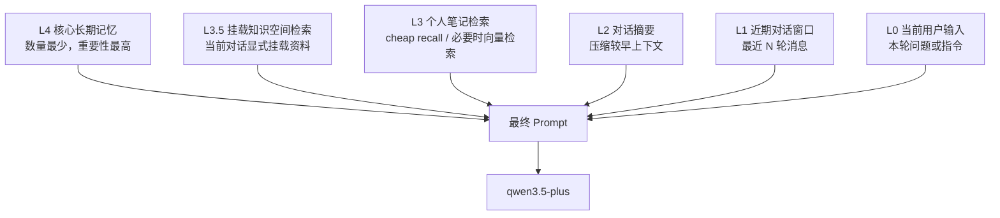
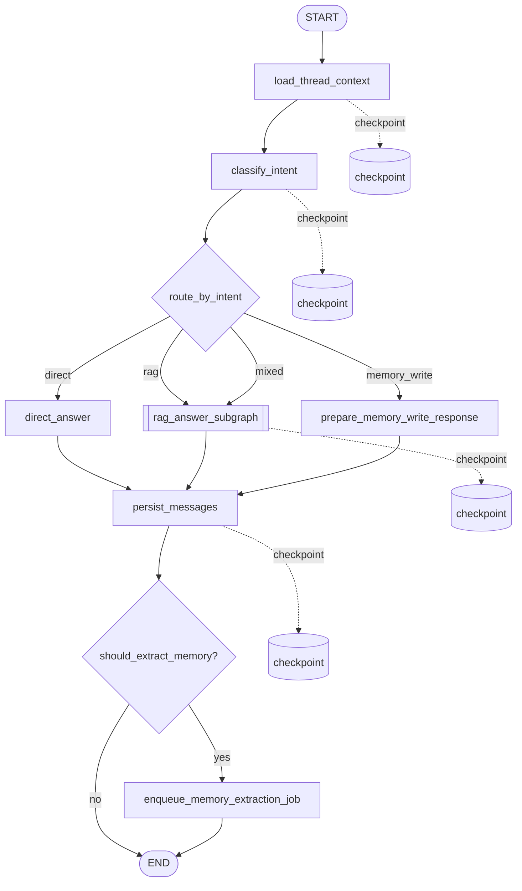
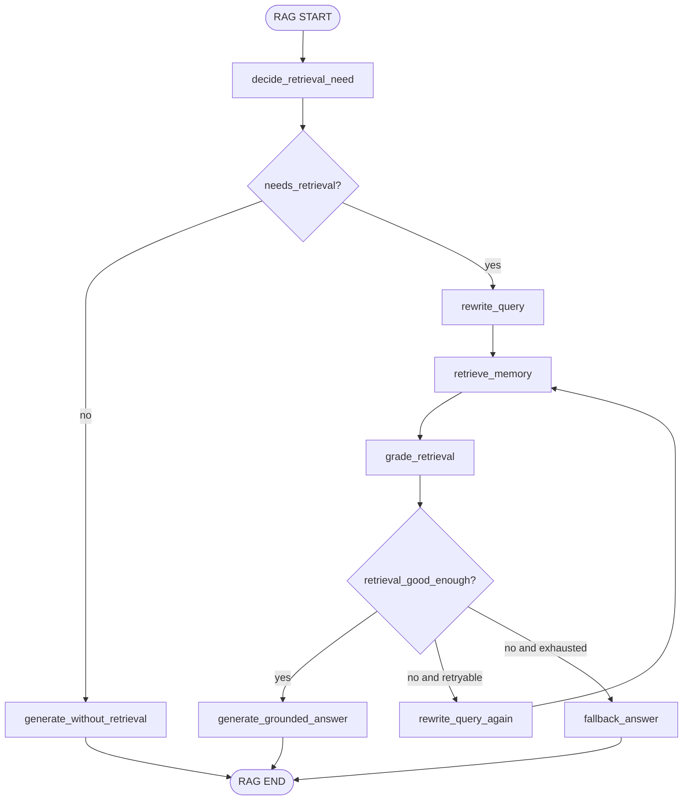
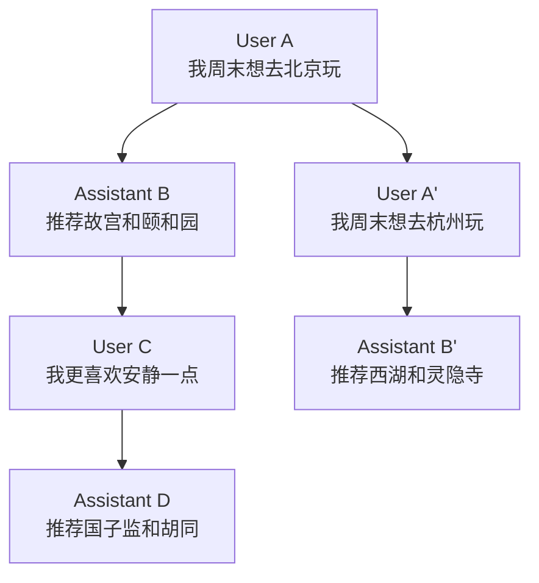
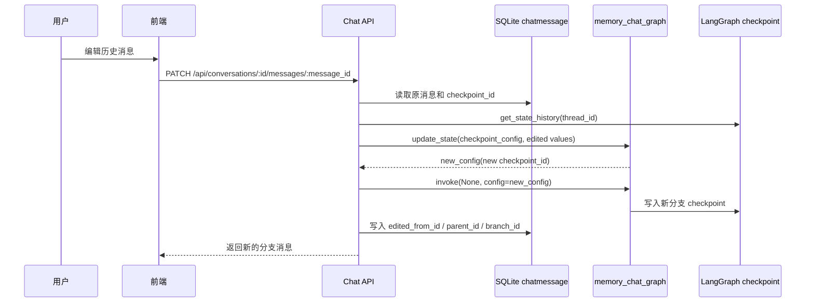
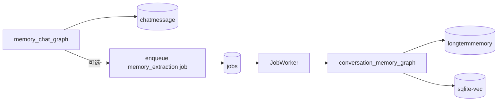
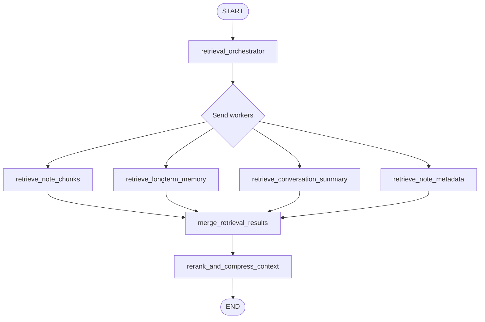
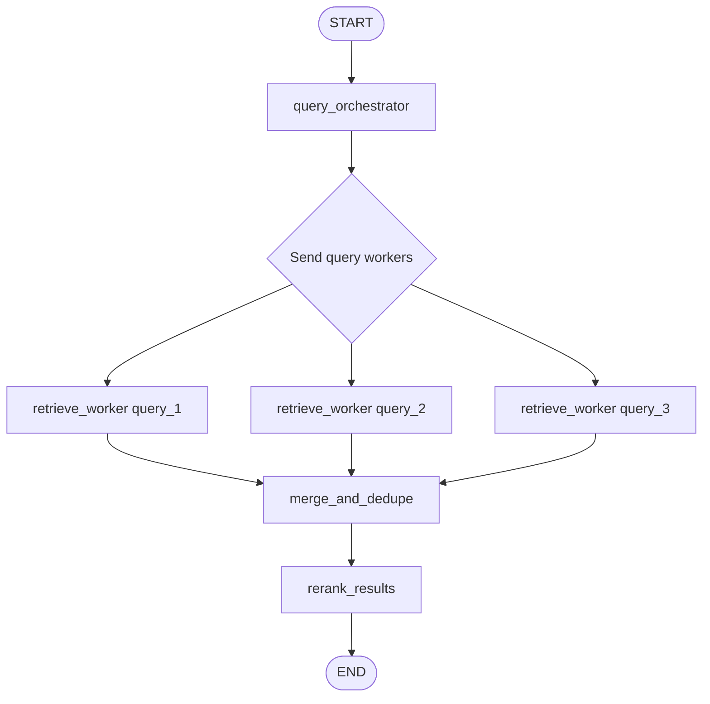
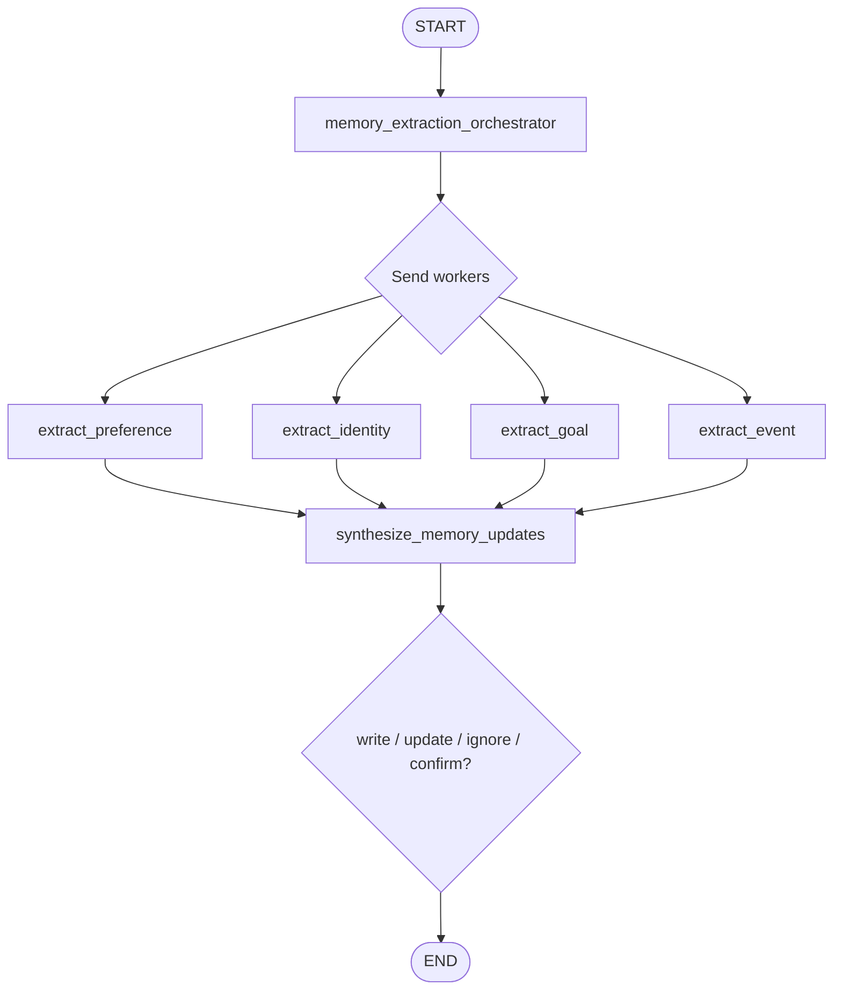

# Memory Chat Graph 设计草案

本文档描述 Ai 记下一阶段的对话与记忆问答设计。当前只作为设计讨论稿，不代表已经实现。

## 设计目标

`memory_chat_graph` 的目标是把 Ai 记从“笔记 + 向量化”推进到“可以基于个人知识库对话”的系统。

它需要同时解决三件事：

- 对话连续性：同一个会话内能携带上下文，不会一问就忘。
- 个人知识库问答：默认用 cheap recall 召回笔记候选，必要时升级向量检索，并由 agent 判断召回结果是否能支撑回答。
- 记忆分层：区分近期对话、对话摘要、笔记检索结果、长期重要记忆。

## 记忆分层

第一版先使用明确的上下文金字塔，而不是把所有历史消息塞进模型。



各层职责：

```text
L0 当前输入
  本轮用户消息。

L1 近期对话窗口
  当前 conversation 最近若干轮消息。数量较多，但受 token budget 限制。

L2 对话摘要
  当消息过长时，把较早上下文压缩为 summary。

L3.5 挂载知识空间检索
  从当前 conversation 显式挂载的知识空间中检索出的内容；未挂载时不能全局检索。

L3 个人笔记检索
  每轮默认从笔记 chunk 中做关键词轻量召回；明确个人记忆意图时升级向量检索。
  没有可靠结果时只提供 no-evidence 说明。

L4 核心长期记忆
  用户稳定偏好、身份信息、长期目标、重要事实。数量少，优先级高。
```

## 总体 Graph



### 节点职责

```text
load_thread_context
  根据 conversation_id/thread_id 读取近期消息、对话摘要、核心长期记忆。

classify_intent
  判断用户输入是否需要检索、是否是在新增记忆、是否是普通问答。

route_by_intent
  使用条件边进入 direct / rag / memory_write / mixed 分支。

direct_answer
  不查询向量库，直接基于当前输入和近期上下文回答。

rag_answer_subgraph
  负责 query rewrite、向量检索、结果评分、回答生成。

prepare_memory_write_response
  当用户明显是在告诉系统需要记住的内容时，先给出确认式回复。
  真实记忆抽取仍建议异步 job 完成，避免阻塞用户对话。

persist_messages
  保存用户消息和 AI 回复到业务表，并记录 checkpoint_id。

should_extract_memory?
  判断本轮对话是否可能包含值得长期保存的信息。

enqueue_memory_extraction_job
  创建异步 memory extraction job。后续由独立 graph 做重要性判断和写入。
```

## RAG 子图



### RAG 节点职责

```text
decide_retrieval_need
  判断问题是否需要查询个人知识库。
  简单常识、数学、闲聊不检索；涉及“我之前/笔记/上次/记得”等倾向检索。

rewrite_query
  将用户问题结合近期上下文改写为适合向量检索的 query。

retrieve_memory
  调用 sqlite-vec 检索 notechunk，后续可扩展检索 long_term_memory。

grade_retrieval
  判断检索结果是否与问题相关、是否足够回答。

rewrite_query_again
  当第一次检索质量不足时，允许有限次数重写。

generate_grounded_answer
  基于检索内容回答，并尽量说明答案来自哪些记忆片段。

fallback_answer
  检索不足时诚实回答“不确定”或询问澄清，不编造用户记忆。
```

## 意图路由

第一版意图类型建议保持少量、稳定。

```text
direct
  不需要检索个人知识库的普通问答。

rag
  需要查询笔记或历史记忆才能回答。

memory_write
  用户明确表达“记住这件事”“以后提醒我”等记忆写入意图。

mixed
  既需要查询旧记忆，也可能包含新信息。
```

`classify_intent` 可以先采用“规则 + LLM 结构化输出”的混合策略：

```text
规则优先
  包含 我之前 / 上次 / 记得 / 笔记 / 我说过 等词时，倾向 rag。

LLM 兜底
  对模糊问题使用结构化输出返回 intent、confidence、reason。
```

## Graph State 字段设计

`memory_chat_graph` 的 state 建议分为公开输入、内部状态和输出三类。实现时可以使用 TypedDict，并为 `messages` 使用追加 reducer。

```text
输入字段
  conversation_id: int
  user_message: str
  parent_message_id: int | None
  requested_checkpoint_id: str | None

对话上下文字段
  recent_messages: list[ChatMessagePayload]
  conversation_summary: str
  core_memories: list[MemoryPayload]

路由字段
  intent: "direct" | "rag" | "memory_write" | "mixed"
  intent_confidence: float
  intent_reason: str
  needs_retrieval: bool

RAG 字段
  retrieval_query: str
  rewritten_queries: list[str]
  retrieval_attempts: int
  retrieved_chunks: list[RetrievedChunkPayload]
  retrieval_grade: "good" | "poor" | "none"
  retrieval_reason: str

生成字段
  prompt_context: PromptContextPayload
  assistant_answer: str
  answer_citations: list[CitationPayload]

持久化字段
  user_message_id: int | None
  assistant_message_id: int | None
  checkpoint_id: str | None

异步任务字段
  should_extract_memory: bool
  memory_extraction_job_id: int | None

错误字段
  error: str
```

### Payload 建议

```text
ChatMessagePayload
  id: int
  role: "user" | "assistant" | "system"
  content: str
  created_at: datetime

MemoryPayload
  id: int
  level: int
  content: str
  importance: float
  source_type: str
  source_id: int | None

RetrievedChunkPayload
  chunk_id: int
  note_id: int
  note_title: str
  content: str
  score: float
  content_hash: str

CitationPayload
  source_type: "note_chunk" | "memory"
  source_id: int
  title: str
```

## 数据表设计

### conversation

```text
conversation
  id
  title
  status
  summary
  summary_message_id
  langgraph_thread_id
  created_at
  updated_at
```

说明：

- `langgraph_thread_id` 建议使用 `conversation:{conversation.id}`。
- `summary` 保存当前对话的滚动摘要。
- `summary_message_id` 表示摘要已经覆盖到哪一条消息。

### chatmessage

```text
chatmessage
  id
  conversation_id
  role
  content
  parent_id
  checkpoint_id
  status
  token_count
  created_at
  updated_at
```

说明：

- `parent_id` 为未来“编辑消息后分支重放”预留。
- `checkpoint_id` 记录该消息生成后对应的 LangGraph checkpoint。
- `status` 可取 `completed / edited / deleted / failed`。

### longtermmemory

```text
longtermmemory
  id
  level
  content
  summary
  importance
  confidence
  source_type
  source_id
  status
  content_hash
  created_at
  updated_at
```

说明：

- `level` 对应记忆金字塔层级，第一版可使用：
  - `4`: 核心长期记忆
  - `3`: 普通长期记忆
- `importance` 用于排序和上下文预算。
- `confidence` 表示抽取可信度。
- `source_type/source_id` 指向来源，例如 `chatmessage` 或 `note`。
- 长期记忆后续也需要 embedding，可复用 embedding job/graph 模式。

### memorycitation

```text
memorycitation
  id
  assistant_message_id
  source_type
  source_id
  quote
  score
  created_at
```

说明：

- 保存 AI 回答引用了哪些 note chunk 或 memory。
- 前端未来可以展示“这句话参考了哪些记忆”。

### conversationbranch

第一版可以暂不实现，但建议保留设计。

```text
conversationbranch
  id
  conversation_id
  parent_message_id
  root_checkpoint_id
  status
  created_at
```

说明：

- 用于对话编辑、从某个 checkpoint 回溯并重放。
- 不是 MVP 必需，但会影响 `chatmessage.parent_id` 和 `checkpoint_id` 的设计。

## Checkpoint 使用约定

```text
thread_id = conversation:{conversation_id}
```

每次用户发送消息，都在同一个 thread 上继续执行 `memory_chat_graph`。

当用户修改历史消息时，后续可以使用：

```text
thread_id = conversation:{conversation_id}
checkpoint_id = 被编辑消息之前的 checkpoint
```

从该 checkpoint fork 或 replay，生成新的消息分支。第一版只记录 checkpoint，不做 UI 回溯。

## 对话编辑与状态树

Ai 记后续可以把“业务消息树”和“LangGraph 状态树”结合起来，实现比普通线性聊天更强的对话回溯能力。

两层结构的职责不同：

```text
chatmessage.parent_id
  记录用户可见的业务消息关系。
  它回答：这条消息接在哪条消息后面？

chatmessage.edited_from_id
  记录编辑来源。
  它回答：这条新消息是由哪条旧消息编辑出来的？

chatmessage.branch_id
  记录消息属于哪个业务分支。
  它回答：当前 UI 展示的是哪一条对话路径？

checkpoint_id
  记录 LangGraph 执行状态。
  它回答：如果要从这里继续执行，应该恢复哪一个 graph 状态？
```

因此，未来如果用户编辑历史消息，不应该直接覆盖旧消息，而应该产生一个新的业务分支。



业务表中的关系可以是：

```text
A.parent_id = null
B.parent_id = A.id
C.parent_id = B.id
D.parent_id = C.id

A'.parent_id = null
A'.edited_from_id = A.id
B'.parent_id = A'.id
```

更严格的实现中，`A'` 的 `parent_id` 也可以指向 `A` 的父节点。具体取决于 UI 想表达“替换同层消息”还是“从某节点派生新子节点”。

### LangGraph update_state 流程

LangGraph 提供 `update_state()`，可以在历史 checkpoint 上修改状态，并创建新的 checkpoint 分支。

对话编辑可以按下面流程设计：



关键点：

```text
get_state_history()
  用来找到可编辑的历史状态。

update_state(config, values)
  用来修改历史状态，并生成新的 checkpoint config。

invoke(None, config=new_config)
  用来从修改后的状态继续执行。
```

如果 state 中的 `messages` 使用追加 reducer，编辑历史消息时需要谨慎使用覆盖语义。例如 LangGraph 文档中的模式是：

```text
Overwrite([HumanMessage(content="新的用户消息")])
```

它表示不是追加，而是用新的 messages 替换该 checkpoint 中的 messages。

### 对话状态树能力

长期来看，Ai 记可以提供“对话状态树”视图：

```text
业务消息树
  用户看见的消息节点、编辑分支、回答分支。

LangGraph checkpoint 树
  每个节点背后的执行状态、工具调用结果、检索结果、下一步节点。
```

用户可以在树上选择某个节点，然后继续对话：

```text
选择消息节点
  -> 找到该消息对应 checkpoint_id
  -> 恢复 graph 状态
  -> 输入新的用户消息
  -> 生成新的分支
```

这不是 MVP 能力，但会影响现在的数据设计。为了给它留出口，建议最终 `chatmessage` 至少预留：

```text
parent_id
edited_from_id
branch_id
checkpoint_id
```

第一版可以先实现 `parent_id` 和 `checkpoint_id`，后续真正做编辑和状态树 UI 时再补 `edited_from_id` 与 `branch_id`。

## 与 Job 系统的关系

聊天主流程应该尽量同步返回答案，但耗时的“记忆整理”应走 job。



建议后续新增：

```text
type: conversation_memory_extraction
graph_name: conversation_memory_graph
payload: {"conversation_id": 1, "message_id": 10}
dedupe_key: conversation_memory:message:{message_id}
```

## Worker 模式候选点

LangGraph 支持协调者-工作者模式。协调者在运行时拆分任务，通过 `Send` 分发给多个 worker，多个 worker 的结果再通过 reducer 合并，最后由 synthesizer 汇总。

该模式适合“任务彼此独立、可以并行完成、最后需要汇总”的场景。

```text
orchestrator
  -> Send(worker, task_1)
  -> Send(worker, task_2)
  -> Send(worker, task_3)
  -> synthesizer
```

第一版 `memory_chat_graph` 不建议马上引入 worker 模式。原因是主聊天链路需要先保持可读、可测、容易排查。后续可在以下位置逐步使用。

### 候选点一：多源并行检索

当记忆来源不止 note chunks 时，可以并行查询多个来源。



适用原因：

```text
notechunk 检索
longtermmemory 检索
conversation_summary 检索
metadata/tag 检索
```

这些数据源互不依赖，天然适合并行。汇总阶段负责去重、排序、压缩上下文。

### 候选点二：多 Query 并行检索

用户问题含糊时，可以先生成多个检索 query，再并行检索。

```text
原问题：
  我之前说过那个想吃的东西是什么？

候选 query：
  用户之前提到想吃什么
  饮食 偏好 想吃
  午餐 炸鸡 想吃
```

后续流程：



约束：

- query 数量需要上限，建议最多 3 个。
- 每个 query 都可能产生 embedding 调用，需要控制成本。
- 第一版可以只做单 query，等召回不足时再升级。

### 候选点三：检索结果并行评分

当检索结果较多时，可以让多个 worker 分别判断 chunk 是否相关。

```text
grade_worker(chunk_1)
grade_worker(chunk_2)
grade_worker(chunk_3)
...
synthesizer -> 选择最可靠的上下文
```

这个能力可以提高答案质量，但 LLM 成本较高。第一版建议先使用简单排序或轻量规则，后续再引入 LLM worker grading。

### 候选点四：长期记忆抽取

`conversation_memory_graph` 非常适合从一开始就按 worker 模式设计，因为不同记忆类型可以独立判断。



各 worker 职责：

```text
extract_preference
  提取用户偏好，例如饮食、工作方式、表达偏好。

extract_identity
  提取稳定身份信息，例如昵称、职业、长期所在地。

extract_goal
  提取长期目标、计划、持续关注事项。

extract_event
  提取重要事件或经历。

synthesize_memory_updates
  合并 worker 结果，处理冲突，决定新增、更新、忽略或向用户确认。
```

这个 graph 应该通过 job 异步执行，不阻塞主聊天回答。

## Worker 模式阶段建议

```text
MVP
  不实现 worker 模式。
  先完成单 query 检索、基础对话和消息持久化。

RAG v2
  增加多源并行检索 worker。

RAG v3
  增加多 query 并行检索和轻量 rerank。

Memory v1
  conversation_memory_graph 使用 worker 模式抽取不同类型长期记忆。

Memory v2
  增加冲突检测、用户确认、人机协同修改记忆。
```

## MVP 范围

第一版已先完成基础设施：

```text
conversation 表
chatmessage 表
search_notes(query, limit)
```

下一步建议实现：

```text
memory_chat_graph
  load_turn_state
  plan_retrieval
  retrieve_notes 或 direct_answer
  grade_retrieval
  generate_answer
  persist_messages
```

第一版暂不实现：

```text
长期记忆抽取
对话摘要滚动压缩
消息编辑和 checkpoint 分支
引用可视化
多轮 query rewrite 循环
```

但表结构和 state 字段应给这些能力留出口。

## 风险与约束

- 不能把所有历史消息都放入 prompt，需要 token budget。
- RAG 检索不足时不能编造用户记忆。
- checkpoint 可以恢复和回溯执行现场，但用户可见数据仍应落在业务表。
- 长期记忆写入需要谨慎，后续最好加入“重要性评分”和“必要时向用户确认”。
- 对话 graph 不应该直接承担所有异步整理任务，复杂记忆整理应拆成 job + graph。
