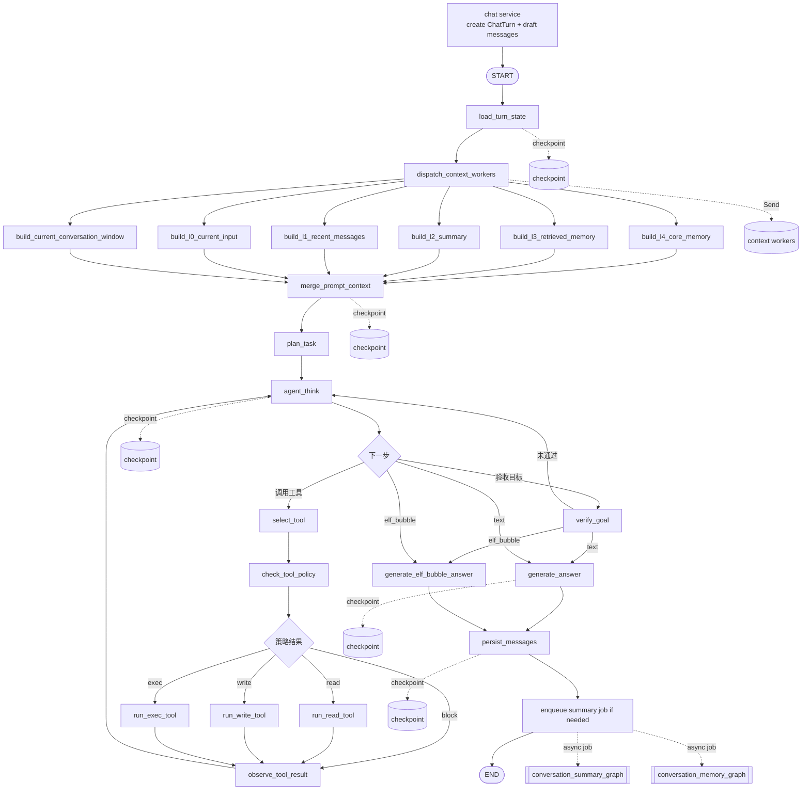
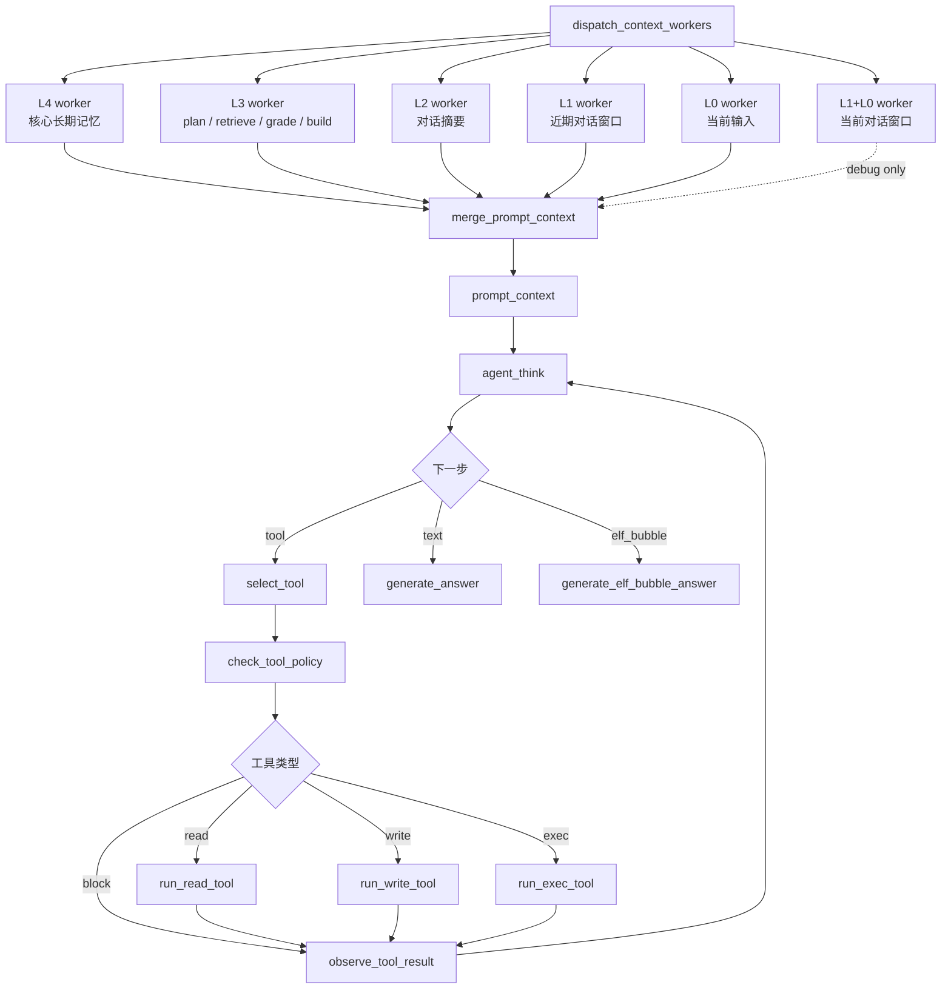
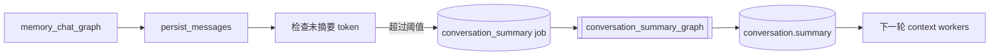
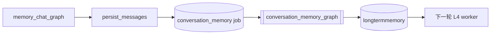

# Memory Chat Graph

`memory_chat_graph` 是 Ai 记的第一版记忆对话 graph。它把 conversation、chatmessage、向量检索和大模型回答串起来。

## 当前流程

流式接口会先创建 `ChatTurn` 和本轮 user/assistant 草稿消息，然后再启动
`memory_chat_graph`。这样浏览器刷新后，消息列表仍然能看到本轮对话；graph 完成后
`persist_messages` 会把 assistant 草稿更新为最终回复。



## 节点职责

```text
load_turn_state
  读取本轮对话的基础状态，包括 conversation、recent_messages 和 conversation.summary。
  同时重置本轮派生字段，避免同一 thread 上一轮结果污染本轮。
  如果服务层已经预创建 user_message_id / assistant_message_id，会从 L1 recent_messages
  中排除这两条本轮草稿，避免当前输入被重复放入上下文。
  如果 conversation.active_task 中存在未完成本地执行任务，并且当前输入是“继续/随便你/
  按你说的/继续运行”等确认语义，则恢复该 task 和 world_state，让下一轮继续上一轮
  未完成目标，而不是只基于短确认重新规划。

dispatch_context_workers
  使用 LangGraph Send 分发上下文 worker。
  每个 worker 独立生成一层 context_l*_layer。

build_l4_core_memory
  读取 longtermmemory 中 active 且 level=4 的核心长期记忆。

build_l3_retrieved_memory
  L3 内部完成 plan_l3_retrieval -> retrieve_notes -> grade_retrieval -> build layer。
  这是当前唯一可能调用检索规划 LLM 和 embedding API 的上下文 worker。

build_l2_summary
  读取 conversation.summary 构建对话摘要层。

build_l1_recent_messages
  按 token budget 裁剪近期消息窗口。该层主要用于调试和后续状态树，不再单独喂给回答模型。

build_l0_current_input
  构建当前用户输入层。该层作为 L0 单独喂给回答模型和工具规划器。

build_current_conversation_window
  把 L1 近期消息和 L0 当前输入合并成一段连续对话：
  `assistant/user/.../user(current)`。
  该层保留用于调试和后续 UI，不再作为主 prompt 的默认输入。原因是它容易让
  agent 把 L1 历史 assistant 草稿误当成本轮 L0 指令继续执行。

merge_prompt_context
  按 L4 -> L3 -> L2 -> L1 history -> L0 current 顺序合并上下文。
  输出最终 prompt_context。

plan_task
  主对话 agent 的全局任务规划节点。它只负责把当前用户目标拆成 Dynamic Task：
  `task.goal / task.pending_steps / task.completed_steps / task.failed_steps / task.world_state / world_status`。
  `task.steps` 当前保留为前端 graph 与旧 checkpoint 的兼容镜像，不再作为执行来源。
  如果本轮不需要本地工具任务，则不生成 task，后续由 agent_think 直接进入回答。
  如果同一轮工具循环或 load_turn_state 跨 turn 恢复后已经存在 task，则保留旧 task，
  不在每次回环时重复规划。

agent_think
  主对话 agent 循环的执行决策节点。它基于 plan_task 生成的 task、已有工具观察结果、
  world_state/world_status 和 tool_budget，决定下一步是执行动态任务步骤、重规划当前步骤，
  还是生成最终回答。
  普通聊天会直接进入最终回答；明确本地文件 read/write 请求会进入工具循环。
  每次决策都会追加一条 turn_messages，记录本轮 agent 的可恢复执行轨迹。
  当前版本已经引入第一版队列式 Dynamic Execution Task：plan_task 把待执行步骤放入
  `pending_steps`，agent_think 只从待执行队列中选择下一步；旧的单 action planner
  只作为兼容退路。
  一旦本轮已经存在 task，agent_think 不允许绕过队列回退到旧单步 planner；
  如果 pending 非空但没有 ready step，会被视为计划结构错误并进入 replan。
  如果还有 planned_tool_actions 未执行完，agent_think 会继续工具队列，而不会因为
  已经看到一次 observation 就提前进入最终回答。
  某一步失败时，该 step 会进入 `failed_steps`，replanner 生成的一个或多个补救步骤
  会插入 `pending_steps` 队首，原本未执行的后续步骤留在队尾等待。
  如果是非法计划，例如 step 依赖不存在的 dependency，replanner 的新步骤会替换旧
  pending 队列，避免把非法计划重复拼接回来。
  如果失败 step 已经不被任何 pending step 依赖，replanner 可以返回
  `plan_patch.drop_failed_step`：保留失败历史，解除 REPLANNING，继续执行剩余 pending。
  如果仍有 pending 依赖该失败 step，则不能 drop，必须生成补救步骤。
  同一队列或历史中的相同 `step.id` 会合并为一条记录，通过 `attempt_count`
  和 `last_error` 表达重复尝试，避免 completed/failed 历史无限堆积。

world_state / world_status
  `world_state` 记录事实：读过哪些文件、写过哪些文件、执行过哪些命令、工具失败信息等。
  `world_status` 是基于事实推导出的进展判断：目标是否满足、缺少哪些要求、是否需要重规划、
  最近错误和下一步 step。工具 observation 不能单独决定任务终止，必须通过 world_status
  反馈给 agent_think。
  对 `READ_BEFORE_WRITE_REQUIRED` 这类确定性工具契约错误，world_status 会给出
  `recovery_hint=read_then_write_same_path` 和原始 path，replan 会按同路径
  `read_file -> write_file` 恢复，禁止换路径绕过覆盖保护。
  如果用户目标要求“运行/执行/测试/返回运行结果”，但 world_state 里还没有成功的
  `exec_command` observation，`missing_requirements` 会记录缺口并触发重规划。
  因此 `write_file` 成功只能说明文件写入完成，不能单独代表整个任务完成。
  read-before-write 属于机械恢复，不消耗语义重规划预算，也不能吞掉原始目标；
  恢复完成后，graph 会继续检查是否仍缺少运行结果或是否还有未解决的 exec 失败。
  对编译、运行、测试类失败，graph 不做语言特化修复，而是把 stderr/stdout、
  已读写文件和原始目标交给通用 replanner，让 agent 自己决定是修改代码、
  补依赖、调整命令还是插入检查步骤。
  失败信息不能只保留错误码：`world_state.failures`、`world_status.last_error`、
  step.`last_error` 和 replanner 的 `recent_failures` 区块都会携带 command、cwd、
  exit_code、stdout/stderr 摘要。
  replanner 不能无变化地重复执行完全相同的失败工具调用；如果要重试同类工具，
  必须先改变前置条件，例如读取信息、修改文件、调整参数或生成新的中间产物。
  `pending_steps` 为空也不能直接结束：graph 必须先确认 `goal_satisfied=true`；
  如果仍缺少运行结果或其他目标产物，则继续重规划并向待执行队列补步骤。
  当前版本新增 `verify_goal` 验收节点：当动态任务没有剩余可执行步骤时，agent_think
  不再直接进入 generate_answer，而是先进入目标验收。验收层会基于真实工具
  observation 检查用户目标是否完成；例如用户要求“生成 8 个随机数并返回运行结果”时，
  即使 `exec_command` exit_code=0，也必须检查 stdout 中是否真的包含足够的数字。
  如果最终仍被阻塞，generate_answer 会收到“任务未完成”约束，不能声称已经完成，
  也不能说自己没有本地工具能力。

select_tool
  从 agent_think 规划出的工具队列中取出下一次工具调用。

check_tool_policy
  工具执行前的统一策略检查。第一版 read/write 仍复用 Local Operator 的工具内部
  workspace、敏感文件、read-before-write 和审计保护。后续 write/exec 审批会在这里接
  LangGraph `interrupt()`。

run_read_tool / run_write_tool
  通过 LangChain `@tool.invoke()` 执行本地工具，并写入 agent_operations 审计。
  工具返回会追加为本轮 tool message，最终回答必须基于这些真实 observation。

observe_tool_result
  把工具结果整理为 tool_observation_context，追加进 prompt_context，然后回到 agent_think。
  这样模型会基于真实工具结果继续判断或最终回答，而不是凭空声称已经完成。
  同时追加本轮观察消息，形成 user -> agent_think -> tool -> observe 的单轮轨迹。

verify_goal
  目标验收节点。它把“工具调用成功”和“用户目标完成”分开：工具 observation 只提供事实，
  verify_goal 负责判断这些事实是否满足 task.goal。第一版使用确定性规则，优先防止
  运行结果类请求被误判完成：如果用户要求运行、测试、执行或返回结果，必须存在成功的
  exec_command observation；如果用户明确要求生成 N 个随机数，stdout 中必须能识别到
  足够数量的数字。验收未通过时会把 missing_criteria / contradictions 写入
  goal_verification 和 world_status，然后回到 agent_think 触发 replan。

generate_answer
  调用 qwen3.5-plus 生成回答。
  默认关闭 Qwen thinking mode，避免普通 RAG 回答首 token 被思考链拖慢。
  回答节点消费 merge_prompt_context 生成的 prompt_context。
  system prompt 由 build_memory_chat_answer_system_prompt 统一维护。
  该节点输出会进入 checkpoint；如果模型调用后中断，恢复时不会重复生成。

generate_elf_bubble_answer
  桌面精灵外置聊天的专用回答分支。
  该节点要求模型输出结构化 JSON：`bubbles: [{ text, emoji }]`。
  每个 bubble 是一个语义完整的气泡片段，emoji 用于驱动精灵表情。
  一个 bubble 只承载一种主要情绪；如果模型把明显情绪转折塞入同一气泡，
  后端会按句子和转折词做轻量二次切分，并重新推断 emoji。
  该节点同样写入 `assistant_answer`，把所有 bubble text 合并为最终消息文本，
  因此下游 `persist_messages` 可以和普通回答分支共用。

persist_messages
  优先更新服务层预创建的 user/assistant 草稿消息，把 assistant 改为 completed。
  如果没有草稿 ID，则按非流式路径创建一问一答。
  该节点仍会检查尾部是否已经存在同样一问一答，降低重试时重复写入风险。
  同时维护 conversation.active_task：如果当前 Dynamic Task 仍有 pending_steps 且未进入
  COMPLETED/FAILED/CANCELLED/SUPERSEDED，就保存为下一轮可恢复任务；如果任务已终止或没有
  未执行步骤，则清空 active_task，避免后续新问题误续旧任务。

enqueue summary job if needed
  这是 chat service 在 memory_chat_graph 完成后的轻量检查，不属于主 graph 节点。
  当未摘要消息 token 超过阈值时创建 conversation_summary job。
  摘要生成由后台 conversation_summary_graph 完成，不阻塞本轮聊天返回。

enqueue memory job
  chat service 会为本轮 user/assistant 消息创建 conversation_memory job。
  长期记忆抽取由后台 conversation_memory_graph 完成，不阻塞聊天返回。
```

## 回答提示词策略

最终回答节点的提示词目标不是“展示检索过程”，而是让用户自然地和自己的记忆系统交流。

当前策略：

```text
保留边界
  不编造用户经历；poor/none 时不能把不存在的记忆说成事实。

弱化报告感
  不默认输出“基于有限片段”“检索质量较弱”“记忆质量不足”等内部评估话术。

个人画像
  当用户问“你觉得我是怎样的人”“你了解我吗”“评价我”时，
  优先给出温和、具体的人格印象，可以轻轻承认了解还不完整，
  但不要把回答开头写成免责声明。

表达方式
  默认短段落、自然中文；除非用户要求分析，不强行编号。
  不暴露 graph、L0-L4、retrieval_grade、chunk、score 等内部实现细节。
```

## Thread 约定

```text
thread_id = conversation:{conversation_id}
```

这个 thread 只给主聊天 graph 使用。后台 job 仍然使用：

```text
thread_id = job:{job_id}
```

## State 字段

```text
conversation_id
user_message
langgraph_thread_id
recent_messages
conversation_summary
intent
needs_retrieval
needs_query_rewrite
retrieval_query
plan_confidence
retrieval_reason
retrieved_chunks
retrieval_grade
retrieval_grade_reason
context_l4_layer
context_l3_layer
context_l2_layer
context_conversation_window_layer
context_l1_layer
context_l0_layer
prompt_context
turn_messages
tool_budget
agent_decision
planned_tool_actions
pending_tool_action
tool_policy_result
tool_observations
tool_observation_context
thought_events
agent_loop_count
answer_mode
assistant_answer
elf_bubble_answer_parts
user_message_id
assistant_message_id
graph_checkpoint_id
error
```

注意：LangGraph 内部保留 `checkpoint_id` 这个 channel 名，所以 graph state 中使用 `graph_checkpoint_id`，业务表和 API 响应仍然叫 `checkpoint_id`。

## 本轮消息流

跨轮历史不直接依赖 LangGraph list reducer，而是每轮从数据库、摘要、长期记忆和
RAG 重新构建金字塔上下文。单轮 graph 内部则使用 `turn_messages` 记录执行轨迹：

```text
load_turn_state
  -> turn_messages = [user(current)]

agent_think
  -> append assistant decision summary

run_read_tool / run_write_tool
  -> append tool observation

observe_tool_result
  -> append assistant observation summary

generate_answer / generate_elf_bubble_answer
  -> model messages = system_prompt + prompt_context + turn_messages
```

这样既能让一轮内部的工具循环天然看到前面发生了什么，也避免同一个
`conversation:{id}` checkpoint thread 在跨轮执行时重复累加历史消息。

## 恢复语义

如果执行中断发生在 `generate_answer` 之后、`persist_messages` 之前：

```text
assistant_answer 已进入 checkpoint
恢复执行时从 persist_messages 继续
不会重复调用 LLM
```

如果中断发生在 `persist_messages` 节点内部，仍存在“数据库已提交但 checkpoint 未写入”的极端窗口。MVP 通过检查尾部一问一答降低重复写入风险。后续如果要进一步增强，可以引入 per-turn request_id 做严格幂等。

## 调试入口和刷新语义

每轮对话开始时，SSE 第一包 `turn` 会返回：

```text
turn_id
user_message
assistant_message
node_statuses
```

前端立即把临时气泡替换成真实消息，并把 assistant 消息与 `turn_id` 绑定。
因此 graph 按钮不再等待回答完成才出现。

调试接口有两种入口：

```text
GET /api/conversations/{conversation_id}/turns/{turn_id}/graph
GET /api/conversations/{conversation_id}/messages/{assistant_message_id}/graph
```

`turn_id` 用于运行中查看；`assistant_message_id` 用于历史消息反查。

刷新恢复的当前语义：

```text
发送开始 -> user 消息 completed，assistant 消息 streaming，ChatTurn running
生成中   -> assistant.content 按 token 增量更新
完成后   -> assistant.status = completed，ChatTurn.status = completed
失败时   -> assistant.status = failed，ChatTurn.status = failed
```

如果浏览器刷新，消息列表会从 `chatmessage` 表恢复，至少不会丢失本轮用户输入和
已经生成的 assistant 草稿。后续如果要做到“刷新后自动继续生成”，需要增加
`running ChatTurn` 的恢复调度器，重新接管对应 checkpoint。

外置精灵聊天的 SSE 语义：

```text
POST /api/elf/chat/stream
  内部仍执行 memory_chat_graph。
  输入 answer_mode = elf_bubble。
  service 关闭精灵工作状态播报，避免“开始检索/长期记忆提取完成”等气泡打断直接对话。

bubble_delta
  generate_elf_bubble_answer 节点的原始 JSON token。
  第一版桌面端不直接展示 token，只等待 done.bubbles。

done.bubbles
  最终结构化气泡列表：[{ text, emoji }]。
  桌面精灵按这些气泡依次展示，并根据 emoji 切换表情。当前表情枚举与
  `frontend/public/elf/memo/*.png` 对齐：
  `idle_soft`、`thinking`、`working_focus`、`success_smile`、
  `error_worried`、`sleepy`、`curious`、`memory_glow`、`shy_blush`、
  `angry_pout`、`surprised`、`sad_teary`、`wronged_pout`、`confused`、
  `proud`、`playful_wink`、`serious`、`relaxed`、`encouraging`、
  `speechless`。旧值 `soft/happy/worried/memory` 会在后端和桌面端归一化。
```

## 性能埋点

每轮 `ChatTurn` 会写入 `debug_payload` JSON，供开发阶段定位慢点。所有时间均以
本轮 turn 创建为起点，单位为毫秒。

```text
debug_payload.events.turn_created
debug_payload.events.graph_done
debug_payload.events.turn_completed
debug_payload.events.turn_failed

debug_payload.summary.first_answer_token_ms
debug_payload.summary.last_answer_token_ms
debug_payload.summary.answer_token_events
debug_payload.summary.answer_chars
debug_payload.summary.retrieved_count

debug_payload.nodes.{node_name}.status
debug_payload.nodes.{node_name}.started_ms
debug_payload.nodes.{node_name}.completed_ms
debug_payload.nodes.{node_name}.duration_ms
debug_payload.nodes.{node_name}.state
```

`debug_payload.nodes.{node_name}.state` 保存该节点完成后的累计 graph state 快照。
它用于前端点击普通节点查看运行时 state。该快照来自 LangGraph updates 事件，与
checkpoint 中的执行状态语义一致，但会做长度裁剪，避免 prompt_context、检索 chunk
或 turn_messages 过大导致调试 payload 膨胀。

注意：第一版节点 state 面板读取的是 `ChatTurn.debug_payload` 中的快照，而不是直接
查询 checkpoint SQLite。后续如果要做“对话状态树”或“任意 checkpoint 回溯”，再扩展
为按 checkpoint_id 读取 LangGraph 原生 state history。

当前已经新增第一版原生 checkpoint history API：

```text
GET /api/conversations/{conversation_id}/turns/{turn_id}/state-history
```

该接口不直接解析 SQLite 表，而是用同一个 `memory_chat_graph` + 同一个 SQLite
checkpointer 编译 graph，然后调用 LangGraph `get_state_history()`。返回内容包含：

```text
checkpoint_id
parent_checkpoint_id
created_at
next
tasks
interrupts
metadata
values
```

节点 state 快照和 checkpoint history 的定位不同：

```text
debug_payload.nodes.{node}.state
  轻量、按节点完成事件保存，适合快速看某个节点结束后的累计 state。

state-history
  LangGraph 原生 checkpoint 时间线，适合排查恢复、回溯、未来对话状态树和 update_state 分支。
```

L3 worker 会额外写入：

```text
debug_payload.nodes.build_l3_retrieved_memory.retrieval_debug.planner_ms
debug_payload.nodes.build_l3_retrieved_memory.retrieval_debug.retriever_ms
debug_payload.nodes.build_l3_retrieved_memory.retrieval_debug.grade_ms
debug_payload.nodes.build_l3_retrieved_memory.retrieval_debug.layer_ms
debug_payload.nodes.build_l3_retrieved_memory.retrieval_debug.total_ms
debug_payload.nodes.build_l3_retrieved_memory.retrieval_debug.planner_source
```

前端 graph 调试面板会展示首 token、完成时间、节点时间表和 L3 内部耗时。

## L3 检索规划策略

检索规划已经从主干下放到 `build_l3_retrieved_memory` worker 内部。这样 L0/L1/L2/L4 不需要等待检索规划和向量检索。

```text
规则明确
  -> 直接输出计划，不调用额外 LLM。

规则不确定
  -> 调用 qwen-turbo planner model，要求返回结构化 JSON。
     默认关闭 Qwen thinking mode，避免小 JSON 判断被思考链拖慢。
```

已覆盖的规则快路径：

```text
个人记忆查询词：我之前、上次、以前、记得、我说过、笔记、提到过、来着等
个人画像问题：你觉得我是一个怎么样的人、评价我、我的性格、我的特点、你了解我等
普通直接问题：1+1、你好等
```

个人画像问题会直接改写为：

```text
用户个人画像 性格特质 生活偏好 近期计划 行为记录
```

这样可以跳过 L3 内部的 planner LLM，只保留 embedding 检索和最终回答生成。

L3 节点会在后端日志输出 `memory_chat.l3_timing`，包含：

```text
planner_ms
retriever_ms
grade_ms
layer_ms
total_ms
planner_source
retrieved_count
```

这个日志用于继续判断 L3 的实际慢点：如果 `planner_ms` 高，说明分类/改写 LLM 慢；
如果 `retriever_ms` 高，说明 embedding 或 sqlite-vec 查询慢。

计划字段：

```text
intent
needs_retrieval
needs_query_rewrite
retrieval_query
confidence
reason
```

当用户使用“那个”“来着”等指代或省略表达时，planner 可以把问题改写为更适合向量检索的 `retrieval_query`。

## 检索质量策略

L3 内部的 `grade_retrieval` 当前不使用 LLM。它根据最高 `score` 输出：

```text
good
  检索结果可作为主要依据。

weak
  检索结果可能相关，但回答时必须谨慎。

poor / none
  不应把检索结果当成可靠记忆。
```

## 金字塔上下文构建

当前实现已经把回答上下文从 `generate_answer` 中拆出，并使用 LangGraph `Send`
worker 并行构建 L0-L4 五层上下文。本地 read/write 工具不再作为上下文 worker
提前执行，而是迁入 `agent_think -> tool -> observe -> agent_think` 主循环。
这能避免模型在工具执行后无法继续决策，也能减少“说自己写了但其实没继续调用工具”的问题。



这里的工具循环发生在 Memory Chat Graph 主干上，而不是隐藏在回答前的上下文构建阶段。
L0/L1/L2/L3/L4 和 L1+L0 当前对话窗口仍然并行构建；工具是否调用由合并上下文后的 agent 决定。
`merge_prompt_context` 真正注入模型的是 L4、L3、L2、L1 history、L0 current。
L1+L0 当前对话窗口保留给调试，不再作为主 prompt 的默认输入。

当前主循环已接入第一版 Dynamic Execution Task。Task/Step/WorldState 暂时保存在
LangGraph checkpoint state 中，不建业务表；后续长任务和桌面 agent 再迁移到
`agent_tasks` / `agent_task_steps` / `agent_task_events`。

当前主循环已开放第一批 read/write 工具：

```text
list_dir
read_file
search_files
search_text
get_file_info
write_file
```

工具调用规则：

```text
普通聊天
  -> plan_tool_use 快速返回 needs_tool = false。

明确本地读取请求
  -> 规则快路径直接生成工具 action
  -> select_tool
  -> run_read_tool
  -> 写入 agent_operations 审计表
  -> observe_tool_result
  -> agent_think
  -> generate_answer / generate_elf_bubble_answer

明确本地写入请求
  -> 规则快路径或 planner 生成 write_file action
  -> select_tool
  -> run_write_tool
  -> 写入 agent_operations 审计表
  -> observe_tool_result
  -> agent_think
  -> generate_answer / generate_elf_bubble_answer

模糊本地操作候选
  -> qwen-turbo planner 返回结构化 JSON
  -> 低置信度或不需要本地读取时跳过
  -> 高置信度工具 action 进入同一条工具链路

多轮确认写入
  -> 如果上一轮 assistant 已经给出目标路径和正文
  -> 用户下一轮说“直接保存/写到具体文件”
  -> agent_think 从 recent_messages 补齐 path/content
  -> 进入 write_file，而不是口头声称已经保存
```

所有路径仍会进入 `LocalOperatorPolicy` 和工具层校验。读取默认开放本机固定盘符和用户
Home，但 `.env`、密钥、数据库文件、设备路径、UNC 网络路径和超大文件等敏感目标默认拒绝。
写入会复用 read-before-write、路径策略和审计记录；高风险写入审批后续接 LangGraph
`interrupt()`。

最终回答必须以工具 observation 为事实来源：

```text
用户要求写入/保存文件
  + 本轮没有成功的 write_file observation
  -> generate_answer 必须说明尚未写入，不能说“已经保存/写入完成”。

用户要求写入/保存文件
  + 本轮存在成功的 write_file observation
  -> generate_answer 可以引用工具返回的真实 path、bytes_written、hash 等信息。
```

L3 worker 内部流程：


各层预算当前在 `ContextBudget` 中定义：

```text
L4 core_memory_tokens: 300
L3 retrieved_memory_tokens: 1200
L2 summary_tokens: 500
L1 recent_message_tokens: 1000
weak_retrieval_max_chunks: 3
```

L3 的使用规则：

```text
good
  检索 chunk 会进入 prompt，可作为主要依据。

weak
  只放入少量候选，并明确提示“可能相关但不确定”。

poor / none
  不把弱相关 chunk 放进 prompt，只告诉模型没有可靠记忆。
```

每层 worker 写入独立 state 字段：

```text
context_l4_layer
context_l3_layer
context_l2_layer
context_l1_layer
context_l0_layer
```

这里没有使用 `context_layers` 列表 reducer。原因是聊天 graph 使用同一个 `conversation:{id}` thread 跨轮执行，列表 reducer 容易把上一轮 layer 追加进本轮。独立字段更明确，也更利于 checkpoint 调试。

L4 当前读取规则：

```text
longtermmemory.status = active
longtermmemory.level = 4
order by importance desc, updated_at desc
limit 8
```

## L2 滚动摘要

`memory_chat_graph` 本身只读取 `conversation.summary`，不会在回答链路中生成摘要。

摘要更新由后台 job 处理：



触发规则：

```text
summary_message_id 之后的 completed user/assistant 消息 token 总量 > 1500
  -> enqueue conversation_summary job
```

恢复语义：

```text
summarize_messages 完成后，generated_summary 进入 checkpoint。
如果进程在 persist_summary 前中断，恢复时直接写库，不重复调用 LLM。
```

## L4 长期核心记忆

聊天结束后，系统会创建长期记忆抽取任务：



第一版写入规则较保守：

```text
should_write = true
importance >= 0.7
confidence >= 0.6
content_hash 不重复
```

当前不做长期记忆向量化、冲突检测和用户确认。

## 当前限制

- 不做多 query rewrite。
- 不做 LLM 检索结果评分。
- 不做多源检索 worker 和 LLM rerank worker。
- 主对话工具循环已接入 read/write/exec。exec 第一版只支持短时、非交互命令；
  高风险命令会被策略拦截，后续再接 LangGraph `interrupt()` 做人工审批。
- 当前工具循环支持继续执行已规划工具队列，并允许 observation 回到 `agent_think` 后再次
  规划下一步。后续要进一步增强“读 -> 判断 -> 写 -> 再读验证 -> 回答”的多步质量，
  可以把 agent_think 的结构化工具决策升级为更严格的 schema / ToolNode。
- write/exec 的用户审批还未接 LangGraph `interrupt()`；目前高风险审批点只在文档中冻结。
- 不做消息编辑和状态树 UI。
- `thought_snapshot` 展示的是可审计过程摘要，不是模型原始 chain-of-thought。
- SSE 使用 LangGraph `stream_mode=["updates", "messages"]`：
  - `updates` 表示节点已经完成，映射为 succeeded 节点状态事件。
  - `messages` 中仅 `generate_answer` 节点的 token 映射为用户可见回答。
  - `generate_elf_bubble_answer` 节点的 token 映射为 `bubble_delta`，最终结构化结果放在 `done.bubbles`。
  - 其他 LLM 节点 token 视为 internal_token，默认不暴露给前端。
- `dispatch_context_workers` 使用 LangGraph `Send` worker 模式。代码中显式给
  `add_conditional_edges` 传入上下文 worker 目标列表，让 LangGraph Mermaid 能画出真实的并行扇出结构。

## LangSmith tracing

Ai 记默认关闭 LangSmith tracing。原因不是技术绕行，而是产品默认：本地优先的个人
知识库不应默认上传用户笔记、对话内容和 graph trace。

默认值在 `backend/app/__init__.py` 中设置。如果用户已经显式配置
`LANGSMITH_TRACING=true`，应用会尊重该配置。也可以设置：

```text
AIJI_ENABLE_LANGSMITH_TRACING=true
```
