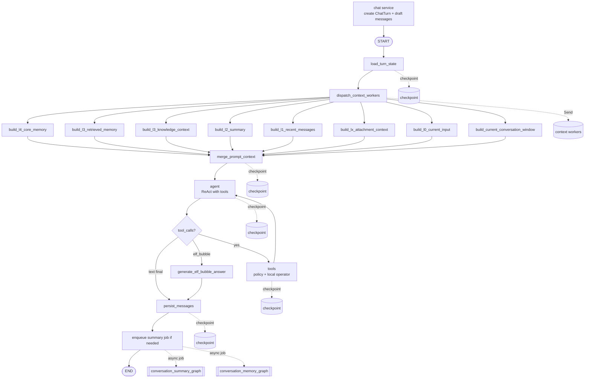
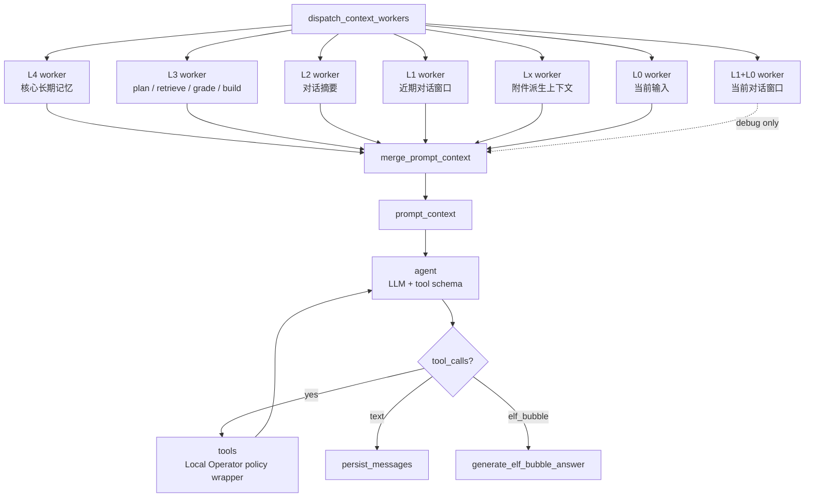
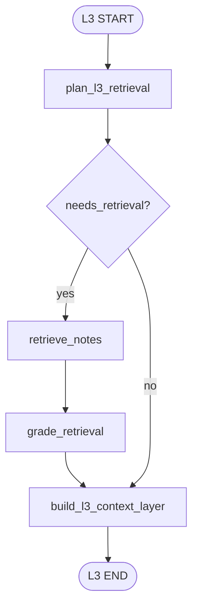
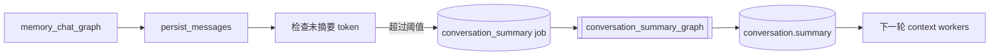
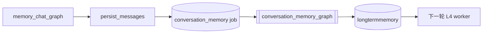

# Memory Chat Graph

`memory_chat_graph` 是 Ai 记的第一版记忆对话 graph。它把 conversation、chatmessage、向量检索和大模型回答串起来。

## 项目规则注入（AGENTS.md → ReAct system prompt）

ReAct agent 的系统提示词由 `backend/app/agent/graphs/memory_chat/nodes.py::_build_react_agent_system_prompt`
构建，在“核心规则”之后、“表达规则”之前，会拼接 `RUNTIME_AGENT_RULES`
（定义在 `backend/app/agent/project_rules.py`），从而把仓库根 `AGENTS.md` 的
核心条款带进每一次推理。最重要的一条：用户要求写代码 / 创建项目 / 新建文件 /
运行涉及本地文件系统的命令时，如果**没有明确指出工作目录**，agent 必须先反问
用户应该放在哪里，而不是默认选择当前工作区或 AiMemo 仓库。

修改条款时同时改 `AGENTS.md` 与 `project_rules.py` 保持一致，然后跑
`backend/tests/test_runtime_agent_rules.py` 验证注入仍然生效。

## 当前流程

流式接口会先创建 `ChatTurn` 和本轮 user/assistant 草稿消息，然后再启动
`memory_chat_graph`。这样浏览器刷新后，消息列表仍然能看到本轮对话；graph 完成后
`persist_messages` 会把 assistant 草稿更新为最终回复。



## 节点职责

```text
load_turn_state
  读取本轮对话的基础状态，包括 conversation、recent_messages 和 conversation.summary。
  同时重置本轮派生字段，避免同一 thread 上一轮结果污染本轮。
  如果服务层已经预创建 user_message_id / assistant_message_id，会从 L1 recent_messages
  中排除这两条本轮草稿，避免当前输入被重复放入上下文。

dispatch_context_workers
  使用 LangGraph Send 分发上下文 worker。
  每个 worker 独立生成一层 context_l*_layer。

build_l4_core_memory
  读取 longtermmemory 中 active 且 level=4 的核心长期记忆。

build_l3_retrieved_memory
  L3 内部完成 plan_l3_retrieval -> retrieve_notes -> grade_retrieval -> build layer。
  这是当前唯一可能调用检索规划 LLM 和 embedding API 的上下文 worker。

build_l3_knowledge_context
  读取当前 conversation 已挂载的知识空间，构建 L3 挂载知库上下文。
  如果没有挂载知识空间，该节点只产出 no-scope 说明，不能全局检索。
  如果已挂载，除非当前输入是非常明确的闲聊或客观常识问题，否则默认先在挂载范围内检索。
  首轮结果进入 prompt_context；如果结果不足，agent 后续只能用 knowledge_search 在同一挂载范围内补检索。
  prompt 中的 [K1]/[K2] 只用于内部定位 chunk，最终回答不要裸露输出这些编号。

build_l2_summary
  读取 conversation.summary 构建对话摘要层。

build_l1_recent_messages
  按 token budget 裁剪近期消息窗口。该层主要用于调试和后续状态树，不再单独喂给回答模型。

build_lx_attachment_context
  处理当前轮和上下文中引用到的图片、文件等附件。
  它不把图片永久替换成文字；原始附件继续作为证据保存，worker 产出的是基础 metadata，
  后续可扩展 OCR、caption、key facts、尺寸、来源路径、attachment_id 等可注入 prompt 的派生上下文。
  agent 默认基于派生文本回答；如果发现派生文本不够，必须能通过 attachment_id/storage_path
  回到原图重新解析，而不是凭不完整摘要编造。

build_l0_current_input
  构建当前用户输入层。该层作为 L0 单独喂给回答模型和工具规划器。

build_current_conversation_window
  把 L1 近期消息和 L0 当前输入合并成一段连续对话：
  `assistant/user/.../user(current)`。
  该层保留用于调试和后续 UI，不再作为主 prompt 的默认输入。原因是它容易让
  agent 把 L1 历史 assistant 草稿误当成本轮 L0 指令继续执行。

merge_prompt_context
  按 L4 -> L3 -> L2 -> L1 history -> Lx attachments -> L0 current 顺序合并上下文。
  输出最终 prompt_context。

agent
  主对话 ReAct 节点。它一次性拿到 L0-L4 prompt_context、turn_messages 和本地工具
  schema，由模型自行决定是否调用工具。
  如果模型返回 tool_calls，路由到 tools；如果没有 tool_calls，agent 直接写入
  assistant_answer 并进入 persist_messages。这样不再由 `_looks_like_*` 规则 helper
  预判“要不要工具”，避免“采用方案一/继续/按你说的”这类接续指令被规则漏判后口编。
  agent 的 system prompt 明确禁止在没有真实工具结果时声称文件已创建、命令已执行或
  编造 stdout/随机数/测试结果。

tools
  执行 agent 返回的 tool_calls。当前复用 Local Operator 工具层，因此 workspace、
  敏感文件、read-before-write、exec 命令策略和 agent_operations 审计仍然生效。
  每个工具结果会转成 tool observation 和 tool message 追加回 turn_messages，然后
  回到 agent，由模型基于真实 ToolMessage 决定下一步或最终回答。

generate_answer
  已从主图删除。普通 text 回答由 agent 节点直接生成并流式输出。
  目标验收不再是独立 verify_goal 节点，而是写入 agent system prompt 和工具结果闭环：
  模型必须在最终回答前自检用户目标是否已被 ToolMessage 证明完成。

generate_elf_bubble_answer
  桌面精灵外置聊天的专用回答分支。
  该节点要求模型输出结构化 JSON：`bubbles: [{ text, emoji }]`。
  每个 bubble 是一个语义完整的气泡片段，emoji 用于驱动精灵表情。
  一个 bubble 只承载一种主要情绪；如果模型把明显情绪转折塞入同一气泡，
  后端会按句子和转折词做轻量二次切分，并重新推断 emoji。
  该节点同样写入 `assistant_answer`，把所有 bubble text 合并为最终消息文本，
  因此下游 `persist_messages` 可以和普通回答分支共用。

persist_messages
  优先更新服务层预创建的 user/assistant 草稿消息，把 assistant 改为 completed。
  如果没有草稿 ID，则按非流式路径创建一问一答。
  该节点仍会检查尾部是否已经存在同样一问一答，降低重试时重复写入风险。
  当前 ReAct 主循环不再使用 conversation.active_task；persist_messages 会清空该字段，
  防止历史 Dynamic Task 数据误续到新对话。

enqueue summary job if needed
  这是 chat service 在 memory_chat_graph 完成后的轻量检查，不属于主 graph 节点。
  当未摘要消息 token 超过阈值时创建 conversation_summary job。
  摘要生成由后台 conversation_summary_graph 完成，不阻塞本轮聊天返回。

enqueue memory job
  chat service 会为本轮 user/assistant 消息创建 conversation_memory job。
  长期记忆抽取由后台 conversation_memory_graph 完成，不阻塞聊天返回。
```

## 回答提示词策略

最终回答节点的提示词目标不是“展示检索过程”，而是让用户自然地和自己的记忆系统交流。

当前策略：

```text
保留边界
  不编造用户经历；poor/none 时不能把不存在的记忆说成事实。

弱化报告感
  不默认输出“基于有限片段”“检索质量较弱”“记忆质量不足”等内部评估话术。

个人画像
  当用户问“你觉得我是怎样的人”“你了解我吗”“评价我”时，
  优先给出温和、具体的人格印象，可以轻轻承认了解还不完整，
  但不要把回答开头写成免责声明。

表达方式
  默认短段落、自然中文；除非用户要求分析，不强行编号。
  不暴露 graph、L0-L4、retrieval_grade、chunk、score 等内部实现细节。
```

## Thread 约定

```text
thread_id = conversation:{conversation_id}
```

这个 thread 只给主聊天 graph 使用。后台 job 仍然使用：

```text
thread_id = job:{job_id}
```

## State 字段

```text
conversation_id
user_message
langgraph_thread_id
recent_messages
conversation_summary
intent
needs_retrieval
needs_query_rewrite
retrieval_query
plan_confidence
retrieval_reason
retrieved_chunks
retrieval_grade
retrieval_grade_reason
context_l4_layer
context_l3_layer
context_l3_knowledge_layer
context_l2_layer
context_conversation_window_layer
context_l1_layer
context_lx_attachment_layer
context_l0_layer
prompt_context
mounted_knowledge_spaces
needs_knowledge_retrieval
knowledge_retrieval_query
knowledge_retrieval_reason
knowledge_retrieved_chunks
knowledge_retrieval_debug
turn_messages
tool_budget
agent_decision
tool_observations
tool_observation_context
thought_events
answer_mode
assistant_answer
elf_bubble_answer_parts
user_message_id
assistant_message_id
graph_checkpoint_id
error
```

注意：LangGraph 内部保留 `checkpoint_id` 这个 channel 名，所以 graph state 中使用 `graph_checkpoint_id`，业务表和 API 响应仍然叫 `checkpoint_id`。

## 本轮消息流

跨轮历史不直接依赖 LangGraph list reducer，而是每轮从数据库、摘要、长期记忆和
RAG 重新构建金字塔上下文。单轮 graph 内部则使用 `turn_messages` 记录执行轨迹：

```text
load_turn_state
  -> turn_messages = [user(current)]

agent
  -> append assistant message
  -> 如果模型返回 tool_calls，保留结构化 AIMessage.tool_calls

tools
  -> append tool observation
  -> append ToolMessage

agent / generate_elf_bubble_answer
  -> model messages = system_prompt + prompt_context + turn_messages
```

这样既能让一轮内部的工具循环天然看到前面发生了什么，也避免同一个
`conversation:{id}` checkpoint thread 在跨轮执行时重复累加历史消息。

重要细节：带工具调用的 assistant 消息不会被压成普通 JSON 文本，而是以
`AIMessage(tool_calls=...)` 的结构回放给模型；工具结果也以同一个
`tool_call_id` 的 `ToolMessage` 回放。这是 ReAct 循环能稳定继续的关键。

## 恢复语义

如果执行中断发生在 `agent` 生成最终 answer 之后、`persist_messages` 之前：

```text
assistant_answer 已进入 checkpoint
恢复执行时从 persist_messages 继续
不会重复调用 LLM
```

如果中断发生在 `persist_messages` 节点内部，仍存在“数据库已提交但 checkpoint 未写入”的极端窗口。MVP 通过检查尾部一问一答降低重复写入风险。后续如果要进一步增强，可以引入 per-turn request_id 做严格幂等。

## 调试入口和刷新语义

每轮对话开始时，SSE 第一包 `turn` 会返回：

```text
turn_id
user_message
assistant_message
node_statuses
```

前端立即把临时气泡替换成真实消息，并把 assistant 消息与 `turn_id` 绑定。
因此 graph 按钮不再等待回答完成才出现。

调试接口有两种入口：

```text
GET /api/conversations/{conversation_id}/turns/{turn_id}/graph
GET /api/conversations/{conversation_id}/messages/{assistant_message_id}/graph
```

`turn_id` 用于运行中查看；`assistant_message_id` 用于历史消息反查。

刷新恢复的当前语义：

```text
发送开始 -> user 消息 completed，assistant 消息 streaming，ChatTurn running
生成中   -> assistant.content 按 token 增量更新
完成后   -> assistant.status = completed，ChatTurn.status = completed
失败时   -> assistant.status = failed，ChatTurn.status = failed
```

如果浏览器刷新，消息列表会从 `chatmessage` 表恢复，至少不会丢失本轮用户输入和
已经生成的 assistant 草稿。后续如果要做到“刷新后自动继续生成”，需要增加
`running ChatTurn` 的恢复调度器，重新接管对应 checkpoint。

外置精灵聊天的 SSE 语义：

```text
POST /api/elf/chat/stream
  内部仍执行 memory_chat_graph。
  输入 answer_mode = elf_bubble。
  service 关闭精灵工作状态播报，避免“开始检索/长期记忆提取完成”等气泡打断直接对话。

bubble_delta
  generate_elf_bubble_answer 节点的原始 JSON token。
  第一版桌面端不直接展示 token，只等待 done.bubbles。

done.bubbles
  最终结构化气泡列表：[{ text, emoji }]。
  桌面精灵按这些气泡依次展示，并根据 emoji 切换表情。当前表情枚举与
  `frontend/public/elf/memo/*.png` 对齐：
  `idle_soft`、`thinking`、`working_focus`、`success_smile`、
  `error_worried`、`sleepy`、`curious`、`memory_glow`、`shy_blush`、
  `angry_pout`、`surprised`、`sad_teary`、`wronged_pout`、`confused`、
  `proud`、`playful_wink`、`serious`、`relaxed`、`encouraging`、
  `speechless`。旧值 `soft/happy/worried/memory` 会在后端和桌面端归一化。
```

## 性能埋点

每轮 `ChatTurn` 会写入 `debug_payload` JSON，供开发阶段定位慢点。所有时间均以
本轮 turn 创建为起点，单位为毫秒。

```text
debug_payload.events.turn_created
debug_payload.events.graph_done
debug_payload.events.turn_completed
debug_payload.events.turn_failed

debug_payload.summary.first_answer_token_ms
debug_payload.summary.last_answer_token_ms
debug_payload.summary.answer_token_events
debug_payload.summary.answer_chars
debug_payload.summary.retrieved_count

debug_payload.nodes.{node_name}.status
debug_payload.nodes.{node_name}.started_ms
debug_payload.nodes.{node_name}.completed_ms
debug_payload.nodes.{node_name}.duration_ms
debug_payload.nodes.{node_name}.state
```

`debug_payload.nodes.{node_name}.state` 保存该节点完成后的累计 graph state 快照。
它用于前端点击普通节点查看运行时 state。该快照来自 LangGraph updates 事件，与
checkpoint 中的执行状态语义一致，但会做长度裁剪，避免 prompt_context、检索 chunk
或 turn_messages 过大导致调试 payload 膨胀。

注意：第一版节点 state 面板读取的是 `ChatTurn.debug_payload` 中的快照，而不是直接
查询 checkpoint SQLite。后续如果要做“对话状态树”或“任意 checkpoint 回溯”，再扩展
为按 checkpoint_id 读取 LangGraph 原生 state history。

当前已经新增第一版原生 checkpoint history API：

```text
GET /api/conversations/{conversation_id}/turns/{turn_id}/state-history
```

该接口不直接解析 SQLite 表，而是用同一个 `memory_chat_graph` + 同一个 SQLite
checkpointer 编译 graph，然后调用 LangGraph `get_state_history()`。返回内容包含：

```text
checkpoint_id
parent_checkpoint_id
created_at
next
tasks
interrupts
metadata
values
```

节点 state 快照和 checkpoint history 的定位不同：

```text
debug_payload.nodes.{node}.state
  轻量、按节点完成事件保存，适合快速看某个节点结束后的累计 state。

state-history
  LangGraph 原生 checkpoint 时间线，适合排查恢复、回溯、未来对话状态树和 update_state 分支。
```

L3 worker 会额外写入：

```text
debug_payload.nodes.build_l3_retrieved_memory.retrieval_debug.planner_ms
debug_payload.nodes.build_l3_retrieved_memory.retrieval_debug.retriever_ms
debug_payload.nodes.build_l3_retrieved_memory.retrieval_debug.grade_ms
debug_payload.nodes.build_l3_retrieved_memory.retrieval_debug.layer_ms
debug_payload.nodes.build_l3_retrieved_memory.retrieval_debug.total_ms
debug_payload.nodes.build_l3_retrieved_memory.retrieval_debug.planner_source
```

前端 graph 调试面板会展示首 token、完成时间、节点时间表和 L3 内部耗时。

## L3 检索规划策略

检索规划已经从主干下放到 `build_l3_retrieved_memory` worker 内部。这样 L0/L1/L2/L4 不需要等待检索规划和向量检索。

```text
规则明确
  -> 直接输出计划，不调用额外 LLM。

规则不确定
  -> 调用 qwen-turbo planner model，要求返回结构化 JSON。
     默认关闭 Qwen thinking mode，避免小 JSON 判断被思考链拖慢。
```

已覆盖的规则快路径：

```text
个人记忆查询词：我之前、上次、以前、记得、我说过、笔记、提到过、来着等
个人画像问题：你觉得我是一个怎么样的人、评价我、我的性格、我的特点、你了解我等
普通直接问题：1+1、你好等
```

个人画像问题会直接改写为：

```text
用户个人画像 性格特质 生活偏好 近期计划 行为记录
```

这样可以跳过 L3 内部的 planner LLM，只保留 embedding 检索和最终回答生成。

L3 节点会在后端日志输出 `memory_chat.l3_timing`，包含：

```text
planner_ms
retriever_ms
grade_ms
layer_ms
total_ms
planner_source
retrieved_count
```

这个日志用于继续判断 L3 的实际慢点：如果 `planner_ms` 高，说明分类/改写 LLM 慢；
如果 `retriever_ms` 高，说明 embedding 或 sqlite-vec 查询慢。

计划字段：

```text
intent
needs_retrieval
needs_query_rewrite
retrieval_query
confidence
reason
```

当用户使用“那个”“来着”等指代或省略表达时，planner 可以把问题改写为更适合向量检索的 `retrieval_query`。

## 检索质量策略

L3 内部的 `grade_retrieval` 当前不使用 LLM。它根据最高 `score` 输出：

```text
good
  检索结果可作为主要依据。

weak
  检索结果可能相关，但回答时必须谨慎。

poor / none
  不应把检索结果当成可靠记忆。
```

## 金字塔上下文构建

当前实现已经把回答上下文从旧 `generate_answer` 节点中拆出，并使用 LangGraph `Send`
worker 并行构建 L0-L4 五层上下文。本地 read/write/exec 工具不再作为上下文 worker
提前执行，而是进入 `agent -> tools -> agent` ReAct 主循环。
这能避免模型在工具执行后无法继续决策，也能减少“说自己写了但其实没继续调用工具”的问题。



这里的工具循环发生在 Memory Chat Graph 主干上，而不是隐藏在回答前的上下文构建阶段。
L0/L1/L2/L3/L4、Lx 附件派生上下文和 L1+L0 当前对话窗口仍然并行构建；工具是否调用由合并上下文后的 agent 决定。
`merge_prompt_context` 真正注入模型的是 L4、L3、L2、L1 history、Lx attachments、L0 current。
L1+L0 当前对话窗口保留给调试，不再作为主 prompt 的默认输入。

当前主循环已开放第一批 read/write/exec 工具：

```text
list_dir
read_file
search_files
search_text
get_file_info
write_file
exec_command
```

工具调用规则：

```text
普通聊天
  -> agent 没有返回 tool_calls，直接生成最终回答。

明确本地读取请求
  -> agent 返回 read 工具 tool_call
  -> tools 执行 read 工具
  -> 写入 agent_operations 审计表
  -> ToolMessage 回到 agent
  -> agent 决定继续调用工具或最终回答

明确本地写入请求
  -> 如果目标是新文件，agent 可直接返回 write_file tool_call
  -> 如果目标已存在，agent 必须先返回 read_file tool_call 完整读取目标文件
  -> tools 执行 write_file
  -> 写入 agent_operations 审计表
  -> ToolMessage 回到 agent
  -> agent 决定是否还需要读取、执行或验证

多轮确认写入
  -> 如果上一轮 assistant 已经给出目标路径和正文
  -> 用户下一轮说“直接保存/写到具体文件”
  -> agent 根据 prompt_context 中的 L1 历史和 L0 当前输入理解接续语义
  -> 进入 write_file，而不是口头声称已经保存
```

所有工具的 `path/root/cwd` 参数都要求使用绝对路径；用户明确给出 `E:\demo` 时，
agent 不能降级成当前仓库下的 `demo/...`。所有路径仍会进入 `LocalOperatorPolicy` 和工具层校验。读取默认开放本机固定盘符和用户
Home，但 `.env`、密钥、数据库文件、设备路径、UNC 网络路径和超大文件等敏感目标默认拒绝。
写入会复用 Claude Code 风格的 read-before-write、路径策略和审计记录；覆盖已有文件时，
`read_file` 必须返回完整视图，且文件 mtime 不能在读取后发生变化。`get_file_info/list_dir`
只能证明路径存在，不能替代读取正文。高风险写入审批后续接 LangGraph `interrupt()`。

最终回答必须以工具 observation 为事实来源：

```text
用户要求写入/保存文件
  + 本轮没有成功的 write_file observation
  -> agent 最终回答必须说明尚未写入，不能说“已经保存/写入完成”。

用户要求写入/保存文件
  + 本轮存在成功的 write_file observation
  -> agent 可以引用工具返回的真实 path、bytes_written、hash 等信息。
```

L3 worker 内部流程：



各层预算由 `config.json5` 的 `context_pyramid` 覆盖，缺省兜底值定义在 `ContextBudget` 中。
当前项目配置为：

```text
L4 core_memory_tokens: 2400
L3 retrieved_memory_tokens: 10000
L2 summary_tokens: 4000
L1 recent_message_tokens: 8000
L1+L0 conversation_window_tokens: 10000
weak_retrieval_max_chunks: 5
```

L3 的使用规则：

```text
good
  检索 chunk 会进入 prompt，可作为主要依据。

weak
  只放入少量候选，并明确提示“可能相关但不确定”。

poor / none
  不把弱相关 chunk 放进 prompt，只告诉模型没有可靠记忆。
```

每层 worker 写入独立 state 字段：

```text
context_l4_layer
context_l3_layer
context_l2_layer
context_l1_layer
context_lx_attachment_layer
context_l0_layer
```

这里没有使用 `context_layers` 列表 reducer。原因是聊天 graph 使用同一个 `conversation:{id}` thread 跨轮执行，列表 reducer 容易把上一轮 layer 追加进本轮。独立字段更明确，也更利于 checkpoint 调试。

## Lx 附件派生上下文

图片和附件的默认策略是“原始证据 + 派生文本”，而不是“只存图片”或“只存提取文字”：

```text
原始附件
  存储在 data/uploads 或配置指定目录。
  记录 attachment_id、conversation_id、message_id、storage_path、mime_type、size、
  width、height、sha256、retention_policy。

派生文本
  记录 OCR、caption、key facts、标签、坐标/尺寸 metadata、生成模型和 source_hash。
  当前实现先生成基础 metadata 派生文本；OCR、caption、key facts 是后续视觉理解扩展。
  派生文本用于 prompt_context、embedding 和后续检索。

上下文注入
  当前轮新图片可以直接进入视觉模型输入，同时写入派生文本。
  历史图片默认只注入派生文本和 attachment 引用，避免每轮重复加载原图。
```

`build_lx_attachment_context` 和 L0/L1/L2/L3/L4 同级，由 `dispatch_context_workers`
并行分发。它的输出形态类似：

```text
[Attachments]
- attachment_id: img_...
  kind: image
  source: /absolute/or/storage/path
  derived:
    caption: ...
    key_facts:
      - ...
    ocr: ...
  fallback: 如果以上信息不足，可重新解析 attachment_id=img_... 的原图。
```

运行策略：

```text
当前轮有新图片
  -> 验证大小和 mime type
  -> 保存原图和缩略图
  -> 同步或快速异步生成本轮回答需要的 caption/key facts
  -> 把派生文本和 attachment 引用写入 context_lx_attachment_layer

历史上下文提到图片
  -> 优先读取已保存的 AttachmentDerivative
  -> 不默认把原图再次塞进模型
  -> 如果用户追问细节，agent 可通过后续附件解析工具回源读取原图

派生文本不足
  -> agent 不应基于 caption 猜测
  -> 使用 attachment_id/storage_path 重新解析图片，或明确说明当前信息不足
```

长期记忆抽取只消费派生文本和用户确认过的结论。图片本体作为证据链接保留，不能因为
一次 OCR/caption 结果就把未经确认的视觉细节提升为 L4 核心记忆。

L4 当前读取规则：

```text
longtermmemory.status = active
longtermmemory.level = 4
order by importance desc, updated_at desc
limit 8
```

## L2 滚动摘要

`memory_chat_graph` 本身只读取 `conversation.summary`，不会在回答链路中生成摘要。

摘要更新由后台 job 处理：



触发规则：

```text
summary_message_id 之后的 completed user/assistant 消息 token 总量 > 1500
  -> enqueue conversation_summary job
```

恢复语义：

```text
summarize_messages 完成后，generated_summary 进入 checkpoint。
如果进程在 persist_summary 前中断，恢复时直接写库，不重复调用 LLM。
```

## L4 长期核心记忆

聊天结束后，系统会创建长期记忆抽取任务：



第一版写入规则较保守：

```text
should_write = true
importance >= 0.7
confidence >= 0.6
content_hash 不重复
```

当前不做长期记忆向量化、冲突检测和用户确认。

## 当前限制

- 不做多 query rewrite。
- 不做 LLM 检索结果评分。
- 不做多源检索 worker 和 LLM rerank worker。
- 当前图片/附件上传、附件表、派生文本表、前端粘贴/选择入口和
  `build_lx_attachment_context` 已接入；OCR、视觉 caption/key facts、图片解析工具仍待实现。
- 主对话工具循环已接入 read/write/exec。exec 第一版只支持短时、非交互命令；
  高风险命令会被策略拦截，后续再接 LangGraph `interrupt()` 做人工审批。
- 当前工具循环由模型 tool_calls 驱动，允许 observation 以 ToolMessage 回到 `agent` 后再次
  决定下一步。旧的 `agent_think/select_tool/verify_goal` 固定状态机和相关 state 字段
  已从 memory_chat_graph 删除。
- write/exec 的用户审批还未接 LangGraph `interrupt()`；目前高风险审批点只在文档中冻结。
- 不做消息编辑和状态树 UI。
- `thought_snapshot` 展示的是可审计过程摘要，不是模型原始 chain-of-thought。
- SSE 使用 LangGraph `stream_mode=["updates", "messages"]`：
  - `updates` 表示节点已经完成，映射为 succeeded 节点状态事件。
  - `messages` 中仅 `agent` 节点的最终回答 token 映射为用户可见回答。
  - `agent` 节点的 tool_call 参数 chunk 会被过滤，避免工具 JSON 泄露到聊天气泡。
  - `generate_elf_bubble_answer` 节点的 token 映射为 `bubble_delta`，最终结构化结果放在 `done.bubbles`。
  - 其他 LLM 节点 token 视为 internal_token，默认不暴露给前端。
- `dispatch_context_workers` 使用 LangGraph `Send` worker 模式。代码中显式给
  `add_conditional_edges` 传入上下文 worker 目标列表，让 LangGraph Mermaid 能画出真实的并行扇出结构。

## LangSmith tracing

Ai 记默认关闭 LangSmith tracing。原因不是技术绕行，而是产品默认：本地优先的个人
知识库不应默认上传用户笔记、对话内容和 graph trace。

默认值在 `backend/app/__init__.py` 中设置。如果用户已经显式配置
`LANGSMITH_TRACING=true`，应用会尊重该配置。也可以设置：

```text
AIJI_ENABLE_LANGSMITH_TRACING=true
```
