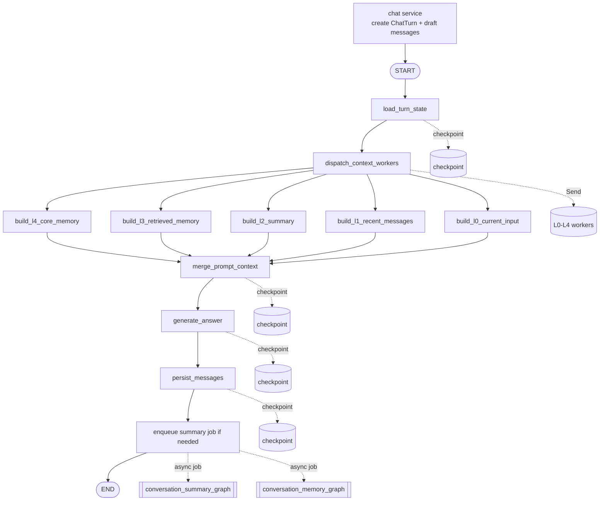
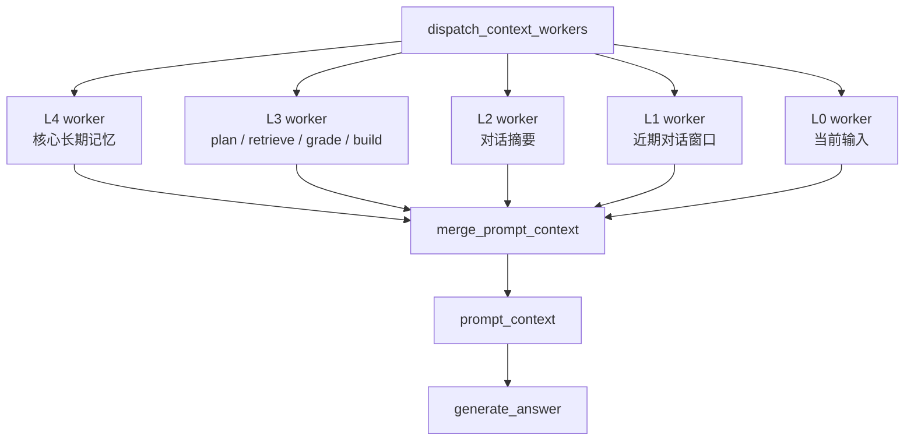
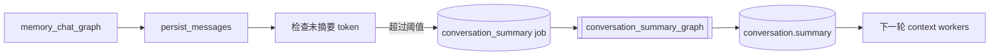
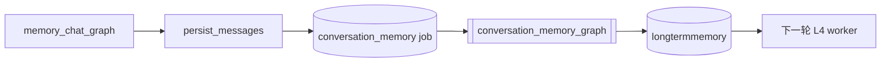

# Memory Chat Graph

`memory_chat_graph` 是 Ai 记的第一版记忆对话 graph。它把 conversation、chatmessage、向量检索和大模型回答串起来。

## 当前流程

流式接口会先创建 `ChatTurn` 和本轮 user/assistant 草稿消息，然后再启动
`memory_chat_graph`。这样浏览器刷新后，消息列表仍然能看到本轮对话；graph 完成后
`persist_messages` 会把 assistant 草稿更新为最终回复。



## 节点职责

```text
load_turn_state
  读取本轮对话的基础状态，包括 conversation、recent_messages 和 conversation.summary。
  同时重置本轮派生字段，避免同一 thread 上一轮结果污染本轮。
  如果服务层已经预创建 user_message_id / assistant_message_id，会从 L1 recent_messages
  中排除这两条本轮草稿，避免当前输入被重复放入上下文。

dispatch_context_workers
  使用 LangGraph Send 分发 L0-L4 五个上下文 worker。
  每个 worker 独立生成一层 context_l*_layer。

build_l4_core_memory
  读取 longtermmemory 中 active 且 level=4 的核心长期记忆。

build_l3_retrieved_memory
  L3 内部完成 plan_l3_retrieval -> retrieve_notes -> grade_retrieval -> build layer。
  这是当前唯一可能调用检索规划 LLM 和 embedding API 的上下文 worker。

build_l2_summary
  读取 conversation.summary 构建对话摘要层。

build_l1_recent_messages
  按 token budget 裁剪近期消息窗口。

build_l0_current_input
  构建当前用户输入层。

merge_prompt_context
  按 L4 -> L0 顺序合并 worker 结果，输出 prompt_context。

generate_answer
  调用 qwen3.5-plus 生成回答。
  默认关闭 Qwen thinking mode，避免普通 RAG 回答首 token 被思考链拖慢。
  回答节点消费 merge_prompt_context 生成的 prompt_context。
  system prompt 由 build_memory_chat_answer_system_prompt 统一维护。
  该节点输出会进入 checkpoint；如果模型调用后中断，恢复时不会重复生成。

persist_messages
  优先更新服务层预创建的 user/assistant 草稿消息，把 assistant 改为 completed。
  如果没有草稿 ID，则按非流式路径创建一问一答。
  该节点仍会检查尾部是否已经存在同样一问一答，降低重试时重复写入风险。

enqueue summary job if needed
  这是 chat service 在 memory_chat_graph 完成后的轻量检查，不属于主 graph 节点。
  当未摘要消息 token 超过阈值时创建 conversation_summary job。
  摘要生成由后台 conversation_summary_graph 完成，不阻塞本轮聊天返回。

enqueue memory job
  chat service 会为本轮 user/assistant 消息创建 conversation_memory job。
  长期记忆抽取由后台 conversation_memory_graph 完成，不阻塞聊天返回。
```

## 回答提示词策略

最终回答节点的提示词目标不是“展示检索过程”，而是让用户自然地和自己的记忆系统交流。

当前策略：

```text
保留边界
  不编造用户经历；poor/none 时不能把不存在的记忆说成事实。

弱化报告感
  不默认输出“基于有限片段”“检索质量较弱”“记忆质量不足”等内部评估话术。

个人画像
  当用户问“你觉得我是怎样的人”“你了解我吗”“评价我”时，
  优先给出温和、具体的人格印象，可以轻轻承认了解还不完整，
  但不要把回答开头写成免责声明。

表达方式
  默认短段落、自然中文；除非用户要求分析，不强行编号。
  不暴露 graph、L0-L4、retrieval_grade、chunk、score 等内部实现细节。
```

## Thread 约定

```text
thread_id = conversation:{conversation_id}
```

这个 thread 只给主聊天 graph 使用。后台 job 仍然使用：

```text
thread_id = job:{job_id}
```

## State 字段

```text
conversation_id
user_message
langgraph_thread_id
recent_messages
conversation_summary
intent
needs_retrieval
needs_query_rewrite
retrieval_query
plan_confidence
retrieval_reason
retrieved_chunks
retrieval_grade
retrieval_grade_reason
context_l4_layer
context_l3_layer
context_l2_layer
context_l1_layer
context_l0_layer
prompt_context
assistant_answer
user_message_id
assistant_message_id
graph_checkpoint_id
error
```

注意：LangGraph 内部保留 `checkpoint_id` 这个 channel 名，所以 graph state 中使用 `graph_checkpoint_id`，业务表和 API 响应仍然叫 `checkpoint_id`。

## 恢复语义

如果执行中断发生在 `generate_answer` 之后、`persist_messages` 之前：

```text
assistant_answer 已进入 checkpoint
恢复执行时从 persist_messages 继续
不会重复调用 LLM
```

如果中断发生在 `persist_messages` 节点内部，仍存在“数据库已提交但 checkpoint 未写入”的极端窗口。MVP 通过检查尾部一问一答降低重复写入风险。后续如果要进一步增强，可以引入 per-turn request_id 做严格幂等。

## 调试入口和刷新语义

每轮对话开始时，SSE 第一包 `turn` 会返回：

```text
turn_id
user_message
assistant_message
node_statuses
```

前端立即把临时气泡替换成真实消息，并把 assistant 消息与 `turn_id` 绑定。
因此 graph 按钮不再等待回答完成才出现。

调试接口有两种入口：

```text
GET /api/conversations/{conversation_id}/turns/{turn_id}/graph
GET /api/conversations/{conversation_id}/messages/{assistant_message_id}/graph
```

`turn_id` 用于运行中查看；`assistant_message_id` 用于历史消息反查。

刷新恢复的当前语义：

```text
发送开始 -> user 消息 completed，assistant 消息 streaming，ChatTurn running
生成中   -> assistant.content 按 token 增量更新
完成后   -> assistant.status = completed，ChatTurn.status = completed
失败时   -> assistant.status = failed，ChatTurn.status = failed
```

如果浏览器刷新，消息列表会从 `chatmessage` 表恢复，至少不会丢失本轮用户输入和
已经生成的 assistant 草稿。后续如果要做到“刷新后自动继续生成”，需要增加
`running ChatTurn` 的恢复调度器，重新接管对应 checkpoint。

## 性能埋点

每轮 `ChatTurn` 会写入 `debug_payload` JSON，供开发阶段定位慢点。所有时间均以
本轮 turn 创建为起点，单位为毫秒。

```text
debug_payload.events.turn_created
debug_payload.events.graph_done
debug_payload.events.turn_completed
debug_payload.events.turn_failed

debug_payload.summary.first_answer_token_ms
debug_payload.summary.last_answer_token_ms
debug_payload.summary.answer_token_events
debug_payload.summary.answer_chars
debug_payload.summary.retrieved_count

debug_payload.nodes.{node_name}.status
debug_payload.nodes.{node_name}.started_ms
debug_payload.nodes.{node_name}.completed_ms
debug_payload.nodes.{node_name}.duration_ms
```

L3 worker 会额外写入：

```text
debug_payload.nodes.build_l3_retrieved_memory.retrieval_debug.planner_ms
debug_payload.nodes.build_l3_retrieved_memory.retrieval_debug.retriever_ms
debug_payload.nodes.build_l3_retrieved_memory.retrieval_debug.grade_ms
debug_payload.nodes.build_l3_retrieved_memory.retrieval_debug.layer_ms
debug_payload.nodes.build_l3_retrieved_memory.retrieval_debug.total_ms
debug_payload.nodes.build_l3_retrieved_memory.retrieval_debug.planner_source
```

前端 graph 调试面板会展示首 token、完成时间、节点时间表和 L3 内部耗时。

## L3 检索规划策略

检索规划已经从主干下放到 `build_l3_retrieved_memory` worker 内部。这样 L0/L1/L2/L4 不需要等待检索规划和向量检索。

```text
规则明确
  -> 直接输出计划，不调用额外 LLM。

规则不确定
  -> 调用 qwen-turbo planner model，要求返回结构化 JSON。
     默认关闭 Qwen thinking mode，避免小 JSON 判断被思考链拖慢。
```

已覆盖的规则快路径：

```text
个人记忆查询词：我之前、上次、以前、记得、我说过、笔记、提到过、来着等
个人画像问题：你觉得我是一个怎么样的人、评价我、我的性格、我的特点、你了解我等
普通直接问题：1+1、你好等
```

个人画像问题会直接改写为：

```text
用户个人画像 性格特质 生活偏好 近期计划 行为记录
```

这样可以跳过 L3 内部的 planner LLM，只保留 embedding 检索和最终回答生成。

L3 节点会在后端日志输出 `memory_chat.l3_timing`，包含：

```text
planner_ms
retriever_ms
grade_ms
layer_ms
total_ms
planner_source
retrieved_count
```

这个日志用于继续判断 L3 的实际慢点：如果 `planner_ms` 高，说明分类/改写 LLM 慢；
如果 `retriever_ms` 高，说明 embedding 或 sqlite-vec 查询慢。

计划字段：

```text
intent
needs_retrieval
needs_query_rewrite
retrieval_query
confidence
reason
```

当用户使用“那个”“来着”等指代或省略表达时，planner 可以把问题改写为更适合向量检索的 `retrieval_query`。

## 检索质量策略

L3 内部的 `grade_retrieval` 当前不使用 LLM。它根据最高 `score` 输出：

```text
good
  检索结果可作为主要依据。

weak
  检索结果可能相关，但回答时必须谨慎。

poor / none
  不应把检索结果当成可靠记忆。
```

## 金字塔上下文构建

当前实现已经把回答上下文从 `generate_answer` 中拆出，并使用 LangGraph `Send` worker 并行构建 L0-L4 五层上下文。



L3 worker 内部流程：


各层预算当前在 `ContextBudget` 中定义：

```text
L4 core_memory_tokens: 300
L3 retrieved_memory_tokens: 1200
L2 summary_tokens: 500
L1 recent_message_tokens: 1000
weak_retrieval_max_chunks: 3
```

L3 的使用规则：

```text
good
  检索 chunk 会进入 prompt，可作为主要依据。

weak
  只放入少量候选，并明确提示“可能相关但不确定”。

poor / none
  不把弱相关 chunk 放进 prompt，只告诉模型没有可靠记忆。
```

每层 worker 写入独立 state 字段：

```text
context_l4_layer
context_l3_layer
context_l2_layer
context_l1_layer
context_l0_layer
```

这里没有使用 `context_layers` 列表 reducer。原因是聊天 graph 使用同一个 `conversation:{id}` thread 跨轮执行，列表 reducer 容易把上一轮 layer 追加进本轮。独立字段更明确，也更利于 checkpoint 调试。

L4 当前读取规则：

```text
longtermmemory.status = active
longtermmemory.level = 4
order by importance desc, updated_at desc
limit 8
```

## L2 滚动摘要

`memory_chat_graph` 本身只读取 `conversation.summary`，不会在回答链路中生成摘要。

摘要更新由后台 job 处理：



触发规则：

```text
summary_message_id 之后的 completed user/assistant 消息 token 总量 > 1500
  -> enqueue conversation_summary job
```

恢复语义：

```text
summarize_messages 完成后，generated_summary 进入 checkpoint。
如果进程在 persist_summary 前中断，恢复时直接写库，不重复调用 LLM。
```

## L4 长期核心记忆

聊天结束后，系统会创建长期记忆抽取任务：



第一版写入规则较保守：

```text
should_write = true
importance >= 0.7
confidence >= 0.6
content_hash 不重复
```

当前不做长期记忆向量化、冲突检测和用户确认。

## 当前限制

- 不做多 query rewrite。
- 不做 LLM 检索结果评分。
- 不做多源检索 worker 和 LLM rerank worker。
- 不做消息编辑和状态树 UI。
- SSE 使用 LangGraph `stream_mode=["updates", "messages"]`：
  - `updates` 表示节点已经完成，映射为 succeeded 节点状态事件。
  - `messages` 中仅 `generate_answer` 节点的 token 映射为用户可见回答。
  - 其他 LLM 节点 token 视为 internal_token，默认不暴露给前端。
- `dispatch_context_workers` 使用 LangGraph `Send` worker 模式。代码中显式给
  `add_conditional_edges` 传入 L0-L4 worker 目标列表，让 LangGraph Mermaid 能画出
  真实的并行扇出结构。

## LangSmith tracing

Ai 记默认关闭 LangSmith tracing。原因不是技术绕行，而是产品默认：本地优先的个人
知识库不应默认上传用户笔记、对话内容和 graph trace。

默认值在 `backend/app/__init__.py` 中设置。如果用户已经显式配置
`LANGSMITH_TRACING=true`，应用会尊重该配置。也可以设置：

```text
AIJI_ENABLE_LANGSMITH_TRACING=true
```
