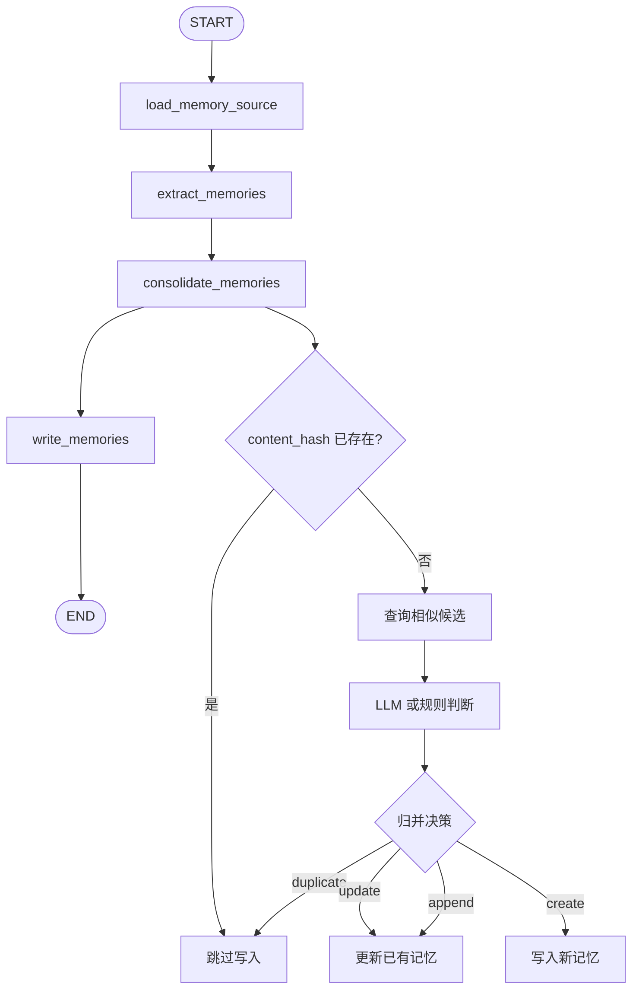

# Memory Consolidation 设计草案

本文记录 Ai 记长期记忆归并层的设计。它的目标是减少 L4 长期记忆中的重复、近似重复和冲突信息，避免上下文金字塔被脏记忆污染。

## 背景问题

当前 `conversation_memory_graph` 已经会在对话结束后异步抽取长期记忆，并写入 `longtermmemory`。

现有写入规则只做了精确 hash 去重：

```text
content_hash = hash(category + normalized_content)
```

这可以拦住完全相同的内容，但无法处理语义相同、措辞略有差异的记忆。

例如：

```text
用户正在计划开发名为 Ai 记 的智能化笔记软件。
用户计划开发名为 Ai 记 的智能化笔记软件。
```

这两条在语义上高度重复，但字符串不同，因此会生成不同 `content_hash`，当前系统会写入两条 active L4 记忆。

## 设计目标

Memory Consolidation 的目标：

```text
减少重复长期记忆。
合并语义相近的长期记忆。
保留信息量更高、更稳定的版本。
避免覆盖用户手动编辑过的重要记忆。
让 L4 上下文更短、更准、更干净。
```

非目标：

```text
第一版不做复杂版本历史。
第一版不做用户确认流程。
第一版不做跨用户、多租户记忆管理。
第一版不做记忆图谱。
第一版不删除旧记忆，最多停用或更新。
```

## 总体流程

Memory Consolidation 应该发生在 `extract_memories` 之后、真正写入 `longtermmemory` 之前。



第一版也可以先不单独新增 graph 节点，而是在 `write_memories` 内部调用 consolidation service。但从长期维护看，建议拆成独立节点：

```text
load_memory_source
extract_memories
consolidate_memories
write_memories
```

原因：

```text
归并逻辑会变复杂。
checkpoint 可以记录 consolidation_result。
恢复时不用重复 LLM 判断。
后续可以单独调试归并结果。
```

## 三层判断策略

### 1. 精确去重

第一层继续使用 `content_hash`：

```text
category + normalized content 完全一致
  -> duplicate
  -> 不写入
```

这是最低成本、最确定的去重。

### 2. 候选召回

第二层从已有 active L4 memories 中找候选。

第一版可先使用轻量规则召回：

```text
同 category
level = 4
status = active
按 updated_at / importance 取最近或最重要的若干条
```

然后用文本相似度做初筛：

```text
normalized_text overlap
关键词重叠
较短内容包含关系
```

更完整的版本应使用 embedding similarity：

```text
为 long_term_memory 增加 embedding 或 memory_embedding 表
新候选记忆生成 embedding
在同 category active memories 中向量检索 top_k
```

推荐第一版分两步：

```text
v1
  规则召回 + LLM judge。

v2
  长期记忆 embedding + similarity top_k + LLM judge。
```

### 3. LLM 判断

第三层由 LLM 判断候选和已有记忆的关系。

输出决策：

```text
duplicate
  新记忆和已有记忆表达的是同一事实，没有新增信息。

update
  新记忆和已有记忆表达同一事实，但新版本更清晰、更完整或更准确。

append
  新记忆补充了已有记忆，可以合并成一条更完整的记忆。

create
  新记忆不是重复内容，应该创建新记忆。

conflict
  新记忆和已有记忆冲突，第一版不自动覆盖，建议创建或标记待处理。
```

第一版可以先只实现：

```text
duplicate
update
create
```

`append` 和 `conflict` 可以在文档中保留，但实现时先降级：

```text
append -> update
conflict -> create
```

## Consolidation 输入输出

输入：

```ts
interface MemoryCandidate {
  category: string;
  content: string;
  summary: string;
  importance: number;
  confidence: number;
  source_type: string;
  source_id: number;
}

interface ExistingMemory {
  id: number;
  category: string;
  content: string;
  summary: string;
  importance: number;
  confidence: number;
  updated_at: string;
}
```

输出：

```ts
type ConsolidationAction =
  | "skip"
  | "create"
  | "update";

interface ConsolidationDecision {
  action: ConsolidationAction;
  existing_memory_id?: number;
  category: string;
  content: string;
  summary: string;
  importance: number;
  confidence: number;
  reason: string;
}
```

语义：

```text
skip
  不写入新记忆。

create
  写入一条新 LongTermMemory。

update
  更新 existing_memory_id 指向的已有记忆。
```

## 写入规则

### skip

适用于：

```text
精确 hash 重复。
LLM 判断 duplicate。
候选记忆质量低于阈值。
```

行为：

```text
不创建新 LongTermMemory。
可在 graph state 中记录 skipped_memory_count。
```

### create

适用于：

```text
没有相似候选。
LLM 判断是新事实。
冲突但第一版不处理覆盖。
```

行为：

```text
创建新 LongTermMemory。
level = 4
status = active
source_type = chat_message
source_id = assistant_message_id
```

### update

适用于：

```text
新记忆与已有记忆是同一事实。
新记忆更完整、更准确或表达更稳定。
```

行为：

```text
更新已有 LongTermMemory。
content = consolidated_content
summary = consolidated_summary
importance = max(existing.importance, candidate.importance)
confidence = max(existing.confidence, candidate.confidence)
updated_at = now
content_hash = hash(category + content)
```

注意：

```text
第一版不删除旧记忆，因为 update 是原地更新。
如果未来加入版本历史，可以把旧内容写入 memory_versions。
```

## Prompt 设计

LLM judge prompt 应该非常克制，不让模型重新发挥。

输入：

```text
新候选记忆：
category: goal
content: 用户正在计划开发名为 Ai 记 的智能化笔记软件。
summary: 计划开发 Ai 记笔记软件

已有记忆候选：
1. id=18
   category: goal
   content: 用户计划开发名为 Ai 记 的智能化笔记软件。
   summary: 开发 Ai 记智能笔记软件
```

要求输出严格 JSON：

```json
{
  "action": "skip|create|update",
  "existing_memory_id": 18,
  "content": "用户计划开发名为 Ai 记 的智能化笔记软件。",
  "summary": "开发 Ai 记智能笔记软件",
  "importance": 0.9,
  "confidence": 1.0,
  "reason": "两条记忆表达同一长期目标，新候选没有新增信息。"
}
```

判断原则：

```text
同一主体、同一目标、同一事实，只是措辞不同 -> skip。
新内容更具体或更准确 -> update。
新内容表达不同事实 -> create。
临时状态、一次性闲聊、模型猜测 -> skip。
不要因为中文近义词差异创建新记忆。
```

## 与 conversation_memory_graph 的关系

当前 graph：

```text
load_memory_source
extract_memories
write_memories
```

建议改为：

```text
load_memory_source
extract_memories
consolidate_memories
write_memories
```

职责变化：

```text
extract_memories
  只负责从对话中抽取候选记忆。

consolidate_memories
  负责候选记忆和已有记忆的归并决策。

write_memories
  只执行 consolidation 决策，不再做复杂判断。
```

Graph state 建议新增：

```ts
consolidation_result: {
  decisions: ConsolidationDecision[]
}
```

恢复语义：

```text
如果 extract 后中断：
  checkpoint 已有 extraction_result。
  恢复时继续 consolidate，不重复抽取。

如果 consolidate 后中断：
  checkpoint 已有 consolidation_result。
  恢复时直接 write，不重复 LLM judge。

如果 write 重复执行：
  skip/create/update 都需要保持幂等。
```

## 幂等规则

必须保证 job 恢复或重复执行不会污染记忆。

规则：

```text
create
  写入前再次检查 content_hash。
  已存在则跳过。

update
  根据 existing_memory_id 更新。
  如果目标不存在或已 archived，则降级为 create 或 skip。

skip
  永远安全。
```

对于 update：

```text
如果 existing memory 的 content 已经等于 decision.content：
  不重复更新，或只保持 updated_at 不变。
```

## 数据表设计

第一版不强制新增表，可以复用 `longtermmemory`。

现有字段足够支撑：

```text
id
level
category
content
summary
importance
confidence
source_type
source_id
status
content_hash
created_at
updated_at
```

后续可选新增：

```text
memory_versions
  id
  memory_id
  old_content
  old_summary
  reason
  created_at

memory_embeddings
  memory_id
  embedding
  embedding_model
  content_hash
  updated_at

memory_consolidation_events
  id
  job_id
  action
  candidate_content
  existing_memory_id
  decision_json
  created_at
```

第一版建议不新增表，先保持简单。

## 服务层建议

建议新增：

```text
backend/app/services/memory_consolidation_service.py
```

职责：

```text
normalize candidate
exact hash check
load candidate existing memories
call LLM judge
return consolidation decisions
```

建议函数：

```python
def consolidate_memory_candidates(
    session: Session,
    candidates: list[NormalizedMemoryCandidate],
    *,
    source_type: str,
    source_id: int,
) -> list[ConsolidationDecision]:
    ...
```

后续如果加入 embedding：

```python
def find_similar_memories(
    session: Session,
    candidate: NormalizedMemoryCandidate,
    *,
    top_k: int = 5,
) -> list[LongTermMemory]:
    ...
```

## 测试计划

必须覆盖：

```text
完全相同 content_hash -> skip。
语义重复但措辞不同 -> skip 或 update。
新事实 -> create。
低 importance / confidence -> skip。
已有 archived memory 不参与 active 去重。
update 后 content_hash 重新计算。
consolidation_result 已存在时 write 不重复调用 judge。
重复执行 write 不创建重复记忆。
```

针对截图中的案例，应新增测试：

```text
existing:
  用户计划开发名为 Ai 记 的智能化笔记软件。

candidate:
  用户正在计划开发名为 Ai 记 的智能化笔记软件。

expected:
  action = skip
  不创建新 LongTermMemory
```

## 第一版实施建议

我建议第一版按以下顺序实现：

```text
1. 新增 memory_consolidation_service。
2. 先实现 exact hash + 同 category active memory 候选召回。
3. 加 LLM judge，严格 JSON 输出。
4. conversation_memory_graph 新增 consolidate_memories 节点。
5. write_memories 改为执行 decisions。
6. 补 pytest，覆盖 duplicate / create / update / idempotency。
7. 更新 conversation-memory-graph.md Mermaid 图。
```

第一版不要急着做 memory embedding。当前重复问题先用“候选召回 + LLM judge”即可明显改善。

## 已完成记录

### 2026-05-17：第一版归并层

已实现：

```text
新增 backend/app/services/memory_consolidation_service.py。
conversation_memory_graph 新增 consolidate_memories 节点。
ConversationMemoryGraphState 新增 consolidation_result。
write_memories 改为执行 skip/create/update decisions。
content_hash 完全重复时 skip。
明显高相似同类记忆由本地规则 skip。
其余同 category active L4 候选交给 planner LLM judge。
consolidation_result 写入 checkpoint，恢复时不重复调用 judge。
write_memories 对 create/update 保持幂等。
```

当前第一版取舍：

```text
暂不新增 memory embedding 表。
暂不新增 memory_versions 表。
暂不记录 memory_consolidation_events。
append/conflict 暂未作为独立 action 实现。
```

已覆盖测试：

```text
高价值记忆正常写入。
低 confidence 记忆跳过。
extract 后中断恢复不重复调用 extractor。
语义相近但措辞不同的目标记忆不重复写入。
consolidate 后中断恢复不重复调用 judge。
模型 JSON 解析异常降级为空记忆。
```
