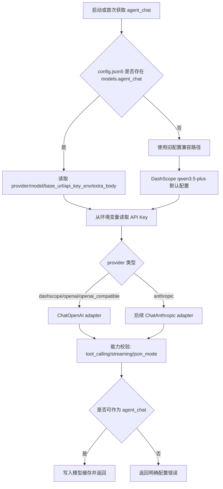
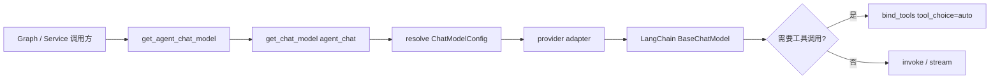

# 聊天模型 Provider 适配设计

本文记录 AiMemo 从“默认只使用阿里百炼 / DashScope 模型”演进到“聊天模型可配置”的第一阶段设计。

第一阶段只改聊天回答模型，也就是 `backend/app/agent/model.py` 中当前由 `get_agent_chat_model()` 创建的主模型。Planner、视觉解析、embedding、语音 ASR/TTS 先保持现状，但配置结构要为后续扩展留出清晰边界。

## 当前状态

当前 Agent 模型工厂集中在：

```text
backend/app/agent/model.py
```

当前固定模型：

```text
agent_chat: qwen3.5-plus
planner: qwen-turbo
vision: config attachments.vision_model，默认 qwen-vl-plus
embedding: DashScope text-embedding-v4
voice: aliyun_dashscope
```

主要问题：

```text
1. 聊天模型写死为 DashScope qwen3.5-plus。
2. `dashscope_api_key/base_url` 是全局字段，不适合表达多个 provider。
3. provider 特性差异没有建模，例如 tool calling、JSON mode、vision、thinking/reasoning 参数。
4. 启动预热和模型缓存只按固定全局实例缓存，切换配置后缺少可预测的 reset 规则。
```

当前 `get_agent_chat_model()` 虽然名义上是“聊天模型”，但实际不只服务主对话回答。以下调用方都会间接受它影响：

```text
memory_chat_graph
  主 ReAct agent、工具调用决策和最终回答。

conversation_summary / conversation_memory / conversation_title
  对话摘要、长期记忆抽取、标题生成等后台或轻量生成任务。

note_metadata
  笔记标题、摘要、标签等元数据生成。
```

因此第一阶段的“聊天模型可配置”应被理解为主通用文本生成模型可配置，而不是只替换聊天窗口里最后一步回答。后续如果需要更细的成本/质量控制，再把这些任务拆成独立 slot。

## 目标

第一阶段目标：

```text
让主聊天模型可通过 config.json5 / .env 选择 provider、base_url、model 和 key。
保持现有 DashScope 默认行为不变。
保持 memory_chat_graph、conversation_summary、conversation_memory、conversation_title 等调用方接口不变。
```

非目标：

```text
不在第一阶段切换 embedding provider。
不在第一阶段切换语音 provider。
不在第一阶段实现前端模型配置 UI。
不在第一阶段实现复杂的多模型路由、成本统计或自动 fallback。
不要求所有 provider 都支持视觉、工具调用和 JSON mode；能力不足时要显式报错或降级。
```

## 模型槽位

模型配置按用途分槽位，而不是只配置一个全局模型：

```text
agent_chat
  主 ReAct agent 和普通回答。第一阶段优先改它。

planner
  检索规划、query rewrite、轻量 JSON 判断。暂时保留 DashScope qwen-turbo。

vision
  图片附件解析。暂时保留 DashScope qwen-vl-plus。

embedding
  笔记/知库向量化。暂时保留 DashScope text-embedding-v4。

voice
  ASR/TTS/Voice Design。继续使用现有 voice.* 配置。
```

这样做的好处是：聊天模型可以换成 OpenAI / DeepSeek / OpenRouter 等，而 embedding 和语音不被迫一起迁移。

第一阶段只把 `agent_chat` 做成可选项；其他 slot 先写入设计，不进入本轮实现范围。

## Provider 类型

第一阶段建议支持两类 provider：

```text
openai_compatible
  使用 langchain_openai.ChatOpenAI。
  适配 DashScope compatible-mode、OpenAI、DeepSeek、OpenRouter、火山/硅基流动等提供 OpenAI 兼容接口的服务。

anthropic
  后续可接 langchain_anthropic.ChatAnthropic。
  第一阶段可以先写入设计，不立即实现。
```

第一阶段实际落地优先级：

```text
1. dashscope_openai_compatible，也可以统一视为 openai_compatible。
2. openai。
3. deepseek/openrouter 等 OpenAI-compatible provider。
4. anthropic 后续再接。
```

## 配置结构

建议在 `config.json5` 中新增 `models` 节点：

```json5
{
  "models": {
    "agent_chat": {
      "provider": "dashscope",
      "model": "qwen3.5-plus",
      "base_url": "https://dashscope.aliyuncs.com/compatible-mode/v1",
      "api_key_env": "DASHSCOPE_API_KEY",
      "temperature": 0.2,
      "streaming": true,
      "capabilities": {
        "tool_calling": true,
        "json_mode": true,
        "vision": false
      },
      "extra_body": {
        "enable_thinking": false
      }
    },
    "planner": {
      "provider": "dashscope",
      "model": "qwen-turbo",
      "base_url": "https://dashscope.aliyuncs.com/compatible-mode/v1",
      "api_key_env": "DASHSCOPE_API_KEY",
      "temperature": 0.0,
      "streaming": false,
      "extra_body": {
        "enable_thinking": false
      }
    },
    "vision": {
      "provider": "dashscope",
      "model": "qwen-vl-plus",
      "base_url": "https://dashscope.aliyuncs.com/compatible-mode/v1",
      "api_key_env": "DASHSCOPE_API_KEY",
      "temperature": 0.1,
      "streaming": false
    }
  }
}
```

`.env` 中保留密钥：

```text
DASHSCOPE_API_KEY=...
OPENAI_API_KEY=...
DEEPSEEK_API_KEY=...
OPENROUTER_API_KEY=...
```

为了兼容当前配置，第一阶段需要保留旧字段：

```text
dashscope_api_key
dashscope_base_url
chat_model
openai_api_key
openai_base_url
```

兼容策略：

```text
如果 models.agent_chat 存在：
  优先使用 models.agent_chat。

如果 models.agent_chat 不存在：
  使用当前旧配置，等价于 DashScope qwen3.5-plus。
```

配置解析流程：



## 常见配置示例

DashScope 默认：

```json5
"agent_chat": {
  "provider": "dashscope",
  "model": "qwen3.5-plus",
  "base_url": "https://dashscope.aliyuncs.com/compatible-mode/v1",
  "api_key_env": "DASHSCOPE_API_KEY",
  "extra_body": { "enable_thinking": false }
}
```

OpenAI：

```json5
"agent_chat": {
  "provider": "openai",
  "model": "gpt-4.1",
  "base_url": "https://api.openai.com/v1",
  "api_key_env": "OPENAI_API_KEY"
}
```

DeepSeek OpenAI-compatible：

```json5
"agent_chat": {
  "provider": "openai_compatible",
  "model": "deepseek-chat",
  "base_url": "https://api.deepseek.com/v1",
  "api_key_env": "DEEPSEEK_API_KEY"
}
```

OpenRouter：

```json5
"agent_chat": {
  "provider": "openai_compatible",
  "model": "openai/gpt-4.1",
  "base_url": "https://openrouter.ai/api/v1",
  "api_key_env": "OPENROUTER_API_KEY"
}
```

这些示例只表达配置形态，不承诺模型名称长期稳定。具体模型名以后以用户配置和 provider 官方列表为准。

## 能力声明

不同模型能力不一致，不能只靠 provider 名称推断。建议在配置中显式声明能力：

```json5
"capabilities": {
  "tool_calling": true,
  "json_mode": true,
  "vision": false,
  "streaming": true
}
```

使用规则：

```text
tool_calling=false
  不能作为主 ReAct agent 模型；启动时应报错，或降级到无工具回答模式。

json_mode=false
  conversation_memory / planner 这类需要 JSON 的任务不能直接绑定 response_format。
  应使用普通 prompt + parse_json_object 兜底，失败时降级。

vision=false
  不能用于 inspect_image_attachment；vision 槽位必须单独配置支持图片的模型。
```

## 工厂设计

建议新增内部数据结构：

```python
class ChatModelSlot(str, Enum):
    AGENT_CHAT = "agent_chat"
    PLANNER = "planner"
    VISION = "vision"

class ChatModelConfig(BaseModel):
    slot: ChatModelSlot
    provider: str
    model: str
    base_url: str
    api_key_env: str
    temperature: float = 0.2
    streaming: bool = False
    extra_body: dict = {}
    capabilities: dict = {}
```

模型工厂入口：

```python
get_chat_model(slot: ChatModelSlot) -> BaseChatModel
get_agent_chat_model() -> BaseChatModel
get_planner_chat_model() -> BaseChatModel
get_vision_chat_model() -> BaseChatModel
```

现有业务代码继续调用 `get_agent_chat_model()`，避免第一阶段大范围改图节点。

内部根据 slot 解析配置：

```text
settings.models.agent_chat
  -> ChatModelConfig
  -> provider adapter
  -> cached model instance
```

模型选择和调用关系：



## Provider Adapter

建议拆成两层：

```text
配置解析层
  从 config.json5 / .env 解析模型槽位配置，处理旧字段兼容。

provider 构造层
  根据 provider 创建 LangChain ChatModel。
```

第一阶段可以先在 `backend/app/agent/model.py` 内部实现，等 provider 增多后再拆：

```text
backend/app/agent/model.py
backend/app/providers/chat_models.py     后续可选
```

OpenAI-compatible 构造：

```python
ChatOpenAI(
    api_key=api_key,
    base_url=config.base_url,
    model=config.model,
    temperature=config.temperature,
    streaming=config.streaming,
    extra_body=config.extra_body or None,
)
```

Anthropic 后续构造：

```python
ChatAnthropic(
    api_key=api_key,
    model=config.model,
    temperature=config.temperature,
    streaming=config.streaming,
)
```

## 缓存和热更新

当前模型实例按全局变量缓存。改为多槽位后建议：

```text
_chat_model_cache: dict[str, BaseChatModel]
```

cache key：

```text
slot + provider + model + base_url + streaming + temperature + extra_body hash
```

重置规则：

```text
reset_agent_models()
  清空所有 chat model cache。

warmup_agent_models()
  只预热启用的关键槽位：planner、agent_chat、vision。
  预热只构造 client，不发真实请求。
```

如果后续做运行时配置 UI，保存配置后必须调用 reset，让下一轮对话使用新模型。

## 错误处理

启动期：

```text
缺少 agent_chat API Key
  warmup 记录 timing 和错误，但不阻断服务启动。

模型配置非法
  后端日志记录具体 slot/provider/model。
  前端 Runtime Config 页面可以展示“模型配置不可用”。
```

对话期：

```text
agent_chat 构造失败
  本轮回答失败，返回明确错误：聊天模型未配置或不可用。

tool_calling 不支持
  如果当前 graph 必须使用 ReAct 工具循环，应在模型创建时阻止该配置。

provider 返回限流/余额/网络错误
  不能静默切换到别的模型，除非用户配置了 fallback。
```

## Fallback 策略

第一阶段不做自动 fallback。原因：

```text
1. 不同 provider 的隐私边界、价格和上下文能力不同。
2. 自动切换可能让用户误以为仍在使用原模型。
3. 工具调用格式和 JSON mode 差异会导致隐性行为变化。
```

后续可以支持显式 fallback：

```json5
"agent_chat": {
  "provider": "openai",
  "model": "gpt-4.1",
  "fallback": [
    { "provider": "dashscope", "model": "qwen3.5-plus" }
  ]
}
```

fallback 触发必须记录到 debug payload，并在必要时向用户说明。

## 迁移步骤

建议按下面顺序实现：

```text
Step 1
  新增 models.agent_chat 配置读取，旧配置兼容。

Step 2
  抽出 ChatModelConfig 和 get_chat_model(slot)。

Step 3
  把 get_agent_chat_model() 改成读取 agent_chat slot。

Step 4
  支持 provider=openai / openai_compatible / dashscope。

Step 5
  加测试：
    - 默认不配置 models.agent_chat 时仍使用 DashScope qwen3.5-plus。
    - 配置 OpenAI 时使用 OPENAI_API_KEY/openai_base_url/model。
    - 配置 DeepSeek/OpenRouter 时走 openai_compatible。
    - tool_calling=false 时主 ReAct 模型报错或拒绝作为 agent_chat。

Step 6
  文档和 setup.md 增加配置示例。
```

第一阶段建议只提交到 Step 5，先保证后端行为稳定；Step 6 可以在配置字段落地后再补安装文档，避免 setup.md 提前写出尚未生效的配置。

## 回归测试建议

需要覆盖：

```text
backend/tests/test_agent_model.py
  - 默认配置兼容
  - agent_chat slot 解析
  - provider/base_url/api_key_env 生效
  - extra_body 对 DashScope 保留 enable_thinking=false
  - reset_agent_models 清空多 slot cache

backend/tests/test_memory_chat_graph.py
  - 主 ReAct agent 能拿到绑定工具的模型
  - tool calling 不支持时不会假装执行工具
```

## 后续扩展

第二阶段可以逐步扩展：

```text
planner slot 可配置
  允许用户为轻量规划选择低成本模型。

vision slot 可配置
  允许图片分析使用不同视觉模型。

embedding provider 可配置
  需要同步处理 embedding_dimensions、向量库重建和历史索引兼容。

前端设置 UI
  展示 provider、model、base_url、API Key 状态、连接测试。

成本与审计
  记录 slot/provider/model/token/timing，帮助用户理解费用和延迟。
```

## 设计原则

```text
1. 先按槽位配置，不做一个全局模型管所有任务。
2. 保持 DashScope 默认行为不变，避免破坏当前用户。
3. provider 能力显式声明，不能靠模型名猜。
4. 不自动 fallback，除非用户显式配置。
5. 密钥只来自环境变量，不写入 config.json5。
6. 调用方继续用 get_agent_chat_model() 等稳定入口，降低迁移风险。
```
