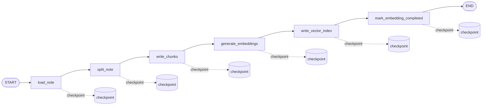

# Note Embedding Graph

`note_embedding_graph` 负责把一条笔记转换为可检索的向量数据。它只处理 chunk、embedding 和向量索引，不负责标题、摘要、标签生成。

## 职责边界

```text
note_metadata_graph
  生成 title / summary / tags。

note_embedding_graph
  生成 notechunk 记录和 sqlite-vec 向量索引。
```

两个 graph 由两个独立 job 驱动。这样后续某个 graph 失败时，不会阻塞另一个 graph 的结果，也方便单独重试和观察。

## 节点流程



## 节点说明

- `load_note`: 读取 note，并把 `note.embedding_status` 标记为 `processing`。
- `split_note`: 使用 chunking 策略把笔记正文拆成多个 chunk，并计算 `content_hash`。
- `write_chunks`: 删除旧 chunk 和旧向量，再写入新的 `notechunk` 行。
- `generate_embeddings`: 调用 DashScope embedding 模型生成向量。
- `write_vector_index`: 把向量写入 `sqlite-vec` 虚拟表，并把 chunk 标记为 `completed`。
- `mark_embedding_completed`: 把 note 标记为 `embedding_status=completed`。

## 恢复语义

graph 使用 `thread_id=job:{job.id}` 绑定 LangGraph checkpoint。

如果任务在 `generate_embeddings` 后中断，向量结果已经进入 checkpoint。恢复执行时会继续从后续节点写入向量索引，不会重复调用 embedding 接口。

如果任务在 `write_chunks` 后中断，恢复时会继续进入 embedding 节点。`write_chunks` 第一版采用“先清理再重建”，这是为了让重试行为更容易推理和测试。

## 当前模型

```text
provider: 阿里云百炼 DashScope OpenAI-compatible API
model: text-embedding-v4
dimensions: 1024
api_key: DASHSCOPE_API_KEY
```

## 相关代码

```text
backend/app/agent/graphs/note_embedding/graph.py
backend/app/agent/graphs/note_embedding/nodes.py
backend/app/agent/graphs/note_embedding/state.py
backend/app/agent/embeddings.py
backend/app/rag/chunking/
backend/app/rag/vector_store.py
```

