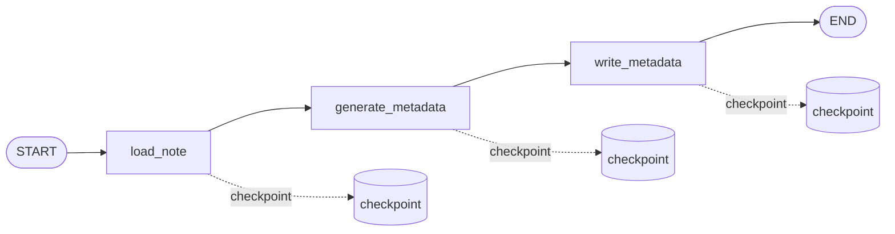
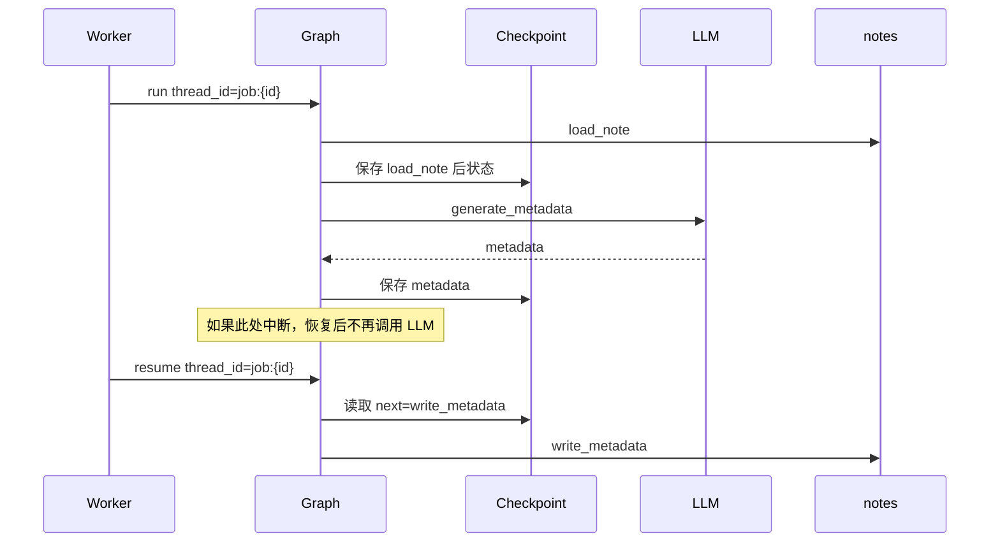

# Note Metadata Graph

`note_metadata_graph` 负责把一条原始笔记整理成标题、摘要和标签。

## 节点

```text
load_note
  -> generate_metadata
  -> write_metadata
```



## 节点职责

- `load_note`: 读取 note，校验 `status/content_hash`，标记 `processing_status=processing`。
- `generate_metadata`: 调用模型生成 `title`、`summary`、`tags`。
- `write_metadata`: 幂等写回 note，并标记 `processing_status=completed`。

## checkpoint 恢复

每个 job 使用独立 thread：

```text
thread_id = job:{job_id}
```

如果 graph 在 `generate_metadata` 后中断，checkpoint 会保存模型生成结果。恢复时会从 `write_metadata` 继续，避免重复调用 LLM。



## 幂等规则

- 用户手动标题不被 AI 覆盖。
- fallback 标题可以被 AI 标题覆盖。
- `write_metadata` 使用覆盖写入，重复执行不会产生重复标签或重复记录。
- job 绑定 `content_hash`。如果笔记已被修改或删除，旧 job 会跳过，不再调用 LLM 或写回旧 metadata。
- 失败时 note 会标记为 `processing_status=failed` 并保存错误信息。
