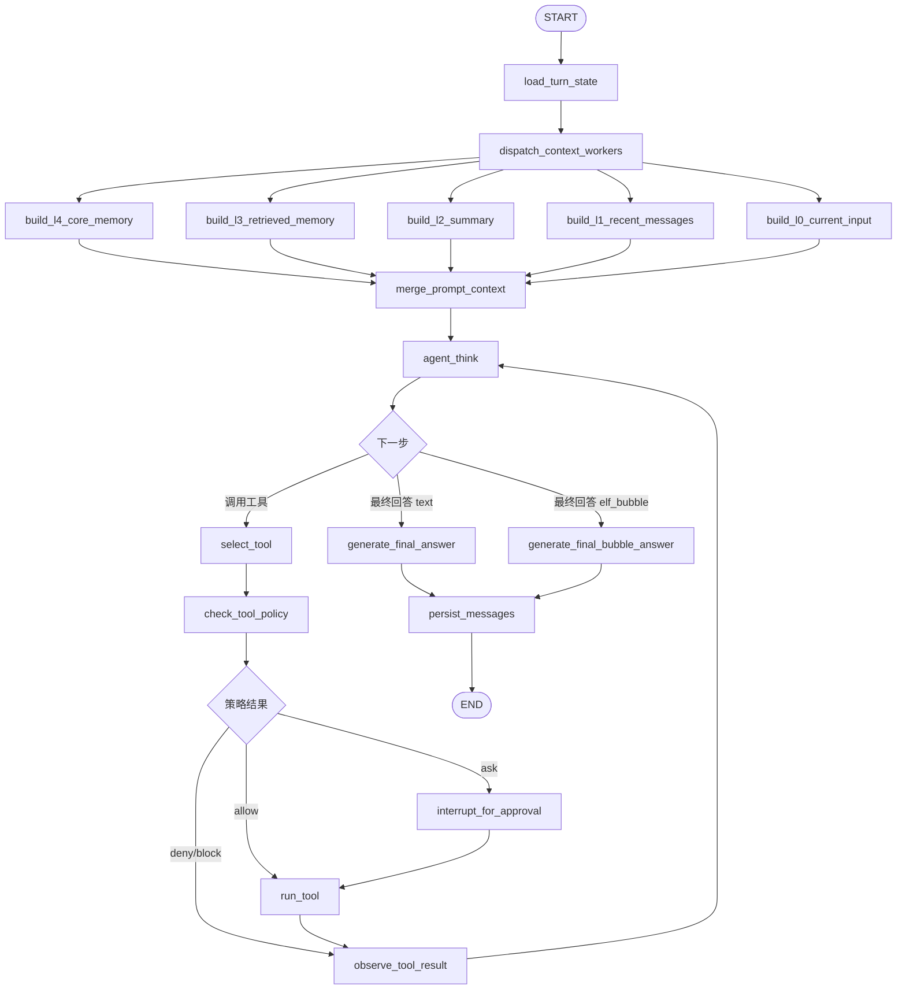

# Memory Chat Agent 工具循环升级草案

本文档讨论把当前 `memory_chat_graph` 从“先并行构建上下文，再一次性回答”的结构，升级为“主对话 agent 可迭代调用工具，再生成最终回答”的结构。

当前问题不是 `read_file` 或 `write_file` 单个工具不够强，而是工具调用层级放错了：Local Operator 现在只是一个上下文 worker，它把工具结果整理成 `local_operator_context` 后交给 `generate_answer`。这会导致模型无法在看到工具结果后继续决定下一步工具调用，也容易出现“说自己写了，但没有继续调用工具”的错觉。

## 核心结论

升级后的工具调用应该进入主对话循环：

```text
LLM 思考
  -> 决定调用工具
  -> 执行工具
  -> 把工具观察结果回灌给 LLM
  -> LLM 再决定继续调用工具或生成最终回答
```

`generate_answer` 不再是“工具之后的终点”，而是 agent 循环中的一种结束动作。工具调用和最终回答处于同一层，由同一个 agent 决策。

## 可借鉴 通用 coding agent 的设计点

本项目不照搬 通用 coding agent 的实现，但可以吸收它的几个工程原则。

### 1. 工具是模型可见的动作，不是隐藏上下文

通用 coding agent 的核心模式是：模型显式选择工具，工具结果以 `tool_result` 形式回到对话，再让模型继续推理。这样模型不会只看到“整理后的摘要”，而是能根据真实结果继续行动。

对应到 Ai 记：

```text
当前：
  Local Operator worker -> local_operator_context -> generate_answer

目标：
  agent_think -> tool_call -> observe_tool_result -> agent_think
```

### 2. Read 工具提示词不应过度保守

通用 coding agent 的 Read 工具心智是：如果用户给了路径，模型应该尝试读取；路径不存在、权限不足、不是文本等问题由工具返回错误。

对应到 Ai 记：

```text
模型层：
  不要先说“我可能读不了 C 盘”。
  用户给出明确本地路径时，应优先调用 read 工具。

工具层：
  负责路径规范化、敏感文件拦截、大小限制、错误码和审计。
```

### 3. Write 必须 read-before-write

通用 coding agent 的 Write 工具要求：如果目标文件已存在，必须先读该文件，否则写入失败。这个规则非常适合 Ai 记。

对应到 Ai 记：

```text
创建新文件：
  可以直接 write_file。

覆盖已有文件：
  必须先 get_file_info 或 read_file。
  然后 write_file(overwrite=true)。

修改已有文件：
  后续优先引入 edit/patch 工具，而不是让 write_file 承担局部修改。
```

### 4. 权限系统独立于模型

通用 coding agent 的权限判断不是写在 prompt 里让模型自觉遵守，而是在工具执行前做独立检查。

对应到 Ai 记：

```text
agent_think 可以提出工具调用。
tool_policy 决定允许、拒绝、要求确认或阻断。
run_tool 只执行通过策略的工具。
agent_operations 记录所有工具尝试和结果。
```

## 目标 Mermaid 图

第一版建议把上下文金字塔保留为并行准备层，把工具循环放到 `merge_prompt_context` 后面：



这里有两个关键变化：

- `build_local_operator_context` 从上下文 worker 中移除。
- `agent_think` 成为回答前的主循环入口。

## 节点职责设计

### `agent_think`

职责：让模型基于当前上下文、历史工具观察结果和用户目标，决定下一步动作。

输入：

```text
prompt_context
tool_messages
tool_budget
answer_mode
user_message
```

输出：

```text
agent_decision.type = tool_call | final_answer
agent_decision.tool_name
agent_decision.arguments
agent_decision.reason
agent_decision.final_answer_draft
```

设计说明：

- 第一版可以先用结构化 JSON 决策，不急着切到原生 OpenAI tool calling。
- 工具定义仍保持 LangChain `@tool`，为后续切换 ToolNode 做准备。
- `agent_think` 不能直接写文件或读文件，只能提出工具调用意图。

### `select_tool`

职责：把 `agent_decision` 转成内部标准 `ToolAction`。

输出字段：

```text
tool_call_id
tool_name
arguments
operation_type
risk_level
requires_approval
```

设计说明：

- 只允许白名单工具。
- 不在这里执行工具。
- 不在这里做最终安全判断。

### `check_tool_policy`

职责：工具执行前的统一策略判断。

策略结果：

```text
allow
  可直接执行。

ask
  需要用户确认，进入 interrupt。

deny
  用户或配置禁止。

block
  安全策略强制阻断，例如敏感文件、危险命令、越界路径。
```

第一阶段规则：

```text
read/list/search/info
  默认 allow，但敏感文件 block。

write_file 创建新文件
  MVP 可 allow，但建议尽快升级为 ask。

write_file 覆盖已有文件
  必须本轮已 read_file/get_file_info 同一路径，否则 block 或要求先读。

exec
  暂未开放，默认 block。
```

### `interrupt_for_approval`

职责：暂停 graph，把待审批工具调用返回给前端或桌面精灵。

设计说明：

- write/exec 必须使用 LangGraph 原生 `interrupt()`，不要自己实现一套复杂中断系统。
- LangGraph interrupt 依赖 checkpointer 保存当前状态；`memory_chat_graph` 已经使用
  sqlite checkpointer 和 `conversation:{id}` thread，天然适合承载审批恢复。
- 进入 interrupt 前只能创建幂等的 `agent_operations` 草稿，不能执行副作用。
- 用户确认后用 `Command(resume=...)` 恢复 graph。
- 恢复时继续从同一个 checkpoint 往下执行，而不是重新规划整轮对话。

参考文档要点：

```text
节点内调用 interrupt(payload)
  -> graph 暂停并返回 __interrupt__
  -> checkpoint 保存当前执行状态
  -> 前端/桌面精灵展示 payload
  -> 用户确认或拒绝
  -> graph.invoke(Command(resume=decision), config)
  -> 从暂停点继续执行
```

审批 payload 建议包含：

```text
tool_call_id
tool_name
operation_type
risk_level
arguments
preview
reason
approval_options
```

其中 `preview` 对不同工具含义不同：

```text
write_file
  展示目标路径、将写入内容摘要、是否覆盖、必要时展示 diff。

exec
  展示 command、cwd、风险等级、可能影响。
```

### `run_tool`

职责：执行通过策略的工具。

要求：

```text
调用 LangChain @tool.invoke()
写入 agent_operations 审计
捕获错误并结构化
把结果写入 observations
```

`run_tool` 不负责决定是否继续，这个决定回到 `agent_think`。

### `observe_tool_result`

职责：把工具结果转换成模型可消费的观察消息。

输出：

```text
tool_messages += ToolObservation
observations += raw_result_summary
tool_budget -= 1
```

设计说明：

- 成功结果要保留关键内容。
- 大文件结果要截断，并告诉模型如何继续指定行号读取。
- 写入成功必须明确返回真实路径、写入字节数、文件 hash 或修改时间，避免模型凭空声称完成。

### `generate_final_answer`

职责：生成最终用户可见回答。

设计说明：

- 只在 `agent_think` 判断不需要更多工具后进入。
- 回答必须基于 observations，不允许声称未执行的工具结果。
- 普通聊天走 text 输出。
- 外置精灵走 bubble 输出，并携带 emoji。

## State 字段草案

建议在 `MemoryChatGraphState` 增加或调整字段：

```text
tool_budget
  本轮最多工具调用次数，默认 6。

agent_decision
  agent_think 输出的结构化决策。

pending_tool_action
  当前待执行工具。

tool_messages
  给 agent_think 回看的工具观察消息。

tool_observations
  原始工具结果摘要列表。

tool_policy_result
  check_tool_policy 输出。

approval_request
  interrupt 给前端/桌面精灵展示的审批内容。

final_answer_mode
  text | elf_bubble。

assistant_answer
  最终普通文本。

elf_bubble_answer_parts
  最终精灵气泡。
```

`LocalOperatorState` 后续可以保留为工具执行内部结构，也可以被拆成更通用的 `tool_runtime` 模块。关键是：工具循环状态应进入主聊天 graph 的 checkpoint。

## 数据表影响

现有 `agent_operations` 表可以继续使用，但需要加强语义。

建议字段保持：

```text
id
conversation_id
turn_id
operation_type
status
tool_name
input_json
output_json
risk_level
approval_required
approved_at
created_at
updated_at
```

建议补充字段：

```text
tool_call_id
  本轮 graph 内唯一 ID。用于 checkpoint 恢复和前端定位。

checkpoint_id
  记录产生该操作的 graph checkpoint，方便对话状态树回溯。

approval_payload_json
  write/exec 审批时展示给用户的 diff、命令、风险说明。
```

状态流转：

```text
planned -> running -> completed
planned -> blocked
planned -> pending_approval -> running -> completed
planned -> pending_approval -> rejected
running -> failed
```

恢复规则：

```text
如果 checkpoint 已有 pending_tool_action，但 agent_operations 中同 tool_call_id 已 completed：
  直接读取 output_json，跳过重复执行。

如果状态是 pending_approval：
  恢复时继续等待用户确认。

如果状态是 running：
  read 可以重试。
  write/exec 必须按 tool_call_id 和文件 hash 判断是否已经执行，避免重复副作用。
```

## 工具分层

建议把 Local Operator 拆成三层：

```text
tool_specs
  LangChain @tool 定义、参数 schema、工具描述。

tool_policy
  权限、风险评估、read-before-write、审批判断。

tool_runtime
  执行工具、审计、错误归一化、结果摘要。
```

这样主 graph 只依赖稳定接口：

```text
list_available_tools()
check_tool_policy(action, state)
run_tool(action, state)
format_observation(result)
```

## 与 LangGraph ToolNode 的关系

LangGraph 原生 `ToolNode` 很适合标准 ReAct：

```text
LLM with tools -> ToolNode -> LLM
```

但 Ai 记第一阶段不建议直接全量切到 `ToolNode`，原因：

- 我们需要 `agent_operations` 审计。
- write/exec 需要审批 interrupt。
- read-before-write 需要看本轮 observations。
- 前端需要展示工具节点状态和子图进展。

推荐路线：

```text
MVP
  手写 agent_think + select_tool + check_tool_policy + run_tool 循环。
  工具仍用 LangChain @tool。

后续
  对低风险 read 工具可局部引入 ToolNode。
  对 write/exec 仍保留 policy + interrupt 包装。
```

## 与现有上下文金字塔的关系

L0-L4 金字塔仍然保留，它负责“回答前的初始上下文”。

但 Local Operator 不再作为 L0-L4 的并行 worker，因为本地工具不是静态上下文，它是 agent 行动的一部分。

保留：

```text
L0 当前输入
L1 近期对话
L2 滚动摘要
L3 笔记检索
L4 核心长期记忆
```

移除或降级：

```text
build_local_operator_context
  从主上下文 worker 移除。
  其内部工具能力迁入 agent 工具循环。
```

## 流式输出策略

工具循环会改变流式协议。

建议事件：

```text
agent_decision
  模型决定下一步是工具还是最终回答。

tool_planned
  已生成工具调用。

tool_policy
  工具策略判断结果。

tool_running
  工具开始执行。

tool_result
  工具完成、失败或被阻断。

answer_delta
  最终普通回答 token。

bubble_delta
  外置精灵气泡回答 token。
```

### 思考过程可视化

当前更推荐把 `agent_think` 的“过程摘要”展示给用户，而不是完全隐藏。这里的“思考过程”不是暴露模型原始 chain-of-thought，而是暴露可审计、可解释、可折叠的工作过程：

```text
我先确认你问的是本地文件问题。
我准备搜索用户目录下是否存在 AiMemo / Ai 记 项目。
我找到了几个候选路径，接下来读取 package/README 判断哪个是当前项目。
我已经创建文件，接下来基于写入结果给你回复。
```

这样可以让用户感知 agent 正在做事，也方便排查“为什么它没有调用工具”。

建议新增事件：

```text
thought_started
  一个思考阶段开始。

thought_delta
  思考阶段的可见摘要增量。

thought_done
  当前思考阶段结束，前端可自动折叠。

thought_snapshot
  恢复/刷新时返回历史思考阶段。
```

每个 thought item 建议字段：

```text
id
turn_id
index
title
summary
status        running/completed/failed/interrupted
related_node
related_tool_call_id
started_at
completed_at
is_collapsed
```

展示策略：

```text
AiMemo 聊天界面
  当前 thought 用半透明气泡展开显示。
  当前 thought 完成后自动折叠，只留下标题和简短摘要。
  下一个 thought 展开。
  最终回答开始后，所有 thought 默认折叠。
  用户可以点开任意 thought 查看过程摘要、工具调用和结果。

外置精灵聊天
  精灵可以用更自然的气泡暴露过程，例如“我去找一下你的项目目录”。
  工具状态和思考摘要可以合并成短气泡，避免刷屏。
  长过程按阶段分气泡，每个阶段结束后再切换下一气泡。
```

注意边界：

```text
不展示原始模型隐藏推理链。
展示的是 agent 自己生成的过程摘要、工具计划、工具观察和安全策略结果。
涉及敏感路径、密钥、文件内容时必须脱敏。
```

### 与 通用 coding agent 展示方式的关系

通用 coding agent 的交互给我们的启发是：用户不只关心最后答案，也关心 agent 正在执行哪些步骤。Ai 记可以在此基础上做得更柔和：

```text
通用 coding agent 偏工程日志：
  Read file
  Search text
  Write file

Ai 记偏陪伴式过程：
  我先看看这个目录里有什么。
  我找到了目标文件，现在读取关键几行。
  写入完成，我再确认一下结果。
```

前端仍应保留工程详情入口：

```text
折叠气泡展示自然语言过程。
展开后展示 tool_name、arguments、status、耗时、结果摘要。
Graph 面板展示节点进展。
```

### 事件与节点映射

建议映射：

```text
agent_think
  -> thought_started / thought_delta / thought_done

select_tool
  -> tool_planned

check_tool_policy
  -> tool_policy

interrupt_for_approval
  -> approval_required

run_tool
  -> tool_running / tool_result

generate_final_answer
  -> answer_delta

generate_final_bubble_answer
  -> bubble_delta
```

这意味着前端可以同时得到三层信息：

```text
自然过程：thought_*
工程动作：tool_*
最终回复：answer_delta / bubble_delta
```

## 第一阶段迁移状态

### Step 1：文档和 graph 设计冻结

已完成本文档，确认主循环结构、state 字段和数据表影响。

### Step 2：新增工具循环节点

已新增节点：

```text
agent_think
select_tool
check_tool_policy
run_read_tool
run_write_tool
observe_tool_result
generate_answer
generate_elf_bubble_answer
```

旧 `build_local_operator_context` 已从 Memory Chat 上下文 worker 中移除。
Local Operator Graph 仍作为工具层对照测试保留，主聊天 graph 复用其 planner/runtime helper。

### Step 3：把 read/write 工具接入主循环

已完成第一版：

```text
用户问本地路径 -> agent_think 选择 read/list/search。
用户要求创建文件 -> agent_think 选择 write_file。
工具结果回到 agent_think。
最终回答基于真实 observations。
```

### Step 4：移除 Local Operator worker

已从 `dispatch_context_workers` 移除 `build_local_operator_context`。

### Step 5：引入审批 interrupt

待实现。

write/exec 前置审批：

```text
write_file 覆盖已有文件 -> interrupt
exec 任意命令 -> interrupt
```

### Step 6：思考过程可视化

已接入第一版 `thought_snapshot`，它展示的是可审计过程摘要，不是模型原始
chain-of-thought。后续可以把 tool_delta、approval_requested 和更多阶段事件补齐。

```text
后端
  在 agent_think、tool_policy、run_tool 等节点输出 thought/tool 事件。
  将 thought snapshots 写入 ChatTurn.debug_payload 或独立表，支持刷新恢复。

前端
  聊天窗口增加半透明 thought 气泡。
  thought 完成后自动折叠。
  最终回答完成后默认全部折叠，但允许用户展开查看。

桌面精灵
  把 thought 阶段转成短气泡和表情变化。
  长 thought 按阶段展示，不逐 token 频繁刷屏。
```

## 验收场景

必须覆盖这些测试：

```text
读文件：
  用户给明确路径，agent 调用 read_file，然后基于内容回答。

找项目：
  用户问“我电脑有没有 Ai 记项目”，agent 使用 search_files 或 list_dir，而不是说自己不能看。

创建文件：
  用户要求在 E:/test 创建 md 文件并评价用户，agent 必须先生成真实内容，再 write_file。
  文件内容不能是“此处填写...”这类占位模板。

覆盖文件：
  目标存在时，agent 必须先 get_file_info/read_file，再 write_file。

工具失败：
  路径不存在时，agent 说明工具返回的真实错误，并给出下一步建议。

精灵气泡：
  外置精灵调用同一工具循环，但最终走 bubble 输出。
```

## 风险

```text
循环失控
  用 tool_budget 和 max_iterations 限制。

模型误调用写工具
  check_tool_policy 拦截；write prompt 明确不能写占位模板。

重复执行副作用
  tool_call_id + agent_operations + checkpoint 恢复规则。

流式体验变慢
  工具状态事件即时发给前端/精灵，让用户知道 agent 正在做什么。

Mermaid 图复杂度上升
  主图只展示循环骨架；工具详情可以点击子图或操作记录查看。
```

## 建议

我建议下一步先实现 Step 2 和 Step 3 的最小闭环：

```text
agent_think -> read/write tool -> observe -> agent_think -> final answer
```

先不引入 exec，不立刻做复杂审批 UI。这样可以优先解决当前最核心的问题：模型必须基于真实工具结果行动和回答。
