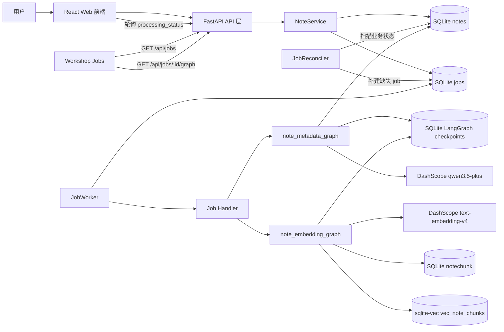
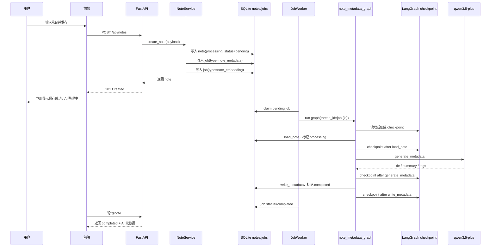
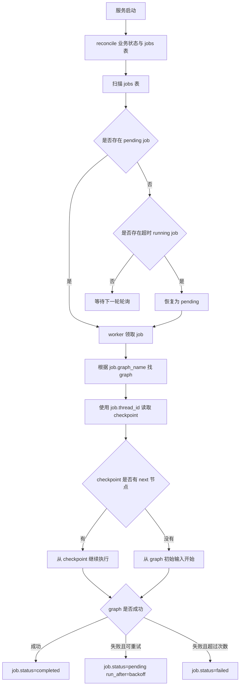
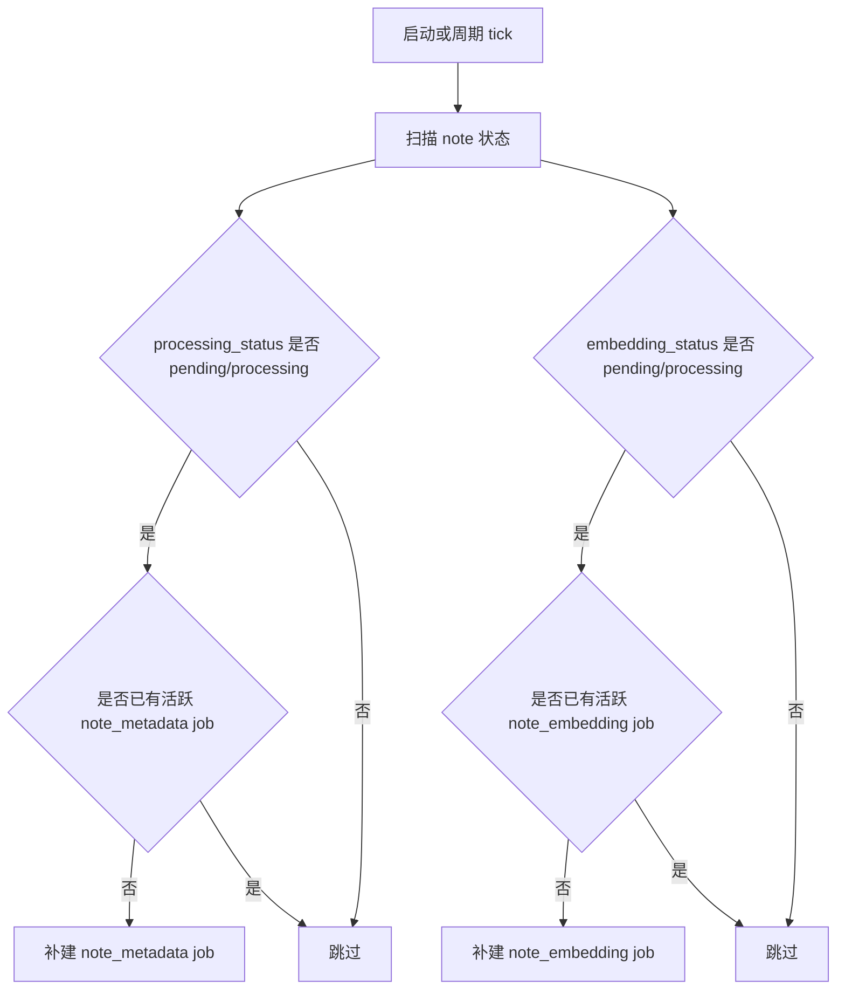
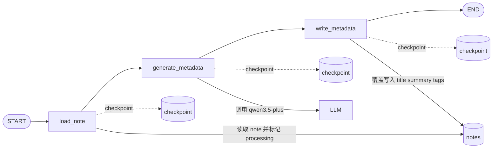
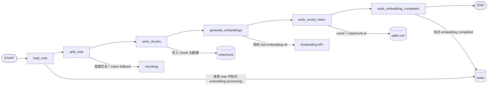
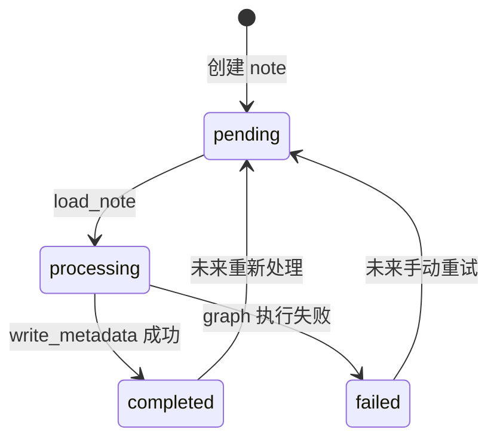
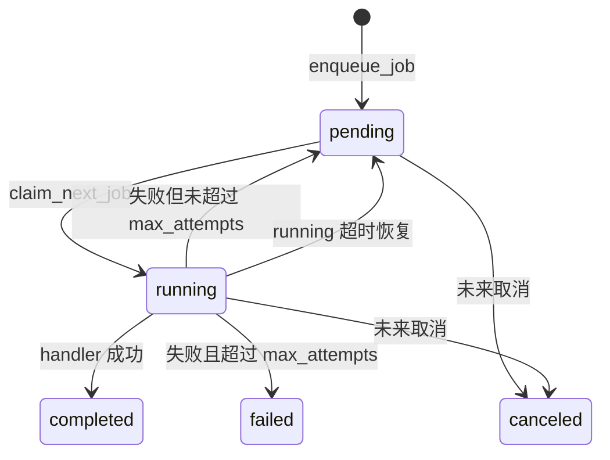

# 流程图

本文档用 Mermaid 描述 Ai 记当前核心流程。阅读顺序建议：

1. 先看系统总览。
2. 再看创建笔记流程。
3. 最后看具体 job 和 graph 的状态流转。

## 系统总览

## 创建笔记与 AI 整理

## Job 与 Checkpoint 分层恢复

## Job Reconciler

## Note Metadata Graph

## Note Embedding Graph

## Note 处理状态

## Job 状态

