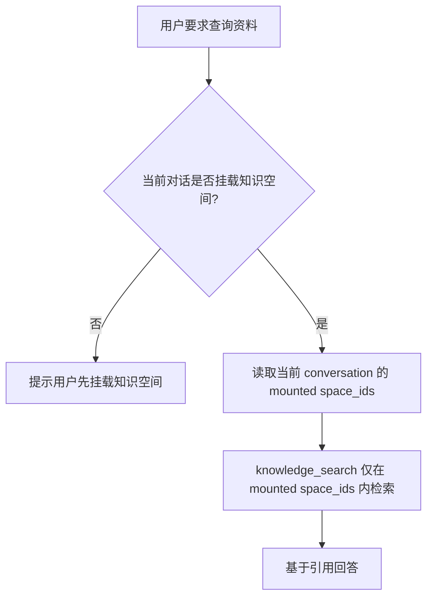
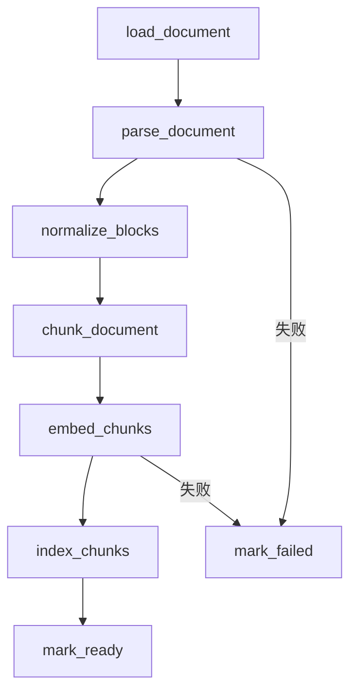
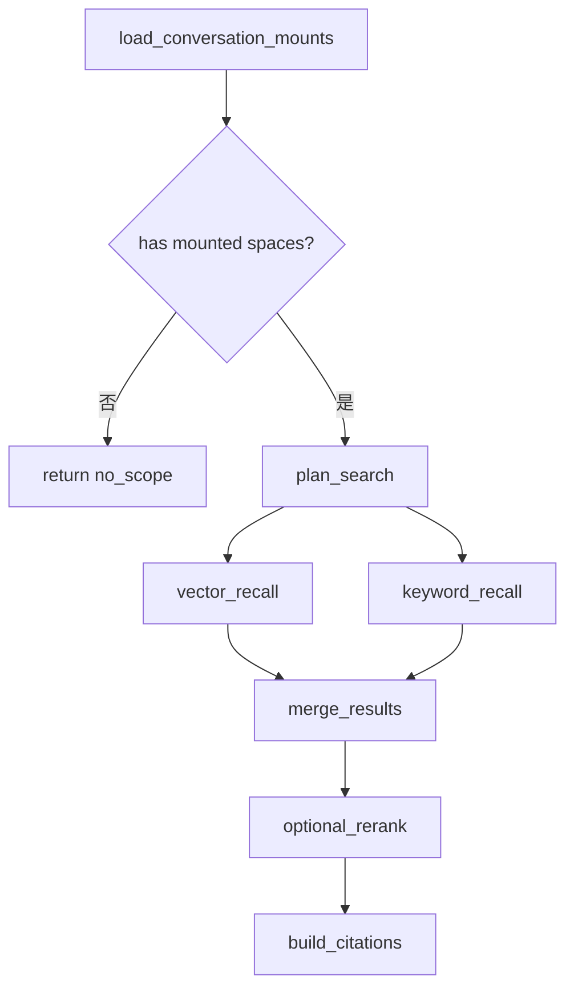
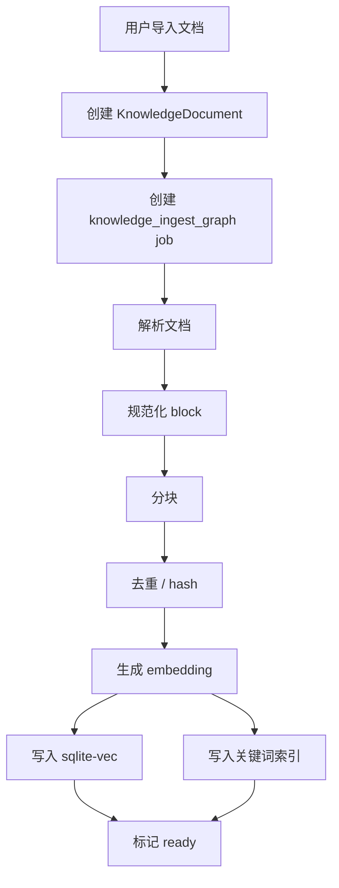
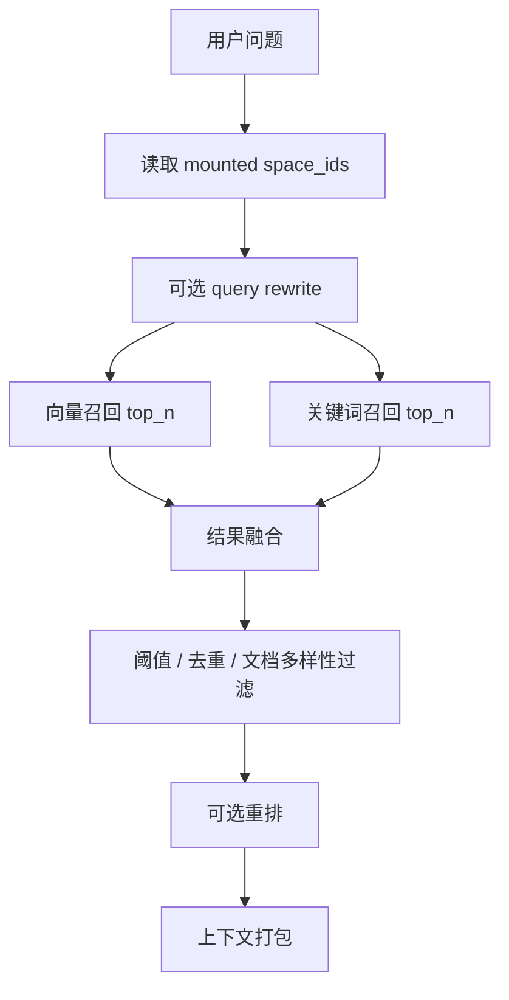

# Memo 知库模块设计

本文设计 Memo Elf / AiMemo 的新核心模块：**知库**。

知库不是“把所有文档扔进一个全局 RAG 池”，而是用户主动管理外部资料、知识空间和检索授权的系统。它与现有模块的边界如下：

```text
Ai记
  用户主动写下的笔记、灵感、日常记录。

对话
  用户与 Agent 交流、执行任务和使用工具的入口。

知库
  用户导入和整理外部资料：PDF、Markdown、Word、网页、项目文档、技术资料。

工坊
  系统能力、后台任务、记忆、语音和调试入口。
```

## 命名

模块名建议使用：

```text
知库
```

完整表达可写作：

```text
Memo 知库
```

原因：

```text
短，适合作为导航项。
语义明确，用户能联想到知识库。
不像“个人知识库系统”那样笨重。
与 Ai记 / 对话 / 工坊 的命名风格更接近。
```

内部概念：

```text
Knowledge Space / 知识空间
  一组文档和索引的隔离集合，例如“Zenoh 项目资料”“论文阅读”“Python 文档”。

Knowledge Document / 知识文档
  一个被导入的文件、网页、文本或未来的文件夹同步源。

Knowledge Chunk / 知识片段
  文档解析和分块后的可检索片段。

Citation / 引用
  Agent 回答时指向具体文档、页码、标题路径或 chunk 的来源信息。
```

## 设计原则

### 1. 知库默认不进入对话上下文

知库内容可能非常多，也可能包含用户只想临时保存、不希望每轮对话都被 Agent 扫描的资料。

因此：

```text
用户没有把知识空间挂载到当前对话时，Agent 不得检索该知识空间。
即使用户说“检查某个文档”，Agent 也只能在已挂载的知识空间范围内检索。
```

这是一层非常重要的边界：**知库是用户可管理的资料空间，不是 Agent 自动偷看的全局记忆池**。

### 2. 对话检索采用二重防护

对话使用知库时必须满足两个条件：

```text
第一重：知识空间存在，且文档已进入 ready 状态。
第二重：该知识空间已被用户手动挂载到当前 conversation。
```

只有同时满足，Agent 工具才允许检索。



### 3. 知库检索必须可引用

知库回答和普通记忆回答不同，必须尽量带来源：

```text
文档标题
页码或标题路径
chunk 片段
导入来源
```

Agent 不能把知库内容揉成“我记得好像是”。

如果检索不到，应明确说明：

```text
当前已挂载知识空间中没有找到相关内容。
```

不要暗示已经搜索了未挂载空间。

### 4. 文档处理必须可观察、可恢复

文档导入不是一个同步 API 调用，而是一条后台流水线：

```text
parse -> normalize -> chunk -> embed -> index -> ready
```

每一步都应该能被 job / graph 记录，失败后可重试。

LangGraph 在这里的价值很高：

```text
节点状态可视化。
checkpoint 可恢复。
失败节点可定位。
未来可加入 human-in-the-loop，例如解析结果确认、分块策略选择。
```

## 产品流程

### 创建知识空间

用户在知库模块创建空间：

```text
名称：Zenoh 项目资料
描述：保存 Zenoh 迁移、API、设计文档和调研资料
```

第一版只需要：

```text
创建
重命名
删除 / 归档
查看文档列表
```

### 导入文档

第一版支持：

```text
PDF
Markdown
TXT
DOCX
PPTX
HTML 文件
```

后续再支持：

```text
网页 URL
文件夹同步
Git 仓库文档扫描
剪贴板导入
```

导入后创建后台任务：

```text
KnowledgeDocument.status = pending
Job.graph_name = knowledge_ingest_graph
```

### 挂载到对话

用户进入对话页面，可以在当前 conversation 上挂载知识空间：

```text
当前对话挂载：
  [x] Zenoh 项目资料
  [ ] Python 文档
  [ ] 论文阅读
```

挂载是 conversation 级别，不是全局设置。

原因：

```text
同一个用户可能同时进行多个主题的对话。
每个对话需要独立的知识边界。
避免 Agent 因为历史对话或全局偏好误查无关资料。
```

### 对话中使用知库

用户说：

```text
帮我检查一下文档里 Zenoh publisher 的迁移方案。
```

Agent 行为：

```text
1. 读取当前 conversation 挂载的 knowledge space。
2. 如果没有挂载，不能调用全局 search，而是提示用户先挂载相关知库。
3. 如果已挂载，除非本轮是非常明确的闲聊或客观常识问题，否则默认先在挂载空间内检索。
4. 如果首轮检索不足，再通过 knowledge_search 在同一挂载范围内补充检索。
5. 回答时可以用文档标题、页码或标题路径说明来源。
```

`[K1]` / `[K2]` 这类编号只作为内部 prompt 中的检索片段定位符，避免模型和 graph 搞混多个 chunk。
它们不是用户可见的引用格式，最终回答不应在末尾裸露输出 `[K1][K2][K3]` 之类的标记。

如果用户提到某个文档名，但该文档不在挂载空间中：

```text
我当前只能检索这个对话已挂载的知库空间，里面没有找到该文档。
你可以先在知库里导入它，或把包含它的知识空间挂载到本对话。
```

## 后端模型草案

### KnowledgeSpace

```text
id
name
description
icon
status: active | archived
created_at
updated_at
```

### KnowledgeDocument

```text
id
space_id
title
source_type: file | url | text | folder
source_uri
original_path
content_hash
mime_type
parser
chunk_strategy
status: pending | parsing | chunking | embedding | indexing | ready | failed
chunk_count
error_code
error_message
created_at
updated_at
```

### KnowledgeChunk

```text
id
space_id
document_id
chunk_index
text
summary
heading_path
page_number
token_count
content_hash
metadata_json
created_at
updated_at
```

### KnowledgeEmbedding

```text
id
space_id
document_id
chunk_id
embedding_model
dimensions
vector
created_at
```

第一版可以继续使用 `sqlite-vec`，不急着引入 Chroma / FAISS。

### ConversationKnowledgeMount

这是二重防护的关键表。

```text
id
conversation_id
space_id
created_at
created_by: user | system
```

约束：

```text
同一个 conversation_id + space_id 只能存在一条 active mount。
只有 mounted space 才能进入 conversation 的 knowledge_search scope。
```

后续可以扩展：

```text
scope_note
  用户为什么挂载该空间。

expires_at
  临时挂载，过期自动解除。

permission
  read | cite | write，第一版只做 read。
```

## LangGraph 设计

### knowledge_ingest_graph

负责文档处理。



节点职责：

```text
load_document
  读取原文件，校验大小、类型、hash。

parse_document
  根据 MIME / 扩展名选择 parser。

normalize_blocks
  统一成标题、段落、表格、页码等中间结构。

chunk_document
  按策略生成 KnowledgeChunk。

embed_chunks
  调用现有 embedding provider。

index_chunks
  写入 sqlite-vec 和关键词索引。

mark_ready / mark_failed
  更新文档状态和 job 状态。
```

### knowledge_search_graph

负责检索。



关键要求：

```text
load_conversation_mounts 必须在图最前面。
vector_recall 和 keyword_recall 必须接收 mounted space_ids。
工具层也要校验 mounted space_ids，不能只依赖 prompt。
```

### 在 Memory Chat Graph 中的位置

知库 RAG 进入聊天 graph 时，不应只作为后期 tool loop 的能力存在。更合理的分工是：

```text
dispatch_context_workers 阶段的 RAG worker
  主召回路径。根据用户初问、当前 conversation 挂载的知识空间和对话上下文，判断是否需要知库检索。
  如果需要，提前检索并产出 L3_knowledge_context，让 generate_answer 一开始就拿到资料。

tool loop 中的 knowledge_search
  补召回路径。当 agent_think / generate 阶段发现首轮检索不够、问题被细化、
  或用户要求从另一个角度继续查资料时，再显式调用。
```

推荐聊天 graph 结构：

```text
dispatch_context_workers
  ├─ build_l0_current_input
  ├─ build_l1_recent_messages
  ├─ build_l2_conversation_summary
  ├─ build_l3_retrieved_memory
  ├─ build_l3_knowledge_context
  └─ build_l4_long_term_memory

merge_context_pyramid
  合并 L0 / L1 / L2 / L3_notes / L3_knowledge / L4

agent_think / tool loop
  knowledge_search 仅作为补充检索工具
```

理由：

```text
用户初问通常已经能判断是否需要查资料。
dispatch_context_workers 本来就是构建回答上下文的阶段。
提前检索能减少 generate_answer 中途发现缺资料再转向的延迟和语义断裂。
tool loop 仍保留灵活性，但不承担第一轮 RAG 的主要职责。
```

边界：

```text
build_l3_knowledge_context 仍必须遵守 conversation mounted spaces。
没有挂载知识空间时，它不能全局检索，只能产出 no_mounted_knowledge_scope / skipped reason。
首轮 RAG worker 只做高置信度、低副作用的检索；不确定时可以跳过，把补检索机会留给后续 tool loop。
```

## RAG 流程策略

知库的 RAG 不应只是“向量检索 top_k 然后塞进 prompt”。第一版就需要把流程拆清楚，否则后续很容易出现检索污染、引用缺失、上下文过长和 Agent 越权检索。

推荐采用两条主流程：

```text
离线 / 后台 ingest 流程
  文档进入知库后，解析、分块、向量化、索引。

在线 / 对话 search + answer 流程
  用户提问时，在当前 conversation 已挂载的知识空间内检索、筛选、引用并回答。
```

对话中的 RAG 分为两次机会：

```text
首轮上下文构建 RAG
  发生在 dispatch_context_workers，产物进入 L3_knowledge_context。
  这是默认主路径。

后续工具补充 RAG
  发生在 agent_think / tool loop，通过 knowledge_search 显式调用。
  只用于补充首轮检索不足或进一步细化问题。
```

### 1. Ingest：文档进入索引

Ingest 是后台任务，不阻塞对话。



策略要点：

```text
解析层
  不同格式走不同 parser，但输出统一 block 结构。
  block 至少保留 text、page_number、heading_path、source_offset。

分块层
  第一版默认使用“标题 / 段落优先 + token 上限”的混合策略。
  不建议只按固定长度硬切，否则引用体验差。

去重层
  用 content_hash 避免重复 chunk 反复入库。
  同一文档更新时可以先做粗粒度全量重建，后续再做增量更新。

索引层
  向量索引用 sqlite-vec。
  关键词索引优先考虑 SQLite FTS5；如果第一版时间紧，可先保留 title/text LIKE 作为降级。
```

第一版 chunk 建议：

```text
目标长度：400-800 中文字或等价 token
overlap：50-120 中文字
硬上限：1200 中文字
保留标题路径：例如 ["安装", "Windows", "常见问题"]
保留页码：PDF 必须保留 page_number
```

### 2. Query Understanding：判断是否需要知库

对话中不是所有问题都应该查知库，但只要当前 conversation 已挂载知识空间，默认策略应偏向检索。
Agent 在调用 `knowledge_search` 前应先判断：

```text
当前 conversation 是否挂载了知识空间。
本轮是否只是非常明确的闲聊或客观常识。
问题是否依赖已导入资料。
```

决策结果：

```text
未挂载知库
  不做全局搜索，提示用户先挂载相关知识空间。

已挂载，且本轮是明确闲聊或客观常识
  正常回答，不调用 knowledge_search。

已挂载，且不是明确闲聊或客观常识
  dispatch_context_workers 中的 build_l3_knowledge_context 先执行首轮检索。
```

这一步可以在 Memory Chat Graph 中作为独立节点：

```text
plan_knowledge_retrieval
```

也可以合并进 `build_l3_knowledge_context` 节点内部。无论采用哪种实现，工具层仍必须二次校验挂载范围。

后续 tool loop 的 `knowledge_search` 不应该替代这一步。它的定位是：

```text
首轮检索结果不够。
用户追问更具体的资料点。
Agent 需要换关键词、换角度补查。
```

### 3. Retrieval：混合召回

第一版建议默认采用 hybrid retrieval：



推荐默认参数：

```text
vector_top_n = 12
keyword_top_n = 12
final_top_k = 5
min_score = 视 embedding 分布调参，第一版可只做弱阈值
```

结果融合策略：

```text
第一版
  简单加权或 RRF。

后续
  引入 reranker 后，先高召回，再精排。
```

RRF 示例语义：

```text
同一个 chunk 同时出现在向量和关键词结果里，应获得更高排名。
只出现在一个召回通道里的结果也保留，避免漏召回。
```

### 4. Filtering：范围和质量控制

过滤必须包含两类：

```text
权限过滤
  只允许 mounted space_ids。
  document.status 必须 ready。
  archived space / deleted document 不参与检索。

质量过滤
  空 chunk、过短 chunk、重复 chunk、低分 chunk 过滤。
  同一文档连续命中太多时做多样性控制，避免一个长 PDF 占满上下文。
```

多样性策略：

```text
第一版可限制：
  每个 document 最多进入最终上下文 3 个 chunk。

如果用户明确指定某个文档：
  可以提高该文档上限。
```

### 5. Context Packing：上下文打包

进入 prompt 的不是原始检索结果，而是结构化 context pack。

建议格式：

```text
[引用 1]
space: Zenoh 项目资料
document: zenoh-migration.md
location: Publisher > Migration
chunk_id: 12
content:
...

[引用 2]
...
```

上下文打包原则：

```text
保留 citation id，回答时能引用。
不要把 metadata 和正文混成一团。
超过 token budget 时优先保留高分、高多样性、高标题匹配结果。
保留原文，不要先让模型总结后再回答；总结会损失引用精度。
```

与现有上下文金字塔关系：

```text
L0 当前用户输入
L1 最近对话
L2 对话摘要
L3 笔记 / 知库检索结果
L4 长期记忆
```

知库可以进入 L3，但必须与现有 note retrieval 分开标记来源：

```text
L3_notes
L3_knowledge
```

不要把 note chunks 和 knowledge chunks 混成一个无来源列表。

如果本轮同时发生首轮 RAG 和工具补充 RAG，context pack 需要记录来源：

```text
retrieval_phase: initial_context_worker | tool_supplement
```

这样 graph 调试面板可以解释：

```text
哪些引用来自首轮上下文构建。
哪些引用来自后续工具补检索。
```

### 6. Answering：引用式回答

当回答使用知库内容时，Agent 必须优先采用引用式回答：

```text
根据已挂载的“Zenoh 项目资料”，迁移方案里提到 ...

来源：
zenoh-migration.md / Publisher > Migration
api-notes.pdf / p.12
```

内部检索上下文可能使用 `[K1]` / `[K2]` 标识 chunk，但最终回答应避免把这些内部编号裸露给用户。
如果需要列来源，优先使用文档标题、页码、标题路径等用户能理解的信息。

回答策略：

```text
只回答检索结果支持的内容。
不确定时说明“不确定”，不要把常识补成文档结论。
如果用户问的是总结，可以综合多个引用。
如果用户问的是定位问题，优先指出具体文档和位置。
```

无结果策略：

```text
已挂载但没搜到
  明确说“当前已挂载知库中没有找到相关内容”。

未挂载
  明确说“当前对话还没有挂载知库空间”，并引导用户挂载。

文档未 ready
  明确说“相关文档仍在处理 / 处理失败”，不要假装已检索。
```

### 7. Tool / Graph 双层约束

RAG 策略不能只写在 prompt 里。必须有双层约束：

```text
Graph 层
  dispatch_context_workers / build_l3_knowledge_context 先判断是否需要知库和是否有挂载空间。
  agent_think 后续只能把 knowledge_search 当作补充路径。

Tool 层
  knowledge_search 根据 conversation_id 从数据库读取 mount scope。
  工具参数不允许 LLM 任意传 space_ids。
```

这样即使模型在 prompt 层犯错，工具也不会越权检索。

### 8. 可观测性

RAG 每一轮应保存调试信息：

```text
是否触发知库检索
mounted space_ids
query / rewritten_query
vector results
keyword results
merged results
final citations
未检索原因
```

这些信息应能在 Chat Graph 调试面板里看到，便于解释：

```text
为什么查了知库？
查了哪些空间？
为什么没找到？
回答引用来自哪里？
```

## Agent 工具设计

### knowledge_search

```text
参数：
  query: string
  top_k?: number
  mode?: auto | vector | keyword | hybrid

隐式上下文：
  conversation_id
```

注意：不允许 LLM 自己传入任意 `space_ids` 越过挂载边界。

工具执行时：

```text
1. 从 conversation_id 查询 ConversationKnowledgeMount。
2. 如果没有 mounted space，返回 NEED_KNOWLEDGE_MOUNT。
3. 如果有 mounted space，只在这些 space_id 内检索。
```

返回：

```json
{
  "ok": true,
  "scope": {
    "space_ids": [1, 2],
    "space_names": ["Zenoh 项目资料"]
  },
  "results": [
    {
      "chunk_id": 12,
      "document_id": 3,
      "document_title": "zenoh-migration.md",
      "text": "...",
      "score": 0.83,
      "citation": {
        "page_number": null,
        "heading_path": ["Publisher", "Migration"],
        "source_uri": "..."
      }
    }
  ]
}
```

### knowledge_list_mounted_spaces

用于 Agent 明确知道当前范围：

```text
参数：无
返回：当前 conversation 已挂载的知识空间
```

### knowledge_get_document

```text
参数：
  document_id

限制：
  document 所属 space 必须已挂载到当前 conversation。
```

## API 草案

### 知识空间

```text
GET    /api/knowledge/spaces
POST   /api/knowledge/spaces
GET    /api/knowledge/spaces/{space_id}
PATCH  /api/knowledge/spaces/{space_id}
DELETE /api/knowledge/spaces/{space_id}
```

### 文档

```text
GET    /api/knowledge/spaces/{space_id}/documents
POST   /api/knowledge/spaces/{space_id}/documents/upload
GET    /api/knowledge/documents/{document_id}
DELETE /api/knowledge/documents/{document_id}
POST   /api/knowledge/documents/{document_id}/reindex
GET    /api/knowledge/documents/{document_id}/chunks
```

### 检索

```text
POST /api/knowledge/search
```

该接口用于知库页面内搜索，可以允许用户显式传 `space_id`；但 Agent 工具不直接使用这个开放范围，而是走 conversation mount scope。

### 对话挂载

```text
GET    /api/conversations/{conversation_id}/knowledge-mounts
PUT    /api/conversations/{conversation_id}/knowledge-mounts
POST   /api/conversations/{conversation_id}/knowledge-mounts/{space_id}
DELETE /api/conversations/{conversation_id}/knowledge-mounts/{space_id}
```

`PUT` 可一次性替换当前对话挂载列表。

## 前端模块

路由建议：

```text
/app/knowledge
```

导航显示：

```text
知库
```

页面结构：

```text
左侧：知识空间列表
中间：当前空间文档列表
右侧：文档详情、处理状态、chunk 预览、重建索引
顶部：上传文档、导入 URL、搜索
```

对话页增加一个轻量入口：

```text
当前对话已挂载：
  Zenoh 项目资料

[管理挂载]
```

挂载交互原则：

```text
挂载是用户主动动作。
不要因为用户提到文档名就自动挂载。
Agent 需要未挂载知识时，应提示用户挂载，而不是擅自全局搜索。
```

## 与现有记忆系统的关系

AiMemo 现在已有：

```text
笔记向量检索
长期记忆 L4
Memory Chat Graph
```

知库与它们的关系：

```text
笔记
  用户亲自写下的个人记录，可进入当前 note chunk 向量库。

长期记忆
  从对话中抽取的用户偏好、事实、长期状态。

知库
  用户导入的外部资料，必须按知识空间隔离，并通过 conversation mount 授权进入对话。
```

不要把知库 chunk 直接混进现有 note chunk 检索池，否则二重防护会失效。

推荐第一版：

```text
保留现有 notes / note_chunks。
新增 knowledge_* 表。
检索工具分开：
  search_notes
  knowledge_search
```

后续如果要统一检索，可在更上层做 federation，但底层权限和来源必须保持隔离。

## 第一版 MVP

第一阶段建议只做：

```text
1. 新增“知库”路由和导航。
2. 支持创建 / 选择知识空间。
3. 支持上传 PDF / Markdown / TXT / DOCX。
4. 使用 knowledge_ingest_graph 后台处理文档。
5. 存储 KnowledgeDocument / KnowledgeChunk / KnowledgeEmbedding。
6. 知库页面内支持搜索和 chunk 预览。
7. 对话支持手动挂载知识空间。
8. Agent 新增 knowledge_search 工具，并强制只检索已挂载空间。
9. 回答中展示引用来源。
```

暂不做：

```text
网页爬取
文件夹实时同步
OCR
复杂表格结构理解
多向量库切换
本地 embedding 模型配置 UI
高级 reranker
多用户权限
自动挂载
```

## 风险点

### Agent 越权检索

风险：

```text
LLM 根据用户文字自行决定检索某个未挂载空间。
```

防线：

```text
Prompt 明确禁止。
工具层强制从 conversation mount 表取 scope。
工具参数不暴露任意 space_ids。
测试覆盖未挂载时返回 NEED_KNOWLEDGE_MOUNT。
```

### 知库与笔记语义混乱

风险：

```text
用户不清楚该写 Ai记，还是导入知库。
```

边界：

```text
自己写的记录放 Ai记。
外部资料和项目文档放知库。
需要长期影响 Agent 对你的理解，才进入长期记忆。
```

### 文档处理失败难排查

风险：

```text
PDF / DOCX 解析失败后用户只看到“失败”。
```

防线：

```text
每个文档绑定 job 和 ingest graph。
展示失败节点、错误原因、可重试动作。
保留 parser / chunk strategy 元数据。
```

## 后续扩展

```text
网页 URL 导入
文件夹同步
Git 仓库文档导入
按标题层级的父子 chunk
人工编辑 chunk
检索结果重排
引用高亮回到原文
知库问答专用页面
临时挂载 / 自动过期
知识空间模板
```

## 结论

知库模块的核心不是“新增一个 RAG 页面”，而是给 Memo Elf 增加一套受控的外部知识管理能力。

最重要的产品规则是：

```text
知库资料默认不进入对话。
用户必须手动把知识空间挂载到当前 conversation。
Agent 只能检索当前 conversation 已挂载的知识空间。
只要已挂载，除非本轮是非常明确的闲聊或客观常识，否则每轮对话默认检索挂载知库。
```

这套二重防护能让用户清楚知道 Agent 在看什么，也能避免多个项目、多个文档空间互相污染。
