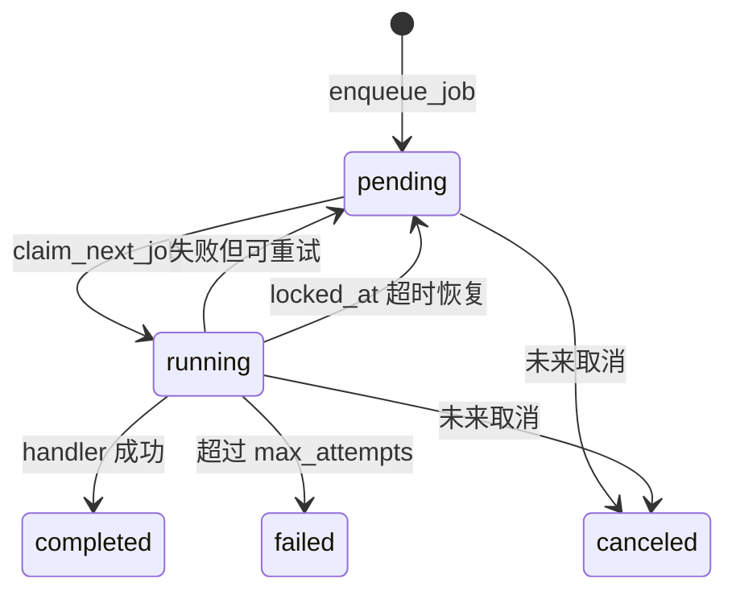
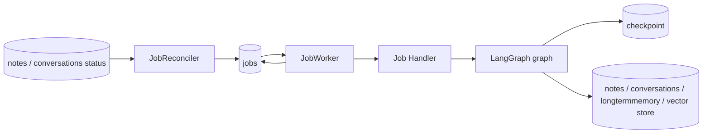

# 本地任务系统

Ai 记使用 SQLite `jobs` 表作为本地持久化任务队列。

当前实现是受控并发 worker：全局 runner 数由 `jobs.worker_concurrency` 控制，
同类任务再通过 `lane` 限流，同一业务对象通过 `lock_key` 互斥。完整设计见
[后台 Job 并发调度设计](./job-concurrency-design.md)。

## 职责边界

```text
Job
  负责任务生命周期：排队、领取、重试、失败、完成、恢复。

LangGraph checkpoint
  负责 graph 内部执行进度：节点状态、下一步节点、中断后恢复。
```

二者协作方式：

```text
reconciler 发现业务状态需要任务但缺少活跃 job
  -> 补建 job
jobs 表存在可执行任务
  -> worker 领取任务
  -> 根据 job.graph_name 执行对应 LangGraph
  -> LangGraph 用 job.thread_id 恢复 checkpoint
  -> graph 成功后 job 标记 completed
```

## 状态流转图



## jobs 表

```text
job
  id
  type
  graph_name
  thread_id
  dedupe_key
  lane
  lock_key
  concurrency_policy
  resource_weight
  status
  payload
  priority
  attempts
  max_attempts
  error
  locked_at
  locked_by
  run_after
  created_at
  updated_at
  completed_at
```

## 状态机

```text
pending -> running -> completed
pending -> running -> pending
pending -> running -> failed
running -> pending
```

- `pending`: 等待 worker 执行。
- `running`: 已被某个 worker 领取。
- `completed`: 执行完成。
- `failed`: 超过最大重试次数或不可恢复。
- `canceled`: 保留状态，后续用于取消任务。

## 并发调度

worker 会启动一个轻量调度循环，并在不超过 `jobs.worker_concurrency` 的前提下并发执行多个 runner。
默认全局并发为 3。

任务领取时不会简单拿第一条 pending job，而是按优先级扫描可运行候选：

```text
pending + run_after <= now
  -> lane 未达到并发上限
  -> lock_key 没有被 running job 占用
  -> concurrency_policy 允许与同 lane 任务共存
  -> running
```

核心字段：

- `lane`: 任务资源通道，用于限制同类任务最大并发，例如 `knowledge_ingest`、`knowledge_retry`。
- `lock_key`: 业务对象互斥锁，例如 `document:6`、`note:1`、`conversation:20`。
- `concurrency_policy`: `shared` 表示可与同 lane 的不同对象并行，`exclusive` 表示同 lane 串行。
- `resource_weight`: 预留的资源权重字段，当前默认 1。

默认 lane 上限：

```text
note_light = 2
embedding = 1
knowledge_ingest = 1
knowledge_retry = 2
conversation_maintenance = 1
cloud_sync = 1
default = 1
```

因此，不同文档的失败图片重试可以并行；同一文档的导入、重试、重建索引会因为 `lock_key=document:{id}` 串行。

## 恢复策略

服务启动后会先执行一次 job reconcile：

```text
note.processing_status in pending/processing
  且不存在活跃 note_metadata job
  -> 补建 note_metadata job

note.embedding_status in pending/processing
  且不存在活跃 note_embedding job
  -> 补建 note_embedding job

conversation 未摘要消息 token 超过阈值
  且不存在活跃 conversation_summary job
  -> 补建 conversation_summary job

assistant 消息缺少任何 conversation_memory job
  -> 补建 conversation_memory job

knowledge_document.status in pending/parsing/chunking/embedding/indexing
  且不存在活跃 knowledge_ingest job
  -> 补建 knowledge_ingest job
```

随后 `JobReconciler` 会按固定间隔继续扫描，默认间隔：

```text
JOB_RECONCILER_INTERVAL_SECONDS=30
```

这解决两类问题：

- 历史数据在新功能上线前没有对应 job。
- 未来某些业务状态和 jobs 表因为异常中断变得不一致。

worker 在领取任务前会扫描过期 `running` 任务：

```text
running + locked_at < now - JOB_RUNNING_TIMEOUT_SECONDS
  -> pending
```

重新领取任务后，worker 使用同一个 `thread_id` 恢复 LangGraph checkpoint。

## 当前任务类型

```text
type: note_metadata
graph_name: note_metadata_graph
payload: {"note_id": 1}
thread_id: job:{job_id}
dedupe_key: note_metadata:note:{note_id}
```

该任务负责给笔记生成标题、摘要和标签。

```text
type: note_embedding
graph_name: note_embedding_graph
payload: {"note_id": 1}
thread_id: job:{job_id}
dedupe_key: note_embedding:note:{note_id}
```

该任务负责把笔记拆分为 chunk，调用 embedding 模型，并写入 `sqlite-vec` 向量索引。

```text
type: conversation_summary
graph_name: conversation_summary_graph
payload: {"conversation_id": 1}
thread_id: job:{job_id}
dedupe_key: conversation_summary:conversation:{conversation_id}
```

该任务负责把 `conversation.summary_message_id` 之后的消息滚动合并到 `conversation.summary`。

```text
type: conversation_memory
graph_name: conversation_memory_graph
payload:
  {
    "conversation_id": 1,
    "user_message_id": 10,
    "assistant_message_id": 11
  }
thread_id: job:{job_id}
dedupe_key: conversation_memory:assistant_message:{assistant_message_id}
```

该任务负责从一轮对话中抽取 L4 核心长期记忆，并写入 `longtermmemory`。

```text
type: knowledge_ingest
graph_name: knowledge_ingest_graph
payload: {"document_id": 1}
thread_id: job:{job_id}
dedupe_key: knowledge_ingest:document:{document_id}
```

该任务负责知库文档导入流水线：解析文档、生成 chunk、调用 embedding，并写入 `sqlite-vec` 知库向量索引。
第一版支持 TXT / Markdown / DOCX / PPTX / PDF。失败任务可以在任务抽屉中重试或删除。

## 与 LangGraph 的协作


