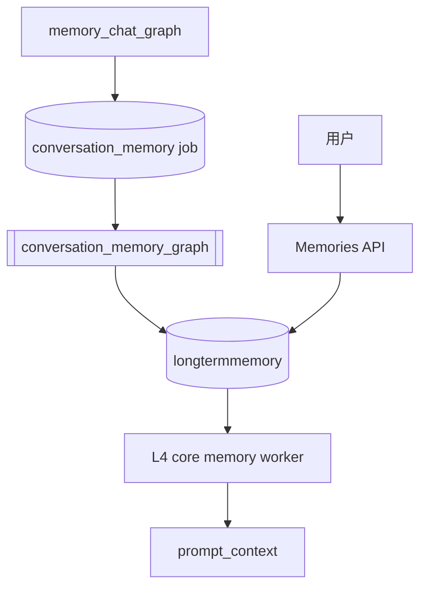

# 长期记忆管理

本文档描述 L4 核心长期记忆的管理方案和当前实现。

## 背景

Ai 记已经具备自动抽取长期记忆的链路：

```text
conversation_memory_graph
  -> 抽取长期记忆候选
  -> 写入 longtermmemory
  -> Memory Chat Graph 的 L4 worker 读取
  -> 进入 prompt_context
```

这个链路让 AI 能“记住”用户偏好、身份信息、长期目标和长期指令。但自动抽取存在误判风险，因此用户必须能查看、编辑和停用这些记忆。

目标是形成闭环：

```text
AI 可以记
用户可以管
回答可以用
```

## 数据模型

现有表：

```text
longtermmemory
  id
  level
  category
  content
  summary
  importance
  confidence
  source_type
  source_id
  status
  content_hash
  created_at
  updated_at
```

字段含义：

```text
level
  金字塔层级。第一版只管理 level=4 的核心长期记忆。

category
  记忆类型。

content
  完整记忆正文，会进入 L4 prompt。

summary
  短摘要，主要用于列表展示和后续 UI。

importance
  重要性，范围 0.0-1.0。

confidence
  可信度，范围 0.0-1.0。

source_type / source_id
  记忆来源。自动抽取的第一版来源是 chat_message + assistant_message_id。

status
  active / archived。

content_hash
  用于去重。由 category + content 计算。
```

## 允许值

`category` 第一版允许：

```text
preference
identity
goal
instruction
event
fact
```

`status` 第一版允许：

```text
active
archived
```

`importance` 和 `confidence` 必须裁剪或校验在：

```text
0.0 <= value <= 1.0
```

## 管理规则

### 列表读取

默认只返回：

```text
status = active
level = 4
```

支持过滤：

```text
status
category
level
limit
offset
```

默认排序：

```text
importance desc
updated_at desc
id desc
```

### 编辑

允许用户修改：

```text
category
content
summary
importance
confidence
status
```

规则：

```text
content 不能为空。
category 必须是允许值。
status 必须是允许值。
importance/confidence 必须在 0.0-1.0。
修改 category 或 content 后必须重新计算 content_hash。
updated_at 必须更新。
```

### 停用

停用不会物理删除，而是将记忆移出 L4：

```text
DELETE /api/memories/{id}
  -> status = archived
```

原因：

```text
避免误删
可以重新启用
保留调试和来源追踪能力
```

重新启用使用通用更新接口：

```text
PATCH /api/memories/{id}
  {"status":"active"}
```

### 删除

用户可以永久删除已经停用的记忆：

```text
DELETE /api/memories/{id}/hard
```

规则：

```text
只允许删除 archived 记忆。
active 记忆必须先停用。
删除后无法恢复，也不会再出现在停用列表。
```

这样保留了两级安全语义：

```text
停用
  可恢复，不进入 L4。

删除
  不可恢复，只对已停用记忆开放。
```

### L4 读取边界

Memory Chat Graph 的 L4 worker 只读取：

```text
longtermmemory.status = active
longtermmemory.level = 4
```

因此 archived 记忆不会进入后续回答上下文；重新启用后会再次进入 L4。

## Service 设计

新增：

```text
backend/app/services/memory_service.py
```

职责：

```text
list_memories
  列出长期记忆，支持过滤和分页。

get_memory
  读取单条长期记忆，不存在时报 404。

get_memory_detail
  读取长期记忆详情，并解析 source_type/source_id 对应的来源消息。
  第一版支持 chat_message 来源；来源缺失时返回 source_message=null。

update_memory
  校验并更新长期记忆。

archive_memory
  停用长期记忆，底层写入 status=archived。

delete_archived_memory
  永久删除已停用记忆。active 记忆会被拒绝。
```

Service 层负责业务规则，不把校验散落在 API route 中。

## API 设计

详见：

```text
docs/api/memories.md
```

建议第一版 API：

```text
GET /api/memories
GET /api/memories/{memory_id}
GET /api/memories/{memory_id}/detail
PATCH /api/memories/{memory_id}
DELETE /api/memories/{memory_id}
DELETE /api/memories/{memory_id}/hard
```

## 来源追踪

长期记忆的来源由两个字段表示：

```text
source_type
source_id
```

当前 `conversation_memory_graph` 写入的是：

```text
source_type = chat_message
source_id = assistant_message_id
```

也就是说，一条自动抽取的长期记忆默认指向生成它的 assistant 消息。
详情接口会根据这个 id 读取：

```text
chat_message
conversation
```

并返回：

```text
source_message.id
source_message.conversation_id
source_message.conversation_title
source_message.role
source_message.content
source_message.created_at
```

这样用户在前端打开记忆详情时，可以看到该记忆来自哪条对话消息。后续如果要做
“跳转到对话树节点”，可以复用 `conversation_id + message_id` 定位 UI。

## 与 Graph 的关系



说明：

```text
conversation_memory_graph
  负责自动写入长期记忆。

Memories API
  负责让用户查看、编辑、停用长期记忆。

L4 worker
  只读取 active level=4 记忆，不关心记忆是 AI 写入还是用户编辑。
```

## 测试计划

已新增：

```text
tests/test_memory_service.py
tests/test_memory_api.py
```

覆盖：

```text
GET 默认只返回 active level=4。
GET 支持 status/category/level/limit/offset 过滤。
PATCH 可以编辑 content/category/summary/importance/confidence/status。
PATCH 修改 content 或 category 后会更新 content_hash。
PATCH 拒绝空 content、非法 category、非法 status。
DELETE 会把 status 改为 archived，不物理删除。
PATCH status=active 可以重新启用。
DELETE /hard 只允许删除 archived 记忆。
L4 worker 不读取 archived 记忆，重新启用后会读取。
```

## 暂不实现

第一版不做：

```text
记忆版本历史
记忆冲突检测
用户确认后再写入
长期记忆向量化
```

前端已经具备第一版记忆管理面板，支持列表、编辑、停用、启用、删除和详情查看。
后续可以继续增强搜索、批量整理、来源跳转和记忆版本历史。
