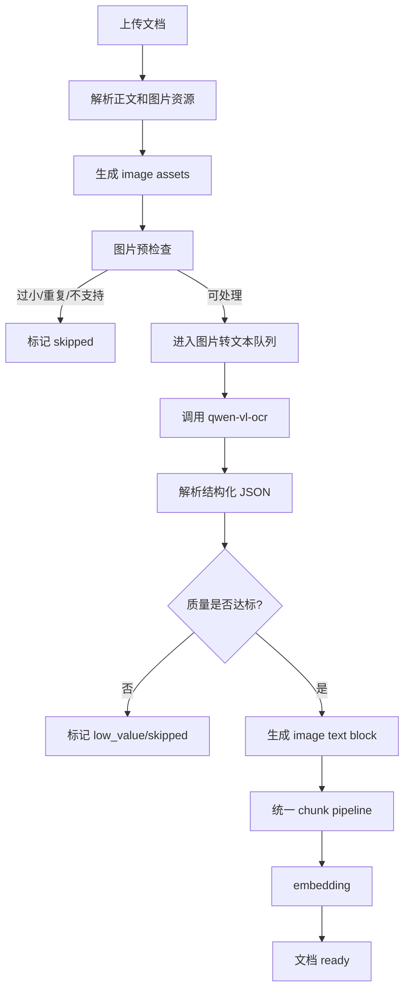

# 从本地 OCR 切换到 qwen-vl-ocr 的设计

本文记录知识库图片转文本从本地 Tesseract OCR 切换到阿里百炼 `qwen-vl-ocr` 的设计方案。

当前本地 OCR 已验证出两个问题：

```text
1. PPT / PDF 中大量图片不是普通文本，而是 logo、图标、架构图、表格截图。
   Tesseract 会把图标和装饰元素硬读成文字，生成大量噪声。

2. Windows 环境下 OCR stdout / 语言混用可能产生 mojibake。
   例如原始 OCR 输出中的智能引号可能入库成 `鈥�` 一类乱码。
```

因此，知识库图片处理不应继续把“图片转文本”理解成纯 OCR。更合理的目标是：

```text
识别图片里有哪些可检索信息。
能提取文字时提取文字。
图片是 logo / 架构图 / 流程图 / 表格截图时，生成面向检索的结构化摘要。
对低价值或低置信度图片，明确跳过，不生成污染索引的 chunk。
```

## 当前实现状态

截至当前代码，Phase 1 已落地：

```text
1. 默认配置切换为 knowledge.image_text_extraction.mode = qwen_vl_ocr。
2. 新增 qwen-vl-ocr extractor，调用 DashScope OpenAI-compatible chat completions。
3. 模型输出按 JSON object 解析，只把 summary / ocr_text / entities / key_facts 压成稳定文本入库。
4. 后端做 should_index、confidence、空文本和 mojibake / 噪声过滤。
5. 图片失败不导致整篇文档 failed；正文、表格等文本仍继续入库。
6. 文档列表和详情展示图片资源总数、已处理数、图片 chunk 数和失败数。
7. `/api/knowledge/ocr/status` 在默认 qwen 模式下检查 DASHSCOPE_API_KEY，不再要求本地 OCR。
```

仍属于后续阶段：

```text
1. 单图重试、指数退避和 rate limit。
2. 图片资源明细表 KnowledgeImageAsset。
3. token usage / 成本统计和预算面板。
4. 上传前按文档估算图片处理费用。
5. 单张图片重试、跳过原因明细和可视化回源。
```

本地 Tesseract OCR 代码仍保留为 `mode=local_ocr` 的手动降级能力，但默认 qwen 路径不会在缺 Key 或模型失败时自动回退到本地 OCR。

## 目标

### 产品目标

```text
1. 用户上传包含图片的文档后，图片仍能转成可检索文本 chunk。
2. 对话检索阶段继续屏蔽格式概念，Agent 只看到统一文本 chunk。
3. 图片 chunk 的质量明显高于本地 OCR，避免 logo 噪声、乱码和无意义字符进入索引。
4. 上传页面继续展示图片资源总数、已处理数、图片 chunk 数和失败数。
5. 成本可控，可在配置里关闭、限流或按文档大小跳过。
```

### 工程目标

```text
1. 保留现有 image asset -> text block -> chunk -> embedding 流程。
2. 替换默认 ImageTextExtractor，不改检索层和向量索引层。
3. 模型调用必须可重试、可观测、可失败降级。
4. 模型输出必须结构化解析，不能把自由文本直接原样入库。
5. 每个图片资源都记录处理方式、状态、错误原因和 token / 成本估算。
```

## 非目标

```text
不在第一阶段做复杂版面还原。
不做图片坐标级高亮回源。
不把图片单独放入多模态向量库。
不在对话阶段重新读取原图，除非用户明确要求看图或重新分析图片。
不默认使用通用视觉聊天模型做长篇图像理解，优先使用 qwen-vl-ocr 这类低成本 OCR 专用模型。
```

## 推荐模型

第一阶段使用：

```text
qwen-vl-ocr
```

模型定位：

```text
面向 OCR / 文档图片 / 表格 / 票据 / 截图文字提取。
相比普通视觉聊天模型，成本更低，输出更适合文本抽取。
```

配置项建议：

```json5
{
  "knowledge": {
    "image_text_extraction": {
      "mode": "qwen_vl_ocr",
      "provider": "dashscope",
      "model": "qwen-vl-ocr",
      "max_images_per_document": 80,
      "max_image_bytes": 5242880,
      "max_concurrency": 2,
      "timeout_seconds": 60,
      "max_attempts": 3,
      "retry_backoff_seconds": 0.5,
      "min_confidence": 0.45,
      "skip_low_value_images": true,
      "monthly_budget_yuan": 20
    }
  }
}
```

模式枚举：

```text
off
  不处理图片。

local_ocr
  保留本地 OCR 作为手动降级，不再默认启用。

qwen_vl_ocr
  使用 qwen-vl-ocr 生成结构化图片文本。

auto
  优先 qwen-vl-ocr；无 API key 或预算不足时跳过图片，不自动退回本地 OCR。
```

## 流程



## 图片预检查

调用模型前先做轻量过滤，减少成本和噪声。

```text
跳过条件：
  图片为空。
  文件过大且无法压缩到上限。
  图片尺寸过小，例如宽高任一低于 80 px。
  图片 hash 在同一文档内重复。
  MIME 类型不支持。

可压缩条件：
  图片超过 max_image_bytes。
  图片尺寸极大但主要用于 OCR，可缩放到长边 1600-2400 px。
```

预检查只决定是否调用模型，不决定最终是否入库。最终是否入库由模型结构化结果和质量规则判断。

## 模型输入

输入由两部分组成：

```text
1. 图片本身。
2. 文档上下文 metadata。
```

metadata 建议包含：

```json
{
  "document_title": "Lecture06",
  "original_filename": "Lecture06.pptx",
  "parser": "pptx",
  "location_label": "Slide 91 图片 1",
  "heading_path": ["Column Family"],
  "alt_text": "Picture 6",
  "nearby_text": "Column family data model"
}
```

`nearby_text` 来自同一页 / 同一 slide 的标题、正文和备注，长度限制在 500-1000 字符。它能帮助模型理解图的主题，但不能让模型编造图片中不存在的信息。

## Prompt

系统提示词建议：

```text
你是知识库图片转文本模块。目标不是描述图片好不好看，而是提取可用于检索和问答的事实。

要求：
1. 优先提取图片中真实可见的文字。
2. 如果图片是表格、流程图、架构图、坐标图或产品 logo 集合，请提取关键实体、关系和图示含义。
3. 如果图片主要是装饰图标、低清 logo、无实际信息的图片，请标记 should_index=false。
4. 不确定的文字不要猜；用 uncertainty 说明。
5. 输出必须是 JSON，不要输出 Markdown。
```

用户提示词模板：

```text
请分析这张文档图片，并返回结构化 JSON。

文档上下文：
{metadata_json}

JSON schema：
{
  "image_type": "text|table|chart|diagram|logo_set|screenshot|photo|decorative|unknown",
  "should_index": true,
  "confidence": 0.0,
  "ocr_text": ["逐行文字"],
  "entities": ["关键实体"],
  "summary": "一句话说明图片表达的信息",
  "key_facts": ["可用于检索和问答的事实"],
  "warnings": ["不确定点或低质量原因"]
}
```

## 模型输出结构

后端只接受 JSON object。解析失败时可重试一次，仍失败则标记该图片失败，不把原始模型文本入库。

字段语义：

```text
image_type
  图片类型。用于质量过滤和调试，不暴露给对话模型。

should_index
  模型判断该图是否值得进入知识库索引。

confidence
  0-1。低于配置阈值时不入库。

ocr_text
  图片中可见文字，按行组织。

entities
  产品名、数据库名、组件名、人物、机构等关键实体。

summary
  图片整体含义，必须短。

key_facts
  可进入检索 chunk 的事实点。

warnings
  低清、遮挡、疑似 logo、无法确定等说明。
```

## 入库文本格式

生成 `DocumentBlock` 时，把结构化结果压成稳定文本：

```text
[图片文本]
位置：Slide 91 图片 1
资源 ID：pptx-slide-91-image-1
提取方式：qwen-vl-ocr
图片类型：diagram
置信度：0.82

摘要：
该图展示 Column Family 数据模型中 Row Key、Column Family、Column Name 和 Column Value 的组织关系。

可见文字：
- Dataset
- Column-Family-1
- Column-Family-2
- Row Key_1
- Column Name_1
- Column Value_1

关键事实：
- 数据集可包含多个 Column Family。
- 每个 Row Key 下可以有不同的 Column Name 和 Column Value。
```

如果 `should_index=false` 或 `confidence < min_confidence`，不生成 `KnowledgeChunk`，只更新图片资源处理状态：

```text
status = skipped
reason = low_value_image | low_confidence | decorative_image
```

## 质量规则

模型返回后再做后处理。

```text
必须跳过：
  should_index=false
  confidence < min_confidence
  ocr_text/entities/key_facts/summary 全为空
  文本中乱码比例过高
  文本长度过短且没有实体，例如只有 "@"、"es"、"SP"

建议跳过：
  image_type=decorative
  image_type=logo_set 且 entities 少于 2 个
  warnings 包含 "too blurry" 且无 key_facts

可以入库：
  有明确表格内容。
  有架构图组件和关系。
  有流程图步骤。
  有截图中的关键 UI 文案。
  有多个可识别实体且与文档主题相关。
```

乱码检测建议：

```text
统计 Unicode replacement char、典型 mojibake 片段、孤立符号、非预期控制字符。
如果异常字符占比超过阈值，标记 low_quality。
```

## 成本控制

第一阶段必须有硬限制。

```text
文档级：
  max_images_per_document
  max_total_image_bytes_per_document
  max_image_text_tokens_per_document

并发级：
  max_concurrency
  rate_limit_per_minute

预算级：
  monthly_budget_yuan
  daily_budget_yuan
  per_document_budget_yuan
```

预算不足时：

```text
1. 不调用模型。
2. 文档正文继续处理。
3. 图片资源标记 skipped_budget_exceeded。
4. 前端展示“图片未处理：预算不足”。
```

前端导入提示：

```text
本次文档包含 44 张图片。
预计将调用 qwen-vl-ocr 处理，可能产生少量模型费用。
你可以继续、仅处理正文，或在设置中关闭图片转文本。
```

## 错误处理

```text
网络失败
  单图最多尝试 3 次，指数退避。

限流 / 服务端错误
  HTTP 408 / 409 / 425 / 429 / 5xx 视为临时失败，按单图重试策略处理。

模型超时
  重试后仍失败则标记 image_timeout，不影响整篇文档。

JSON 解析失败
  视为模型临时输出异常，按单图重试策略处理。
  仍失败则标记 image_parse_failed。

API key 缺失
  文档正文继续处理，图片标记 provider_not_configured。

余额 / 限流
  立即停止后续图片调用，剩余图片标记 budget_or_rate_limited。
```

整篇文档不应因为单张图片失败而 failed。只有正文解析、chunking、embedding 等主流程失败时，文档才 failed。

## 数据模型影响

当前 `KnowledgeDocument` 已有：

```text
image_asset_count
image_asset_processed_count
image_text_chunk_count
image_asset_failed_count
```

第一阶段可继续使用这些字段，但建议后续增加图片资源明细表：

```text
KnowledgeImageAsset
  id
  document_id
  asset_id
  location_label
  page_number
  mime_type
  width
  height
  content_hash
  status: pending | processing | completed | skipped | failed
  extractor: local_ocr | qwen_vl_ocr
  image_type
  confidence
  generated_chunk_count
  error_code
  error_message
  token_usage_json
  created_at
  updated_at
```

没有这张表时，也可以先把明细写入 job event / graph state / chunk metadata，但前端很难展示单图状态。

## 代码落点

```text
backend/app/agent/graphs/knowledge_ingest/nodes.py
  替换 _build_default_image_text_extractor。

backend/app/services/knowledge_image_text_service.py
  新增 provider 无关服务，负责预检查、调用、解析、质量过滤。

backend/app/services/model_provider_service.py
  复用聊天模型适配层的 provider 配置，增加 vision/ocr 能力类型。

backend/app/schemas/knowledge.py
  增加图片资源明细 API schema。

frontend/src/pages/knowledge/KnowledgePage.tsx
  展示图片处理方式、跳过原因、失败原因和预算提示。
```

建议把 `ImageTextExtractor` 从简单的 `Callable[[DocumentImageAsset], str]` 升级为返回结构化结果：

```python
class ImageTextExtractionResult(TypedDict):
    status: Literal["completed", "skipped", "failed"]
    text: str
    extractor: str
    image_type: str
    confidence: float
    error_code: str | None
    error_message: str | None
    token_usage: dict
```

这样不会把“跳过”和“失败”都塞进异常里。

## 分阶段计划

### Phase 1：替换默认图片转文本

```text
1. 新增 qwen-vl-ocr extractor。
2. 保留本地 OCR 代码，但默认 mode 改为 qwen_vl_ocr。
3. 模型输出 JSON，后端做质量过滤。
4. 图片失败不影响正文入库。
5. 前端展示图片处理数、失败数、跳过数。
```

### Phase 2：图片资源明细

```text
1. 增加 KnowledgeImageAsset 表。
2. 每张图片有独立状态和错误原因。
3. 前端文档详情展示图片资源列表。
4. 支持重试单张图片或重试全部失败图片。
```

### Phase 3：成本和预算面板

```text
1. 记录 token usage。
2. 按文档、按天、按月统计图片转文本费用。
3. 超预算时自动跳过图片。
4. 前端上传前显示预计处理图片数和预算状态。
```

## 验收标准

用 `Lecture06.pptx` 作为回归样例：

```text
1. logo 拼图不再生成乱码 chunk。
2. 架构图能提取主要组件和关系。
3. 表格截图能提取行列含义。
4. 图标加短句能保留短句，过滤图标噪声。
5. 图片资源总数、成功数、跳过数、失败数可解释。
6. 最终图片 chunk 不出现 `鈥`、`璁`、`鍥` 等明显 mojibake 噪声。
```

## 结论

本地 OCR 适合纯扫描文本，但不适合 AiMemo 知识库里的 PPT / PDF 图片资源。知识库需要的是“图片信息抽取”，不是简单字符识别。

`qwen-vl-ocr` 的迁移重点不只是换模型，而是建立结构化输出、质量过滤、预算控制和可观测状态。这样图片 chunk 才能成为检索增益，而不是向量索引里的噪声来源。
