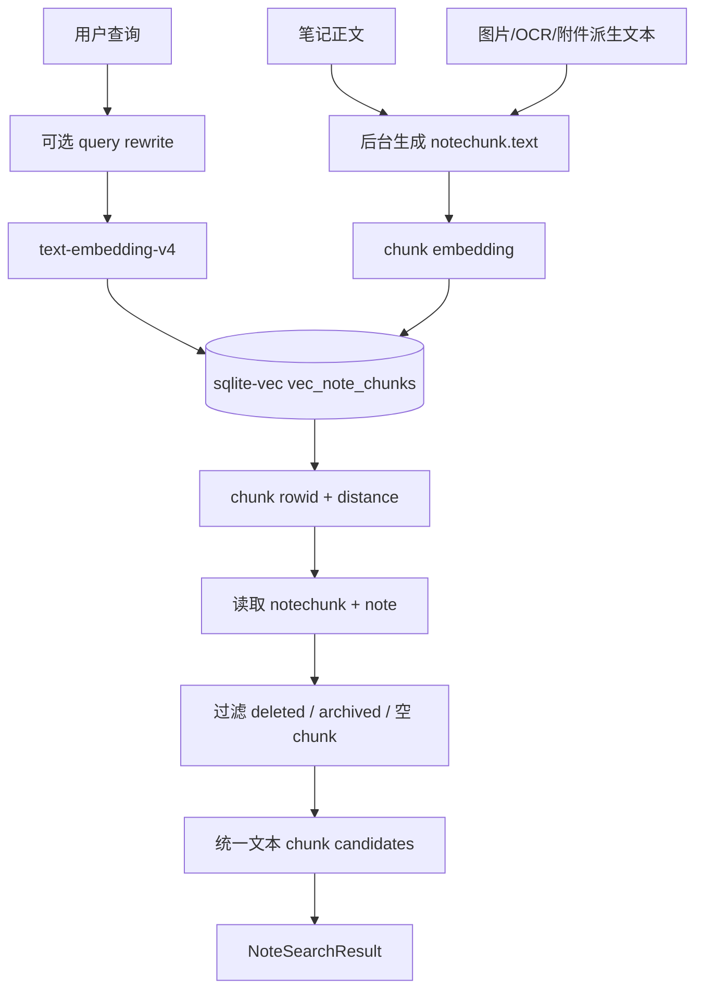

# 向量检索

向量检索负责把用户查询转换为 embedding，并从 `sqlite-vec` 中找出相似的个人笔记文本 chunk。

这里的“文本 chunk”是检索层统一抽象。上游可以来自用户直接写下的 Markdown 正文，也可以来自图片/OCR/附件派生文本；一旦进入检索层，就不再按原始格式拆不同流程。

## 当前流程



## 文件职责

```text
backend/app/rag/vector_store.py
  管理 sqlite-vec 连接、建表、向量写入和向量近邻查询。

backend/app/rag/search.py
  负责 query embedding、调用 vector_store、拼接 notechunk/note 业务数据。

backend/app/api/search.py
  暴露 /api/search/notes。

backend/app/schemas/search.py
  定义 Search API 入参和出参。
```

## 查询规则

`vec_note_chunks.rowid` 固定等于 `notechunk.id`。检索时：

```text
query text
  -> embedding
  -> SELECT rowid, distance FROM vec_note_chunks
  -> rowid 回查 notechunk
  -> notechunk.note_id 回查 note
```

上游写入规则：

```text
笔记正文
  直接按 chunking 策略生成 notechunk.text。

图片 / 附件
  先生成 OCR、caption、key facts 等派生文本。
  图片文本生成不等于调用 Agent；它应由专门的图片转文本 extractor 完成。
  本地 Tesseract OCR 已验证会在 PPT logo、图标、架构图中产生较多乱码和噪声，知识库默认方案
  已切换到 `qwen-vl-ocr`，详见 `docs/backend/qwen-vl-ocr-migration.md`。
  OCR / 图片理解失败、图片低价值或提取为空时，该图片计为 skipped / failed，不生成伪造的图片文本 chunk。
  再进入同一 chunking / embedding / vec_note_chunks 流程。

检索输出
  统一返回 text、note_id、chunk_id、score 和 citation metadata。
  Agent 不需要知道该 chunk 原本来自正文还是图片；只有调试和回源时使用 source metadata。
```

## 分数

sqlite-vec 返回 `distance`，距离越小越相似。

API 同时返回一个便于前端和调试观察的 `score`：

```text
score = 1 / (1 + max(distance, 0))
```

该分数不是严格概率，只用于排序展示和调试。真实排序仍以 `distance` 为准。

## 与 Memory Chat Graph 的关系

`memory_chat_graph` 不应该直接操作 sqlite-vec。它后续应通过检索服务调用：

```text
search_notes(query, limit)
```

这样 RAG 子图只关心“拿到哪些候选记忆”，不关心底层向量表细节。
