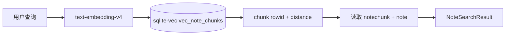

# 向量检索

向量检索负责把用户查询转换为 embedding，并从 `sqlite-vec` 中找出相似的笔记 chunk。

## 当前流程



## 文件职责

```text
backend/app/rag/vector_store.py
  管理 sqlite-vec 连接、建表、向量写入和向量近邻查询。

backend/app/rag/search.py
  负责 query embedding、调用 vector_store、拼接 notechunk/note 业务数据。

backend/app/api/search.py
  暴露 /api/search/notes。

backend/app/schemas/search.py
  定义 Search API 入参和出参。
```

## 查询规则

`vec_note_chunks.rowid` 固定等于 `notechunk.id`。检索时：

```text
query text
  -> embedding
  -> SELECT rowid, distance FROM vec_note_chunks
  -> rowid 回查 notechunk
  -> notechunk.note_id 回查 note
```

## 分数

sqlite-vec 返回 `distance`，距离越小越相似。

API 同时返回一个便于前端和调试观察的 `score`：

```text
score = 1 / (1 + max(distance, 0))
```

该分数不是严格概率，只用于排序展示和调试。真实排序仍以 `distance` 为准。

## 与 Memory Chat Graph 的关系

`memory_chat_graph` 不应该直接操作 sqlite-vec。它后续应通过检索服务调用：

```text
search_notes(query, limit)
```

这样 RAG 子图只关心“拿到哪些候选记忆”，不关心底层向量表细节。

