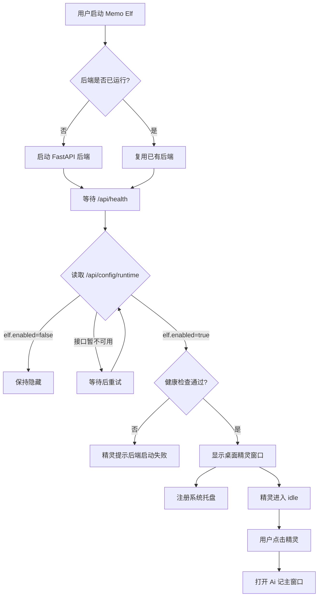
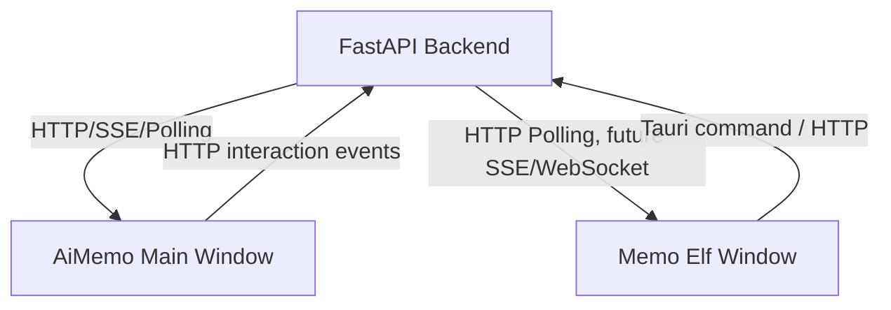

# Memo Elf 桌面化架构草案

本文记录 AiMemo 从 Web 应用内精灵，演进为桌面级 Memo Elf 的产品和技术架构方向。

当前阶段：

```text
Ai 记启动精灵，精灵辅助 Ai 记。
```

下一阶段目标：

```text
精灵成为主入口，Ai 记成为精灵拥有的第一个核心能力。
```

换句话说，项目主线从：

```text
AiMemo with Elf
```

演进为：

```text
Memo Elf with AiMemo Memory Skill
```

## 产品定位变化

Ai 记最初定位是个人知识库中心：

```text
记录笔记
向量化存储
基于个人知识库对话
让 AI 帮用户回忆和处理自己的信息
```

精灵出现后，产品的体验重心开始变化：

```text
用户不是只打开一个网页使用 AI。
用户可以和一个长期陪伴在桌面的精灵互动。
精灵拥有记忆能力，并通过 Ai 记管理这些记忆。
```

这意味着 Ai 记可以成为精灵的第一个技能：

```text
Memo Elf
  桌面精灵本体。

AiMemo Memory Skill
  笔记、记忆、向量检索、Memory Chat Graph。

Agent Skills
  后续扩展能力，例如剪贴板总结、文件助手、网页助手、待办、系统自动化。
```

## 目标体验

理想启动体验：

```text
用户启动项目
  -> 本地后端启动
  -> 桌面精灵自动出现
  -> 精灵悬浮在屏幕最上层
  -> 用户可以拖拽精灵
  -> 用户点击精灵或托盘菜单打开 Ai 记页面
  -> 用户也可以直接和精灵对话
```

精灵不再只是浏览器里的一个 UI 容器，而是一个系统级陪伴入口：

```text
悬浮在桌面
透明窗口
置顶显示
可拖拽
气泡回复
能打开 Ai 记
能感知后台任务
能连接 Memory Chat Graph
```

## 技术路线选择

建议优先采用：

```text
Tauri + React + FastAPI
```

原因：

```text
Tauri 比 Electron 更轻，适合个人开源工具。
现有 React 前端可以复用。
Tauri 支持透明窗口、无边框窗口、置顶窗口、系统托盘、全局快捷键。
后端仍可沿用当前 FastAPI + LangGraph 架构。
```

备选：

```text
Electron
  生态成熟，上手简单，桌面能力丰富。
  缺点是体积大、资源占用更高。

纯 Web/PWA
  开发成本低，但不能真正跳出浏览器成为桌面精灵。

原生桌面应用
  控制力强，但会大幅增加跨平台开发成本。
```

## 总体架构

建议未来结构：

```text
backend/
  FastAPI
  LangGraph
  SQLite / sqlite-vec
  jobs
  memory graphs

frontend/
  AiMemo Web 页面
  当前浏览器内主应用

desktop/
  Tauri 桌面壳
  精灵透明窗口
  主应用窗口
  托盘
  快捷键

shared-ui/
  后续可选
  抽取精灵组件、事件类型、通用 UI
```

第一版可以不立即抽 `shared-ui`，而是在 `desktop` 中复用 `frontend` 构建产物或共享源码。

## 窗口模型

建议至少有两个窗口：

```text
Elf Window
  精灵窗口。
  透明、无边框、always on top。
  默认出现在右下角。
  只显示精灵、气泡、简单输入入口。

Main Window
  Ai 记主页面。
  可以是普通应用窗口。
  显示笔记、记忆、聊天、调试面板。
```

后续可加：

```text
Chat Bubble Window
  独立的精灵对话窗口。
  可以跟随精灵，也可以作为临时输入框弹出。

Debug Window
  开发模式使用。
  显示精灵事件流、backend 状态、graph 状态。
```

## 精灵窗口能力

第一版桌面精灵窗口：

```text
透明背景
无边框
置顶
可拖拽
显示 PNG Memo 精灵
显示气泡
点击打开 Ai 记主窗口
连接本地后端健康状态
读取 /api/config/runtime，支持 elf.enabled 运行时开关
长按说话、ASR 转文本、气泡 TTS 播放
```

暂不做：

```text
读取剪贴板
读取当前窗口标题
操作用户电脑
全局监听键盘内容
复杂系统自动化
```

原因：

```text
这些能力涉及系统权限和用户隐私。
开源项目必须让用户明确知道精灵能读什么、做什么。
第一版应该先把桌面存在感跑通。
```

## 启动流程

建议启动流程：



## 后端启动策略

有两种方案：

### 方案 A：桌面壳负责启动后端

```text
Tauri 启动时拉起 backend 进程。
退出应用时关闭 backend。
```

优点：

```text
用户体验完整。
用户不需要手动启动命令。
```

缺点：

```text
跨平台打包和 Python 环境管理更复杂。
需要处理端口占用、进程清理、日志存储。
```

### 方案 B：开发期仍手动启动后端

```text
开发期使用 scripts/start-backend.ps1 / .sh。
Tauri 只连接已有后端。
```

优点：

```text
实现快。
适合先验证桌面精灵窗口。
```

缺点：

```text
用户体验不完整。
不能算真正的一键桌面应用。
```

建议：

```text
第一版使用方案 B。
桌面窗口跑通后，再做方案 A。
```

## 通信方式

当前前端和后端使用：

```text
HTTP
SSE chat stream
TanStack Query polling jobs
```

桌面阶段第一版已经改为“后端事件中心”：

```text
FastAPI 后端产生精灵事件。
AiMemo Web 和 Memo Elf Desktop 并行消费这些事件。
浏览器不再作为主精灵的控制者。
```

原因：

```text
后端最接近 chat stream、job worker、graph 节点和 memory mutation。
精灵事件由后端产生，比浏览器轮询业务状态后再猜测更准确。
桌面精灵即使在浏览器关闭时，也可以继续感知后台任务。
```

未来通信模型：



## 精灵事件系统演进

当前 Web 内精灵已经有：

```text
elfEventBus
elfRuntime
ElfMood
ElfMotion
Chat stream -> elf events
jobs fallback
```

桌面化后，事件系统需要跨窗口，并以后端为中心：

```text
Backend
  发送 note / chat / job / memory / graph 事件。

Memo Elf Window
  接收事件并显示表情、动作、气泡。

AiMemo Main Window
  默认不再渲染主精灵。
  只保留精灵工坊和调试入口。
```

第一版已经采用：

```text
Backend in-memory elf event queue
GET /api/elf/events?after_id=<last_id>
Desktop polling
```

后续再升级为：

```text
Backend WebSocket event stream
所有窗口订阅同一事件源
```

## AiMemo 作为 Memory Skill

未来可以把 Ai 记抽象成一个技能：

```text
memory skill
  create_note
  update_note
  delete_note
  search_notes
  chat_with_memory
  list_memories
  disable_memory
  restore_memory
```

精灵对用户暴露的是自然语言入口：

```text
帮我记一下……
我之前有没有提过……
总结一下我最近关于项目的想法。
打开我的笔记页面。
把剪贴板内容存成一条笔记。
```

底层调用的是 AiMemo skill。

## 未来 Agent Skills

后续技能可以包括：

```text
clipboard skill
  总结剪贴板
  把剪贴板写入记忆

browser skill
  打开 AiMemo 页面
  打开指定网页
  总结当前网页，需用户授权

file skill
  读取用户明确选择的文件
  总结文档
  写入笔记

todo skill
  创建待办
  从笔记抽取待办

automation skill
  后期谨慎加入
  需要明确权限和用户确认
```

## 权限与隐私原则

桌面精灵会天然让用户感觉“它在电脑里”。因此必须明确权限边界：

```text
默认不读取剪贴板。
默认不读取当前窗口标题。
默认不监听全局键盘输入。
默认不操作文件。
默认不操作浏览器。
```

任何系统级能力都应满足：

```text
用户主动开启
清楚说明用途
可随时关闭
敏感操作前确认
日志可查看
```

这是开源项目必须建立的信任基础。

## 阶段计划

### Phase 1：桌面精灵壳验证

```text
创建 desktop/tauri 工程。
显示透明置顶精灵窗口。
复用当前 Memo PNG 表情。
支持拖拽。
点击打开 AiMemo Web 页面。
连接后端 /api/health。
```

### Phase 2：桌面主窗口

```text
Tauri 内打开 AiMemo 主窗口。
开发期仍可访问 http://127.0.0.1:5173。
生产期加载前端构建产物。
加入系统托盘：打开 AiMemo、显示/隐藏精灵、退出。
```

### Phase 3：桌面精灵对话入口

```text
点击 / 快捷键唤起输入框。
调用 Memory Chat Graph。
气泡流式回复。
保留打开完整 AiMemo 聊天页的能力。
```

### Phase 4：跨窗口事件系统

```text
主窗口发出 note/chat/job/memory 事件。
精灵窗口接收事件并显示。
必要时引入 WebSocket。
```

### Phase 5：技能系统雏形

```text
把 AiMemo 抽象为 memory skill。
定义 skill manifest / tool schema。
让精灵能通过自然语言调用 memory skill。
```

### Phase 6：系统级能力

```text
剪贴板
当前窗口
文件
网页
自动化
```

该阶段必须以权限和安全为前提。

## 第一版实现建议

近期不要直接做完整系统自动化。最小可行版本：

```text
desktop/
  Tauri 工程
  透明置顶 Elf Window
  加载 Memo PNG 精灵
  可拖拽
  点击打开 AiMemo URL
  后端健康状态气泡
```

这个版本能验证最关键的问题：

```text
精灵跳出浏览器后体验是否成立。
透明窗口在 Windows 上表现是否稳定。
拖拽、置顶、点击是否符合预期。
现有 React 精灵组件是否适合抽离复用。
```

验证通过后，再决定是否把当前 Web 内精灵组件抽成 shared-ui。

## 命名建议

项目主品牌可以继续保留：

```text
AiMemo
```

但桌面精灵层可以使用：

```text
Memo Elf
```

文案上可以这样表达：

```text
Memo Elf is your personal memory companion.
AiMemo is its first built-in memory skill.
```

中文：

```text
Memo Elf 是你的个人记忆精灵。
Ai 记是它拥有的第一个记忆能力。
```
