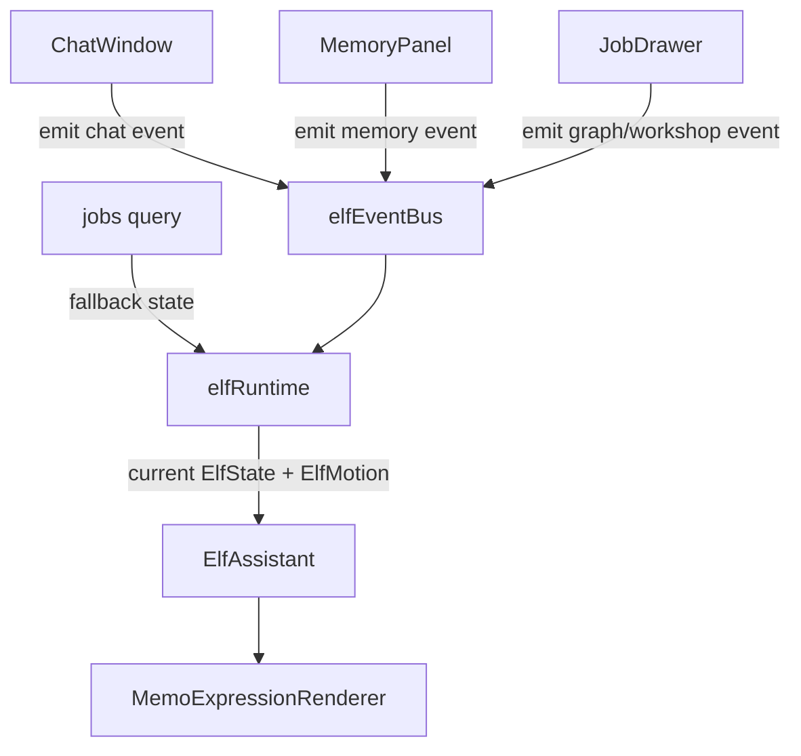
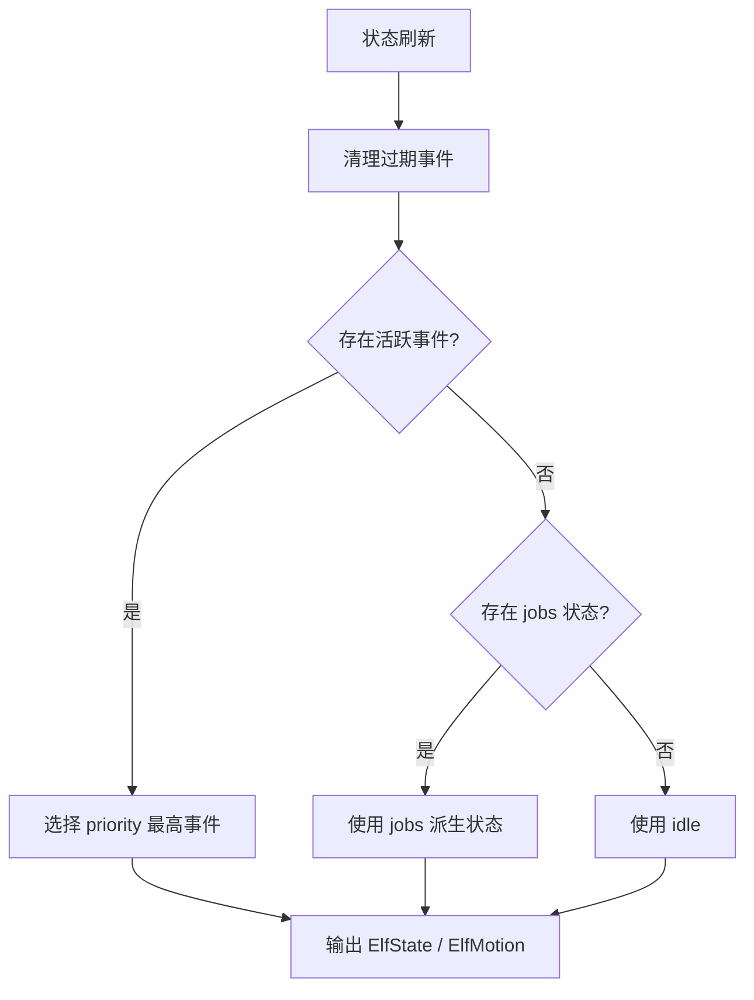

# 精灵事件总线设计草案

本文记录 AiMemo 精灵从“jobs 状态显示器”升级为“应用状态代理”的前端设计。随着桌面 Memo Elf 出现，事件中心已经从浏览器前端上移到后端；本文件仍保留 Web 内精灵的设计记录和调试开关说明。

当前推荐结构见：[后端精灵事件中心](../backend/elf-events.md)。

## 设计目标

当前精灵已经能根据 jobs 推导状态，但它还不够“知道应用在发生什么”。下一步应该让精灵接收更多前端事件：

```text
用户正在聊天
AI 正在组织回答
Memory 正在写入
用户打开了记忆详情
用户查看了 Graph
某个后台任务失败
```

这些事件不应该直接写进 `ElfAssistant.tsx`。否则 ChatWindow、JobDrawer、MemoryPanel 会和精灵组件互相纠缠，后续很难维护。

因此需要一个轻量的前端事件总线：

```text
业务模块发出 elf event
精灵运行时统一收集事件
根据 priority / ttl / source 计算当前展示状态
ElfAssistant 只消费最终的 ElfState
```

## 核心原则

```text
低耦合
  业务模块只发事件，不关心精灵怎么显示。

短生命周期
  大部分事件都应该有 ttl，避免气泡一直不消失。

优先级明确
  错误 > 用户主动交互 > AI 正在工作 > 轻提示 > idle。

可降级
  没有事件时继续使用 jobs 派生状态。

可替换
  后续如果从 PNG 换成 Live2D，事件结构不变，只替换渲染映射。
```

## 建议目录结构

```text
frontend/src/features/elf/
  ElfAssistant.tsx
  elfEventBus.ts
  elfRuntime.ts
  elfState.ts
  elfMessages.ts
  memoExpressionRenderer.tsx
  types.ts
```

职责说明：

```text
elfEventBus.ts
  提供 emit / subscribe / clear 等事件总线能力。

elfRuntime.ts
  订阅事件，合并 jobs 派生状态，输出当前展示用 ElfState / ElfMotion。

elfState.ts
  保留纯函数：根据 jobs 或候选状态推导精灵状态。

ElfAssistant.tsx
  只负责渲染、拖拽和打开精灵工坊。
```

## 事件结构

建议第一版类型：

```ts
export type ElfEventSource =
  | "jobs"
  | "chat"
  | "memory"
  | "graph"
  | "workshop"
  | "system";

export interface ElfEvent {
  id?: string;
  source: ElfEventSource;
  mood: ElfMood;
  motion?: ElfMotion;
  message?: string;
  priority: number;
  ttlMs?: number;
  createdAt?: number;
  dedupeKey?: string;
  metadata?: Record<string, unknown>;
}
```

字段说明：

```text
id
  事件唯一标识。未传入时由事件总线生成。

source
  事件来源，用于调试和优先级策略。

mood
  表情状态。

motion
  动作状态。未提供时由运行时根据 mood 推导。

message
  可选气泡文案。没有 message 时只切换表情 / 动作。

priority
  优先级，数值越高越应该展示。

ttlMs
  事件有效期。短提示必须设置，长期状态可以不设置。

createdAt
  创建时间。未传入时由事件总线填充。

dedupeKey
  去重键，防止同一类提示频繁重复。

metadata
  调试字段，例如 jobId、turnId、nodeName、memoryId。
```

## 优先级建议

```text
100
  任务失败、系统错误、API 失败。

80
  用户主动查看 Graph / Memory 详情 / 打开精灵工坊。

70
  Chat graph 正在关键节点运行，例如检索记忆、生成回答。

60
  jobs running / pending。

40
  任务完成、记忆写入完成、轻提示。

10
  idle。
```

说明：

```text
jobs 状态仍然重要，但不应该永远压过用户主动交互。
例如用户打开 Graph 面板时，精灵应该短暂表现为 curious，而不是继续只显示 working。
但如果后台任务失败，失败提醒应该压过普通交互。
```

## TTL 策略

建议第一版规则：

```text
错误事件
  可以不设置 ttl，直到对应错误状态被解决或用户打开工坊查看。

用户交互事件
  1500-3000ms。

Chat stream 节点事件
  1500-4000ms，后续节点事件会覆盖前一节点。

完成事件
  3000-4200ms，且需要 dedupe。

纯表情事件
  800-1800ms。
```

事件过期后，运行时重新计算当前状态：

```text
仍有高优先级活跃事件
  展示高优先级事件。

没有活跃事件
  回退到 jobs 派生状态。

jobs 也没有活跃状态
  回到 idle。
```

## 去重策略

需要避免精灵重复说同一句话。建议使用 `dedupeKey`：

```ts
elfEvents.emit({
  source: "jobs",
  mood: "success",
  message: "刚刚有任务完成了。",
  priority: 40,
  ttlMs: 4200,
  dedupeKey: `job-completed:${jobId}`,
});
```

运行时维护一个短期已播报集合：

```text
dedupeKey 在窗口期内出现过
  忽略新事件。

dedupeKey 没出现过
  接受事件，并记录。
```

第一版可以只在浏览器会话内去重。后续如果需要跨刷新记忆，再考虑 localStorage。

## 与 jobs 的关系

jobs 不一定要改造成事件源。第一版可以这样做：

```text
jobs 仍由 ElfAssistant 或 elfRuntime 轮询观察。
jobs 派生状态作为 fallback state。
只有 completed 这种短提醒，可以转成 ElfEvent，方便 ttl 和 dedupe。
```

后续可逐步迁移：

```text
JobDrawer / jobs query 观察到状态变化
  emit job-running / job-completed / job-failed

elfRuntime
  不再直接理解 jobs 列表，只消费事件和少量 fallback 输入。
```

## Chat 事件接入点

Memory Chat Graph stream 已经能拿到节点级事件，适合接入精灵：

```text
plan_retrieval
  mood: thinking
  message: 我在判断要不要翻记忆。

retrieve_notes
  mood: talking 或 curious
  message: 我在翻你的笔记。

build_l3_retrieved_memory
  mood: thinking
  message: 我在筛选相关记忆。

generate_answer
  mood: talking
  message: 我在组织回答。

done
  mood: success
  message: 回答好了。
```

注意：

```text
Chat stream 事件频率可能很高，不应该每个 token 都发给精灵。
只在 node start / node end / stream done 等结构化事件发。
```

## Memory 事件接入点

可接入的 Memory 事件：

```text
记忆写入完成
  mood: success
  motion: success
  message: 我帮你记住了一点。

记忆被停用
  mood: thinking
  message: 这条记忆先收起来了。

记忆恢复
  mood: memory
  message: 这条记忆又回来了。

记忆删除
  mood: warning
  message: 这条记忆已经删除。
```

当前 `ElfMood` 还没有 `memory`，第一版可以先用：

```text
memory-like 状态
  mood: success 或 talking
  expression: memory_glow 后续再接
```

后续建议扩展：

```ts
export type ElfMood = ... | "memory";
```

## Graph / Workshop 事件接入点

```text
用户打开精灵工坊
  mood: talking
  motion: look

用户打开某条 job graph
  mood: thinking
  message: 我把这个流程图展开给你看。

用户打开某条 assistant message graph
  mood: curious
  message: 这是我刚才的思考流程。
```

这些事件属于用户主动交互，优先级应该高于普通 running job，但低于 failed job。

## Runtime 推导流程

建议 Mermaid 图：



运行时选择当前状态：



## 第一版实现计划

### Step 1：事件总线

```text
新增 elfEventBus.ts。
实现 emit / subscribe / clear。
事件总线不依赖 React。
```

### Step 2：运行时 Hook

```text
新增 useElfRuntime 或 elfRuntime.ts。
订阅事件总线。
清理 ttl 过期事件。
根据 priority 选择当前事件。
没有事件时回退 jobs 派生状态。
```

### Step 3：接入 ElfAssistant

```text
ElfAssistant 不再自己直接计算所有展示状态。
它接收 runtime 输出的 displayMood / displayMotion / message。
保留拖拽和打开工坊行为。
```

### Step 4：接入 ChatWindow

```text
在 stream node start / done 处 emit。
只发结构化事件，不发 token delta。
```

### Step 5：接入 Memory / Graph

```text
记忆 mutation 成功后 emit。
打开 graph 面板时 emit。
打开精灵工坊时 emit。
```

## 风险和约束

```text
事件太多会打扰用户
  需要 ttl、dedupe、优先级和低频策略。

组件强耦合
  业务组件只能调用 emit，不应 import ElfAssistant 内部逻辑。

提示气泡泛滥
  允许没有 message 的纯表情事件。

状态竞争
  Runtime 必须有清晰优先级和过期规则。
```

## 建议先做的最小闭环

第一版不要一口气接所有模块。建议只做：

```text
elfEventBus.ts
useElfRuntime
ChatWindow 发送 node-level 事件
Job completed 继续保留现有去重逻辑或迁移到 event bus
```

完成后，用户在聊天时会看到：

```text
检索时：我在翻你的笔记。
生成时：我在组织回答。
完成时：回答好了。
```

这会让精灵从“后台任务入口”变成“AI 工作过程的可视化陪伴”。

## 当前第一版实现记录

状态更新：

```text
浏览器内 ElfAssistant 默认关闭。
默认由桌面 Memo Elf 订阅后端 /api/elf/events。
如需调试 Web 精灵，可设置 VITE_ENABLE_WEB_ELF=true。
```

已实现文件：

```text
frontend/src/features/elf/elfEventBus.ts
  提供 elfEvents.emit / subscribe / clear。

frontend/src/features/elf/elfRuntime.ts
  订阅事件总线，清理 ttl 过期事件，按 priority 选择当前事件。
  没有活跃事件时回退到 jobs 派生状态。

frontend/src/features/chat/chatElfEvents.ts
  把 Memory Chat Graph 的结构化 stream 事件翻译为精灵事件。
```

已接入位置：

```text
frontend/src/features/elf/ElfAssistant.tsx
  使用 useElfRuntime 合并事件状态和 jobs fallback。
  打开 / 收起精灵工坊时 emit workshop 事件。

frontend/src/features/chat/ChatWindow.tsx
  node 事件：emit chat node 事件。
  首个 answer_delta：emit answer started 事件。
  done：emit chat done 事件。
  error：emit chat error 事件。
  打开 assistant message graph：emit graph open 事件。
```

当前仍保留的兼容逻辑：

```text
ElfAssistant 仍然维护 completed job 的历史去重。
这是为了避免首次加载历史 completed job 时误播“刚刚有任务完成了”。
后续如果 jobs 完全事件化，可以把这部分移动到 jobs event adapter。
```

当前未做：

```text
Memory mutation 事件尚未接入。
JobDrawer 打开某个 job graph 尚未接入。
跨浏览器刷新后的 dedupe 尚未持久化。
```
