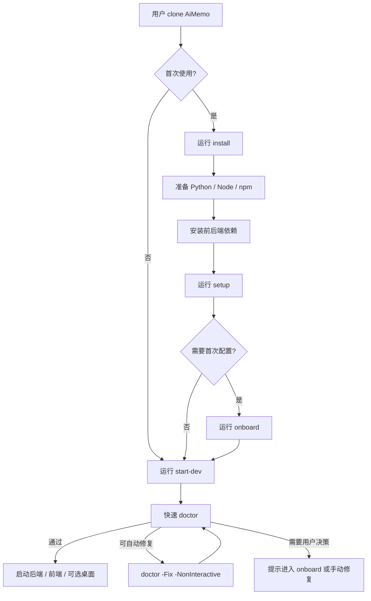

# 启动结构重构设计

本文档记录 AiMemo 启动体验的下一轮重构方案。目标是参考 OpenClaw 的安装/启动分层，把当前较重的 `start-dev` 拆成可诊断、可修复、可恢复的启动体系。

## 背景

当前 AiMemo 的首次启动链路承担了过多职责：

- 检查 Node.js / npm。
- 检查 Python 3.12。
- 创建或重建 `backend/.venv`。
- 安装后端依赖。
- 安装前端依赖。
- 构建前端静态产物。
- 检查 Rust / Cargo，并尝试启动桌面精灵。
- 启动后端、Vite 前端和桌面窗口。

这导致第一次 clone 项目时，如果用户缺 Python、Node、Rust、npm 或 PATH 配置异常，错误会在启动过程中分散暴露。用户的感受是“一开始就跑不起来”，而不是“系统告诉我缺什么，并提供明确修复入口”。

OpenClaw 的结构值得参考：它没有把全部逻辑塞进一个启动脚本，而是分成 installer、setup/onboard、doctor、start/watch。安装负责补环境，onboard 负责首次配置，doctor 负责诊断和修复，start/watch 只负责启动。

## 设计目标

1. 首次使用时减少手动装环境的步骤，尤其是 Windows 用户不应该先后碰到 Python、Node、Rust 多个缺失错误。
2. 启动脚本变薄，避免每次启动都重复执行安装判断和复杂修复。
3. 缺依赖、端口占用、配置缺失、前端未构建等问题由 `doctor` 统一检查并给出可执行修复。
4. Rust / Tauri 桌面能力降级为可选能力，不阻塞 Web 版启动。
5. 安装、诊断、启动过程都能被前端或后台任务面板复用，后续可以显示进度和当前命令。

## 非目标

- 本阶段不改变业务功能、Agent 图、知识库逻辑或模型 Provider 逻辑。
- 本阶段不强制引入 Docker 作为唯一启动方式。
- 本阶段不要求把开发环境和生产打包一次性全部解决。

## OpenClaw 借鉴点

| OpenClaw 做法 | AiMemo 可借鉴点 |
| --- | --- |
| `install.ps1` / `install.sh` 负责安装 Node、CLI、首次 onboard | 新增 AiMemo installer，负责准备 Python、Node、前端/后端依赖和可选桌面依赖 |
| `install-cli.sh` 支持 local prefix 和 JSON 输出 | 安装过程支持本地依赖目录和机器可读事件，便于前端展示进度 |
| `openclaw setup` 只写最小配置和 workspace | AiMemo `setup` 只创建 `.env`、数据目录、默认配置，不做重安装 |
| `openclaw onboard` 区分交互和非交互 | AiMemo onboarding 负责 API Key、模型、OCR、桌面精灵开关等首次配置 |
| `openclaw doctor --fix --non-interactive` 可自动修复 | AiMemo `doctor -Fix` 统一处理缺依赖、venv、前端构建、端口和配置问题 |
| `gateway:watch` 启动失败时自动跑一次 doctor | `start-dev` 启动失败时可提示或自动触发一次非交互 doctor 修复 |

## 目标命令结构

```text
scripts/
  aimemo.ps1         # Windows 仓库内统一命令入口
  aimemo.sh          # Linux/macOS 仓库内统一命令入口
  register-aimemo.ps1 # Windows 注册全局 aimemo 命令
  register-aimemo.sh # Linux/macOS 注册全局 aimemo 命令
  install.ps1        # Windows 首次安装/补环境
  install.sh         # Linux/macOS 首次安装/补环境
  doctor.ps1         # Windows 环境诊断，可选 -Fix
  doctor.sh          # Linux/macOS 环境诊断，可选 --fix
  onboard.ps1        # Windows 首次配置向导
  onboard.sh         # Linux/macOS 首次配置向导
  setup.ps1          # 最小初始化：.env、data、默认目录
  setup.sh
  start-dev.ps1      # 只启动，必要时调用 doctor
  start-dev.sh
  stop-dev.ps1
  stop-dev.sh
```

推荐用户入口：

```powershell
.\scripts\aimemo.ps1 doctor
.\scripts\aimemo.ps1 start
.\scripts\aimemo.ps1 stop
```

开发者已有环境时：

```powershell
.\scripts\aimemo.ps1 doctor
.\scripts\aimemo.ps1 start -SkipDoctor
```

Linux / macOS：

```bash
./scripts/aimemo.sh doctor
./scripts/aimemo.sh start --skip-doctor
./scripts/aimemo.sh stop
```

当前阶段的 `aimemo.ps1` / `aimemo.sh` 是仓库内命令路由层；用户仍需显式调用脚本路径。等 `install` 阶段完成后，再由安装器生成全局 `aimemo` wrapper，并把用户入口收敛为：

```text
aimemo doctor
aimemo start
aimemo stop
```

Windows 当前已有独立注册脚本。第一次 clone 后先注册一次全局命令：

```powershell
.\scripts\register-aimemo.ps1
```

或通过统一入口调用同一套注册逻辑：

```powershell
.\scripts\aimemo.ps1 register
.\scripts\aimemo.ps1 install
```

注册后，当前终端或新终端即可使用：

```powershell
aimemo doctor
aimemo start
aimemo stop
```

`install.ps1` 当前只是 `register-aimemo.ps1` 的兼容薄入口，真正注册逻辑只维护在 `register-aimemo.ps1` 中。该版本只创建 `%LOCALAPPDATA%\AiMemo\bin\aimemo.cmd` 和旁边的 PowerShell wrapper，并把该目录加入用户 PATH，不安装 Python、Node、Rust，也不创建虚拟环境。可先用 dry run 查看将执行的动作：

```powershell
.\scripts\register-aimemo.ps1 -DryRun
```

Linux / macOS 也提供同样的独立注册脚本：

```bash
chmod +x scripts/*.sh
./scripts/register-aimemo.sh
```

或通过统一入口调用：

```bash
./scripts/aimemo.sh register
./scripts/aimemo.sh install
```

注册脚本会写入 `~/.local/bin/aimemo`，并按当前 shell 类型向 `~/.bashrc` / `~/.profile` 或 `~/.zshrc` / `~/.zprofile` 追加 PATH 片段。可先用 dry run 查看动作：

```bash
./scripts/register-aimemo.sh --dry-run
```

## 职责边界

### install

`install` 是首次安装入口，允许做较重的环境准备。

职责：

- 检查 Git。
- 准备 Python 3.12。
- 准备 Node.js 20+ 和 npm。
- 安装或刷新前端依赖。
- 创建后端虚拟环境。
- 安装后端依赖。
- 可选检查 Rust / Cargo。
- 调用 `setup` 写入最小本地目录和配置。
- 可选调用 `onboard`。

原则：

- 默认不要求管理员权限。
- Windows 优先使用用户级依赖目录，例如 `%LOCALAPPDATA%\AiMemo\deps`。
- 支持 `-NoDesktop`，不安装或检查 Rust。
- 支持 `-DryRun`，只展示将执行哪些动作。
- 支持 `-NoOnboard`，只装环境不进入配置向导。
- 支持结构化输出，方便后续前端后台任务面板接入。

### setup

`setup` 是幂等的最小初始化。

职责：

- 如果 `.env` 不存在，从 `.env.example` 创建。
- 确保 `data/`、上传目录、后台任务日志目录存在。
- 确保 `frontend/dist` 缺失时能给出明确提示，但不强制构建。
- 不写真实 API Key。
- 不安装依赖。

### onboard

`onboard` 处理用户决策和首次配置。

职责：

- 引导填写或确认模型 API Key。
- 选择聊天模型 Provider。
- 确认知识库图片转文字方案，例如 qwen-vl-ocr。
- 选择是否启用桌面 Memo Elf。
- 选择是否启用开发期 Vite 前端，还是只使用后端托管的 `frontend/dist`。

后续可以把该流程接到前端设置页，但脚本版本先解决 clone 后启动体验。

### doctor

`doctor` 是统一诊断入口。

检查项：

- Python 3.12 是否可用。
- `backend/.venv` 是否存在且版本正确。
- 后端核心依赖是否可导入。
- `DASHSCOPE_API_KEY` 或当前模型 Provider 所需 Key 是否配置。
- Node.js / npm 是否可用且版本满足要求。
- `frontend/node_modules` 是否存在。
- `frontend/dist/index.html` 是否存在或是否过旧。
- 8000 / 5173 等端口是否被占用。
- Rust / Cargo 是否可用；仅在桌面模式下作为错误，否则作为 warning。
- 桌面依赖是否完整。
- qwen-vl-ocr 所需配置是否可用。

模式：

```powershell
.\scripts\doctor.ps1
.\scripts\doctor.ps1 -Fix
.\scripts\doctor.ps1 -Json
.\scripts\doctor.ps1 -NonInteractive -Fix
```

`-Fix` 可执行的修复：

- 创建或重建 `backend/.venv`。
- 安装后端依赖。
- 安装前端依赖。
- 构建 `frontend/dist`。
- 创建缺失目录。
- 从 `.env.example` 创建 `.env`。

`-Fix` 不自动执行的操作：

- 写入真实 API Key。
- 强制安装 Rust。
- 删除用户数据。
- 修改系统级 PATH，除非用户明确确认。

### start-dev

`start-dev` 只负责启动。

职责：

- 可选先跑一次快速 `doctor`。
- 如果 `doctor` 发现可修复问题，提示用户运行 `doctor -Fix`，或在 `-AutoFix` 模式下执行一次非交互修复。
- 启动后端。
- 启动 Vite 前端。
- 在 Rust / Cargo 可用且未设置 `-NoDesktop` 时启动桌面精灵。
- 输出访问地址和日志位置。

启动脚本不再承担：

- Python 安装。
- Node 安装。
- Rust 安装。
- 大量依赖修复。
- 首次配置向导。

## 推荐流程图



## 依赖分级

| 级别 | 依赖 | 启动影响 |
| --- | --- | --- |
| 必需 | Git | clone / 更新代码需要 |
| 必需 | Python 3.12 | 后端必须 |
| 必需 | Node.js 20+ / npm | 前端构建和 Vite 必须 |
| 必需 | 后端虚拟环境 | 后端运行必须 |
| 必需 | 前端依赖 | Web UI 运行必须 |
| 可选 | Rust / Cargo | 只影响桌面 Memo Elf |
| 可选 | qwen-vl-ocr 配置 | 只影响知识库图片转文字 |

## Windows 安装策略

Windows 是第一优先级，因为当前用户反馈主要发生在 Windows 同学首次启动场景。

建议：

- 使用 `%LOCALAPPDATA%\AiMemo\deps` 保存用户级依赖和下载缓存。
- 优先通过 `uv` 管理 Python 3.12 和虚拟环境，减少用户手动安装 Python 的概率。
- Node.js 可以先保留“提示用户安装”的策略，第二阶段再做 portable Node。
- Rust / Cargo 不进入默认安装链路，只在用户选择桌面模式时提示安装。
- 所有长耗时安装动作接入后台任务模块，显示当前命令和输出。

## 分阶段实现

### Phase 1：文档和脚本边界

- 新增本设计文档。
- 梳理 README / setup 文档，把当前启动链路和目标链路区分开。
- 新增 `doctor.ps1` / `doctor.sh` 雏形，只检查不修复。
- `start-dev.ps1` / `start-dev.sh` 调用快速 doctor，但不改变现有启动行为；如需跳过，可使用 `-SkipDoctor` / `--skip-doctor`。

Phase 1 的 doctor 只读状态，当前检查：

- Git checkout 和 `git` 命令。
- Node.js 20+ 和 npm。
- Python 3.12。
- `backend/.venv` 是否存在且为 Python 3.12。
- 后端核心依赖是否可导入。
- `.env` 是否存在。
- 当前进程是否能看到 `DASHSCOPE_API_KEY`。
- `frontend/node_modules` 和 `mermaid` 依赖。
- `frontend/dist/index.html`。
- 默认后端/前端端口是否占用。
- Rust / Cargo 是否可用；桌面模式外只作为 warning。

### Phase 2：doctor 修复能力

- 新增 `aimemo.ps1` / `aimemo.sh` 仓库内统一命令路由层，先支持 `doctor`、`start`、`stop`、`help`。
- 新增 `register-aimemo.ps1` / `register-aimemo.sh` 作为独立全局命令注册脚本；`install.ps1` / `install.sh` 和 `aimemo.* register/install` 只复用它。
- `doctor.ps1` 普通输出改为彩色诊断面板；`-Json` 继续保持机器可读输出。
- `doctor.ps1 -Fix` 支持创建 venv、安装后端依赖、安装前端依赖、构建前端。
- 输出统一状态码和 JSON。
- 后端暴露环境诊断 API，前端可展示诊断结果。

### Phase 3：installer 和 onboarding

- 新增 `install.ps1`。第一版先注册全局 `aimemo` wrapper，后续再扩展为完整依赖安装器。
- 新增 `onboard.ps1`。
- 首次启动推荐从 `install -> onboard -> start-dev` 开始。
- 将安装过程接入后台任务模块。

### Phase 4：跨平台补齐

- 补齐 `install.sh`、`doctor.sh`、`onboard.sh`。
- 梳理 Linux/macOS 的 Python 3.12 安装建议。
- 评估是否提供 Docker Web-only 启动路径。

## 成功标准

- 新同学 clone 后，README 中的默认路径不再要求手动连续安装 Python、Node、Rust。
- 缺 Rust 时 Web 版稳定启动，桌面能力明确降级。
- 缺 Python / Node 时，用户看到的是统一诊断结果和修复入口，而不是启动脚本中途报错。
- 安装中刷新页面后，前端仍能通过后台任务看到当前安装状态。
- `start-dev` 日常启动明显变快，输出更短，更像“启动服务”而不是“半安装器”。
